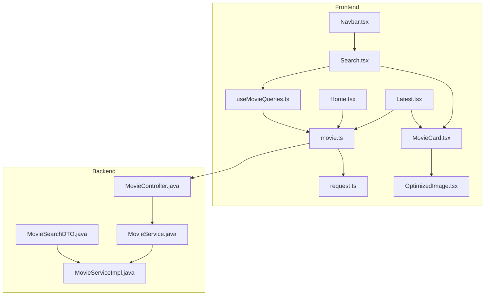
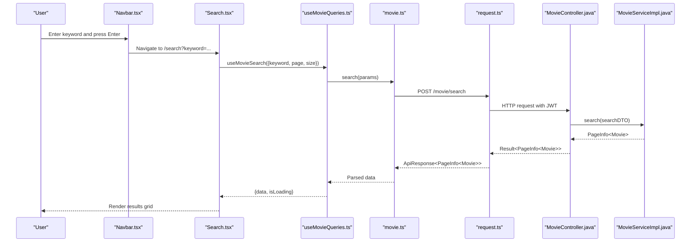
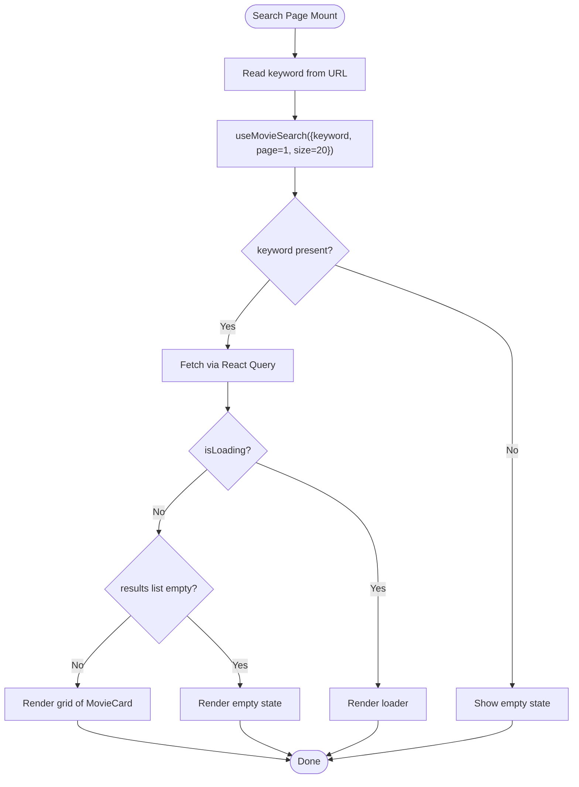
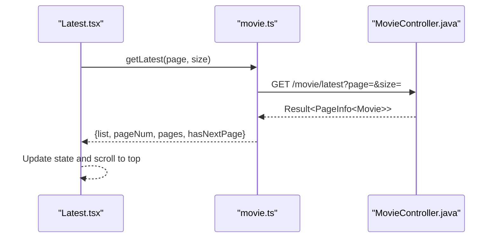
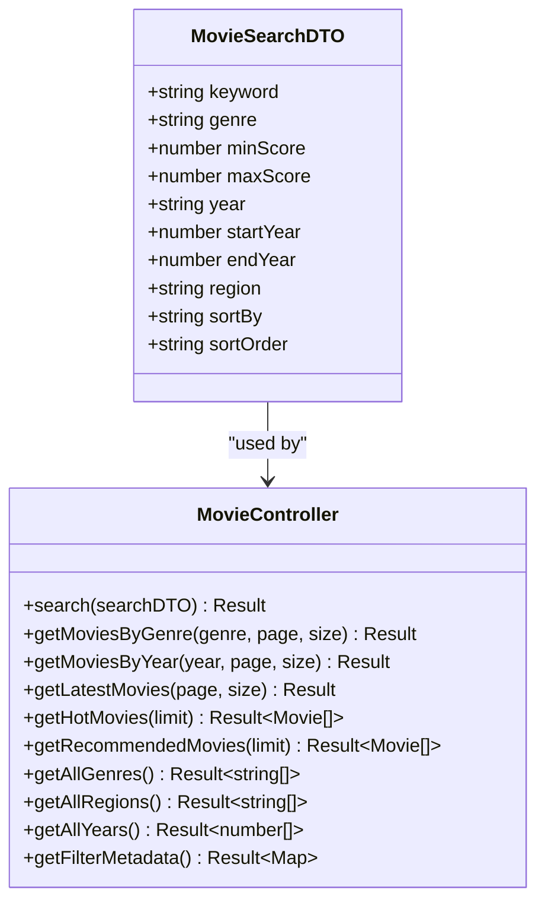
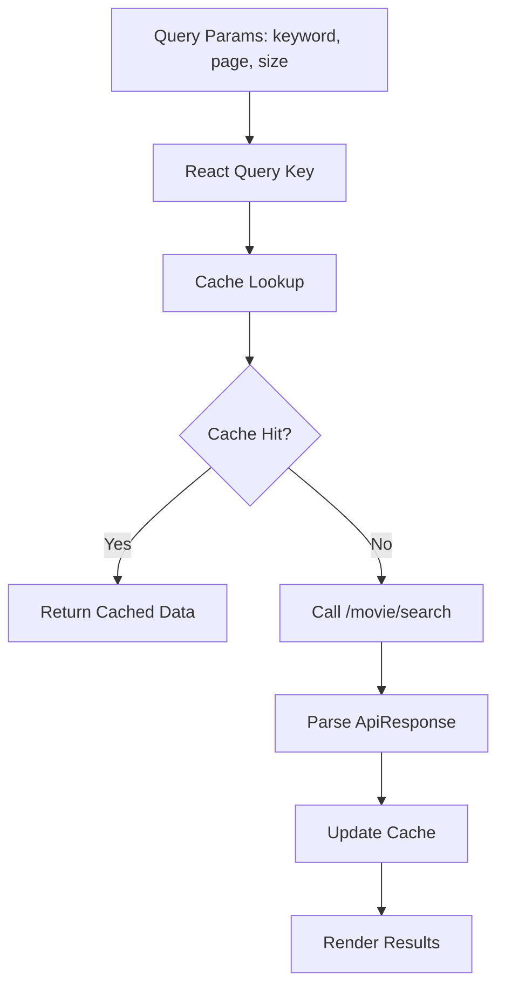
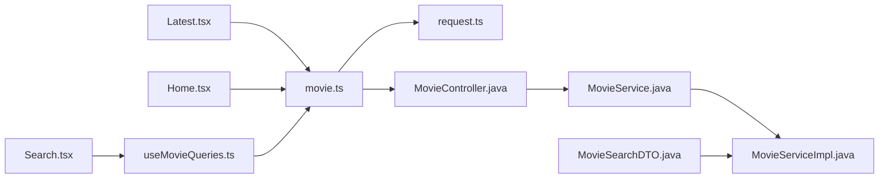

# Search & Browse Pages

<cite>
**Referenced Files in This Document**
- [Search.tsx](file://movie-review-web/src/pages/Search.tsx)
- [Latest.tsx](file://movie-review-web/src/pages/Latest.tsx)
- [Home.tsx](file://movie-review-web/src/pages/Home.tsx)
- [useMovieQueries.ts](file://movie-review-web/src/hooks/useMovieQueries.ts)
- [movie.ts](file://movie-review-web/src/api/movie.ts)
- [request.ts](file://movie-review-web/src/api/request.ts)
- [MovieCard.tsx](file://movie-review-web/src/components/MovieCard.tsx)
- [OptimizedImage.tsx](file://movie-review-web/src/components/OptimizedImage.tsx)
- [Navbar.tsx](file://movie-review-web/src/components/Navbar.tsx)
- [MovieSearchDTO.ts](file://backend/src/main/java/com/movie/backend/dto/MovieSearchDTO.java)
- [MovieController.java](file://backend/src/main/java/com/movie/backend/controller/MovieController.java)
- [MovieService.java](file://backend/src/main/java/com/movie/backend/service/MovieService.java)
- [MovieServiceImpl.java](file://backend/src/main/java/com/movie/backend/service/impl/MovieServiceImpl.java)
- [index.ts](file://movie-review-web/src/types/index.ts)
</cite>

## Table of Contents
1. [Introduction](#introduction)
2. [Project Structure](#project-structure)
3. [Core Components](#core-components)
4. [Architecture Overview](#architecture-overview)
5. [Detailed Component Analysis](#detailed-component-analysis)
6. [Dependency Analysis](#dependency-analysis)
7. [Performance Considerations](#performance-considerations)
8. [Troubleshooting Guide](#troubleshooting-guide)
9. [Conclusion](#conclusion)
10. [Appendices](#appendices)

## Introduction
This document provides comprehensive documentation for the search and browse functionality pages. It covers the search interface implementation, advanced filtering options, sorting mechanisms, and result presentation. It also documents the latest movies page, category-based browsing, and recommendation algorithms. Data fetching strategies for search queries, pagination handling, and real-time search suggestions are included. Component composition patterns, debouncing techniques for search inputs, and performance optimization for large datasets are addressed. Examples of search result formatting, filter persistence, and integration with the movie catalog API are provided. Accessibility considerations for search interfaces and keyboard navigation patterns are discussed.

## Project Structure
The search and browse features span both the frontend and backend:
- Frontend pages: Search, Latest, Home, and reusable components (MovieCard, OptimizedImage).
- Frontend data layer: React Query hooks for caching and fetching, API client with interceptors.
- Backend APIs: MovieController exposes endpoints for search, latest, recommended, genre/year filters, and metadata.
- Types: Shared TypeScript interfaces define the API contract for search DTOs and paginated results.

**Diagram sources**
- [Search.tsx](file://movie-review-web/src/pages/Search.tsx#L1-L67)
- [Latest.tsx](file://movie-review-web/src/pages/Latest.tsx#L1-L100)
- [Home.tsx](file://movie-review-web/src/pages/Home.tsx#L1-L65)
- [useMovieQueries.ts](file://movie-review-web/src/hooks/useMovieQueries.ts#L1-L95)
- [movie.ts](file://movie-review-web/src/api/movie.ts#L1-L65)
- [request.ts](file://movie-review-web/src/api/request.ts#L1-L108)
- [MovieCard.tsx](file://movie-review-web/src/components/MovieCard.tsx#L1-L38)
- [OptimizedImage.tsx](file://movie-review-web/src/components/OptimizedImage.tsx#L1-L179)
- [Navbar.tsx](file://movie-review-web/src/components/Navbar.tsx#L1-L38)
- [MovieController.java](file://backend/src/main/java/com/movie/backend/controller/MovieController.java#L1-L209)
- [MovieService.java](file://backend/src/main/java/com/movie/backend/service/MovieService.java#L1-L60)
- [MovieServiceImpl.java](file://backend/src/main/java/com/movie/backend/service/impl/MovieServiceImpl.java#L1-L116)
- [MovieSearchDTO.java](file://backend/src/main/java/com/movie/backend/dto/MovieSearchDTO.java#L1-L60)

**Section sources**
- [Search.tsx](file://movie-review-web/src/pages/Search.tsx#L1-L67)
- [Latest.tsx](file://movie-review-web/src/pages/Latest.tsx#L1-L100)
- [Home.tsx](file://movie-review-web/src/pages/Home.tsx#L1-L65)
- [useMovieQueries.ts](file://movie-review-web/src/hooks/useMovieQueries.ts#L1-L95)
- [movie.ts](file://movie-review-web/src/api/movie.ts#L1-L65)
- [request.ts](file://movie-review-web/src/api/request.ts#L1-L108)
- [MovieCard.tsx](file://movie-review-web/src/components/MovieCard.tsx#L1-L38)
- [OptimizedImage.tsx](file://movie-review-web/src/components/OptimizedImage.tsx#L1-L179)
- [Navbar.tsx](file://movie-review-web/src/components/Navbar.tsx#L1-L38)
- [MovieController.java](file://backend/src/main/java/com/movie/backend/controller/MovieController.java#L1-L209)
- [MovieService.java](file://backend/src/main/java/com/movie/backend/service/MovieService.java#L1-L60)
- [MovieServiceImpl.java](file://backend/src/main/java/com/movie/backend/service/impl/MovieServiceImpl.java#L1-L116)
- [MovieSearchDTO.java](file://backend/src/main/java/com/movie/backend/dto/MovieSearchDTO.java#L1-L60)

## Core Components
- Search page: Reads the keyword from URL query parameters, triggers a React Query search, renders loading and empty states, and displays results in a responsive grid.
- Latest page: Fetches paginated latest movies, handles loading states, and provides pagination controls.
- Home page: Loads hot and recommended movies concurrently for the landing page.
- React Query hooks: Centralized caching, deduplication, and invalidation for search and latest endpoints.
- API client: Axios instance with interceptors for authentication and unified response handling.
- Movie card and optimized image: Reusable components for consistent rendering and performance.
- Navbar search: Keyboard-driven search submission with URL updates.

**Section sources**
- [Search.tsx](file://movie-review-web/src/pages/Search.tsx#L7-L67)
- [Latest.tsx](file://movie-review-web/src/pages/Latest.tsx#L13-L31)
- [Home.tsx](file://movie-review-web/src/pages/Home.tsx#L30-L44)
- [useMovieQueries.ts](file://movie-review-web/src/hooks/useMovieQueries.ts#L35-L50)
- [movie.ts](file://movie-review-web/src/api/movie.ts#L15-L65)
- [request.ts](file://movie-review-web/src/api/request.ts#L13-L106)
- [MovieCard.tsx](file://movie-review-web/src/components/MovieCard.tsx#L11-L38)
- [OptimizedImage.tsx](file://movie-review-web/src/components/OptimizedImage.tsx#L17-L126)
- [Navbar.tsx](file://movie-review-web/src/components/Navbar.tsx#L12-L25)

## Architecture Overview
The search and browse architecture follows a layered pattern:
- UI pages orchestrate data fetching and rendering.
- React Query manages caching, background refetching, and invalidation.
- API client encapsulates HTTP communication and authentication.
- Backend controllers expose REST endpoints for search, latest, recommended, and filters.
- Services implement business logic and integrate with pagination libraries.
- DTOs define request contracts for advanced filtering and sorting.

**Diagram sources**
- [Navbar.tsx](file://movie-review-web/src/components/Navbar.tsx#L12-L25)
- [Search.tsx](file://movie-review-web/src/pages/Search.tsx#L12-L16)
- [useMovieQueries.ts](file://movie-review-web/src/hooks/useMovieQueries.ts#L35-L42)
- [movie.ts](file://movie-review-web/src/api/movie.ts#L34-L36)
- [request.ts](file://movie-review-web/src/api/request.ts#L13-L29)
- [MovieController.java](file://backend/src/main/java/com/movie/backend/controller/MovieController.java#L72-L75)
- [MovieServiceImpl.java](file://backend/src/main/java/com/movie/backend/service/impl/MovieServiceImpl.java#L34-L44)

## Detailed Component Analysis

### Search Page
- Reads keyword from URL and passes it to a React Query search hook.
- Renders loading spinner while fetching and empty state when no results.
- Displays results in a responsive grid using MovieCard components.
- Integrates with OptimizedImage for lazy-loading and fallbacks.

**Diagram sources**
- [Search.tsx](file://movie-review-web/src/pages/Search.tsx#L8-L19)
- [useMovieQueries.ts](file://movie-review-web/src/hooks/useMovieQueries.ts#L35-L42)

**Section sources**
- [Search.tsx](file://movie-review-web/src/pages/Search.tsx#L7-L67)
- [useMovieQueries.ts](file://movie-review-web/src/hooks/useMovieQueries.ts#L35-L42)
- [MovieCard.tsx](file://movie-review-web/src/components/MovieCard.tsx#L11-L38)
- [OptimizedImage.tsx](file://movie-review-web/src/components/OptimizedImage.tsx#L17-L126)

### Latest Movies Page
- Fetches paginated latest movies on mount and on page changes.
- Provides previous/next buttons and numbered page buttons.
- Scrolls to top after navigating pages.

**Diagram sources**
- [Latest.tsx](file://movie-review-web/src/pages/Latest.tsx#L13-L31)
- [movie.ts](file://movie-review-web/src/api/movie.ts#L22-L24)
- [MovieController.java](file://backend/src/main/java/com/movie/backend/controller/MovieController.java#L143-L153)

**Section sources**
- [Latest.tsx](file://movie-review-web/src/pages/Latest.tsx#L1-L100)
- [movie.ts](file://movie-review-web/src/api/movie.ts#L22-L24)
- [MovieController.java](file://backend/src/main/java/com/movie/backend/controller/MovieController.java#L143-L153)

### Home Page Recommendations
- Concurrently loads hot and recommended movies for the homepage.
- Uses MovieCard components for consistent presentation.

**Section sources**
- [Home.tsx](file://movie-review-web/src/pages/Home.tsx#L30-L44)
- [movie.ts](file://movie-review-web/src/api/movie.ts#L19-L28)

### Advanced Filtering and Sorting
- Backend supports advanced search with filters (genre, min/max score, year, region, start/end year) and sorting (score, year, votes) via MovieSearchDTO.
- Frontend types define the search DTO contract.
- Metadata endpoints provide filter segments for UI rendering.

**Diagram sources**
- [MovieSearchDTO.java](file://backend/src/main/java/com/movie/backend/dto/MovieSearchDTO.java#L18-L59)
- [MovieController.java](file://backend/src/main/java/com/movie/backend/controller/MovieController.java#L72-L198)

**Section sources**
- [MovieSearchDTO.java](file://backend/src/main/java/com/movie/backend/dto/MovieSearchDTO.java#L18-L59)
- [MovieController.java](file://backend/src/main/java/com/movie/backend/controller/MovieController.java#L72-L198)
- [index.ts](file://movie-review-web/src/types/index.ts#L53-L60)

### Recommendation Algorithms
- Hot movies: sorted by view count (votes).
- Recommended movies: sorted by score.
- Latest movies: sorted by release date (descending).

**Section sources**
- [MovieController.java](file://backend/src/main/java/com/movie/backend/controller/MovieController.java#L82-L101)
- [MovieController.java](file://backend/src/main/java/com/movie/backend/controller/MovieController.java#L143-L153)
- [Home.tsx](file://movie-review-web/src/pages/Home.tsx#L33-L38)

### Data Fetching Strategies and Pagination
- React Query automatically caches and deduplicates queries keyed by parameters.
- useMovieQueries defines query keys for search and latest endpoints.
- Latest.tsx implements manual pagination with page and size parameters.
- Backend uses PageHelper for pagination and PageInfo for response metadata.

**Diagram sources**
- [useMovieQueries.ts](file://movie-review-web/src/hooks/useMovieQueries.ts#L6-L12)
- [useMovieQueries.ts](file://movie-review-web/src/hooks/useMovieQueries.ts#L35-L42)
- [movie.ts](file://movie-review-web/src/api/movie.ts#L34-L36)
- [MovieServiceImpl.java](file://backend/src/main/java/com/movie/backend/service/impl/MovieServiceImpl.java#L34-L44)

**Section sources**
- [useMovieQueries.ts](file://movie-review-web/src/hooks/useMovieQueries.ts#L1-L95)
- [Latest.tsx](file://movie-review-web/src/pages/Latest.tsx#L13-L31)
- [MovieServiceImpl.java](file://backend/src/main/java/com/movie/backend/service/impl/MovieServiceImpl.java#L34-L44)

### Real-Time Search Suggestions
- The current implementation navigates to the search page upon pressing Enter in the Navbar search bar.
- Debouncing is not implemented in the Navbar search handler; however, React Query’s built-in deduplication prevents duplicate network requests for identical queries.
- To add real-time suggestions, consider integrating a dedicated suggestions endpoint and debouncing input in the Navbar component.

**Section sources**
- [Navbar.tsx](file://movie-review-web/src/components/Navbar.tsx#L12-L25)
- [useMovieQueries.ts](file://movie-review-web/src/hooks/useMovieQueries.ts#L40-L41)

### Component Composition Patterns
- Search.tsx composes MovieCard components and uses OptimizedImage for lazy-loading.
- Latest.tsx and Home.tsx reuse MovieCard for consistent rendering.
- OptimizedImage abstracts intersection observer-based lazy loading, error fallbacks, and aspect ratio handling.

**Section sources**
- [Search.tsx](file://movie-review-web/src/pages/Search.tsx#L47-L52)
- [Latest.tsx](file://movie-review-web/src/pages/Latest.tsx#L54-L58)
- [Home.tsx](file://movie-review-web/src/pages/Home.tsx#L18-L23)
- [MovieCard.tsx](file://movie-review-web/src/components/MovieCard.tsx#L11-L38)
- [OptimizedImage.tsx](file://movie-review-web/src/components/OptimizedImage.tsx#L17-L126)

### Accessibility and Keyboard Navigation
- The Navbar search input supports Enter key submission, enabling keyboard-only navigation.
- Movie cards are links with clear focus states and hover effects; ensure sufficient color contrast and focus indicators for accessibility.
- Pagination buttons use disabled states for inaccessible actions, improving keyboard navigation.

**Section sources**
- [Navbar.tsx](file://movie-review-web/src/components/Navbar.tsx#L20-L25)
- [Latest.tsx](file://movie-review-web/src/pages/Latest.tsx#L63-L93)
- [MovieCard.tsx](file://movie-review-web/src/components/MovieCard.tsx#L13-L37)

## Dependency Analysis
- Frontend depends on React Query for caching and invalidation, Axios for HTTP requests, and shared types for API contracts.
- Backend controllers depend on services, which integrate with pagination libraries and mappers.
- The search DTO enforces validation and defines supported filters and sort options.

**Diagram sources**
- [Search.tsx](file://movie-review-web/src/pages/Search.tsx#L1-L67)
- [Latest.tsx](file://movie-review-web/src/pages/Latest.tsx#L1-L100)
- [Home.tsx](file://movie-review-web/src/pages/Home.tsx#L1-L65)
- [useMovieQueries.ts](file://movie-review-web/src/hooks/useMovieQueries.ts#L1-L95)
- [movie.ts](file://movie-review-web/src/api/movie.ts#L1-L65)
- [request.ts](file://movie-review-web/src/api/request.ts#L1-L108)
- [MovieController.java](file://backend/src/main/java/com/movie/backend/controller/MovieController.java#L1-L209)
- [MovieService.java](file://backend/src/main/java/com/movie/backend/service/MovieService.java#L1-L60)
- [MovieServiceImpl.java](file://backend/src/main/java/com/movie/backend/service/impl/MovieServiceImpl.java#L1-L116)
- [MovieSearchDTO.java](file://backend/src/main/java/com/movie/backend/dto/MovieSearchDTO.java#L1-L60)

**Section sources**
- [Search.tsx](file://movie-review-web/src/pages/Search.tsx#L1-L67)
- [Latest.tsx](file://movie-review-web/src/pages/Latest.tsx#L1-L100)
- [Home.tsx](file://movie-review-web/src/pages/Home.tsx#L1-L65)
- [useMovieQueries.ts](file://movie-review-web/src/hooks/useMovieQueries.ts#L1-L95)
- [movie.ts](file://movie-review-web/src/api/movie.ts#L1-L65)
- [request.ts](file://movie-review-web/src/api/request.ts#L1-L108)
- [MovieController.java](file://backend/src/main/java/com/movie/backend/controller/MovieController.java#L1-L209)
- [MovieService.java](file://backend/src/main/java/com/movie/backend/service/MovieService.java#L1-L60)
- [MovieServiceImpl.java](file://backend/src/main/java/com/movie/backend/service/impl/MovieServiceImpl.java#L1-L116)
- [MovieSearchDTO.java](file://backend/src/main/java/com/movie/backend/dto/MovieSearchDTO.java#L1-L60)

## Performance Considerations
- Lazy loading: OptimizedImage defers loading until images enter the viewport, reducing initial payload and improving perceived performance.
- Caching and deduplication: React Query caches queries and prevents duplicate network requests for identical parameters.
- Pagination: Backend pagination limits result sets per page; frontend pagination ensures efficient rendering of large lists.
- Concurrency: Home.tsx fetches hot and recommended lists concurrently to reduce total load time.
- Token refresh: request.ts implements a queue-based mechanism to avoid multiple simultaneous refresh attempts.

**Section sources**
- [OptimizedImage.tsx](file://movie-review-web/src/components/OptimizedImage.tsx#L35-L57)
- [useMovieQueries.ts](file://movie-review-web/src/hooks/useMovieQueries.ts#L35-L42)
- [Latest.tsx](file://movie-review-web/src/pages/Latest.tsx#L13-L31)
- [Home.tsx](file://movie-review-web/src/pages/Home.tsx#L33-L38)
- [request.ts](file://movie-review-web/src/api/request.ts#L33-L92)

## Troubleshooting Guide
- Authentication failures: request.ts interceptors handle 401 errors by attempting silent token refresh using a refresh token. If refresh fails, it dispatches a global logout event and clears tokens.
- API response parsing: The interceptor expects a standardized response structure with a code field; non-200 responses are rejected with an error.
- Search not returning results: Ensure the keyword is non-empty; the search hook is configured to be disabled when the keyword is missing.
- Pagination issues: Verify page and size parameters passed to the latest endpoint; backend enforces minimum and maximum values.

**Section sources**
- [request.ts](file://movie-review-web/src/api/request.ts#L21-L106)
- [useMovieQueries.ts](file://movie-review-web/src/hooks/useMovieQueries.ts#L40-L41)
- [MovieController.java](file://backend/src/main/java/com/movie/backend/controller/MovieController.java#L143-L153)

## Conclusion
The search and browse functionality leverages a robust frontend-backend architecture with React Query for caching, Axios interceptors for authentication, and backend pagination for scalable data retrieval. The design supports advanced filtering, sorting, and recommendation algorithms, while maintaining performance through lazy loading and concurrent fetching. Accessibility is considered through keyboard navigation and semantic markup. Future enhancements could include real-time search suggestions and improved debouncing for dynamic search experiences.

## Appendices

### API Definitions
- Search endpoint: POST /movie/search with MovieSearchDTO payload.
- Latest endpoint: GET /movie/latest with page and size parameters.
- Recommended endpoint: GET /movie/recommended with limit parameter.
- Filter metadata endpoint: GET /movie/filter/metadata for scores and eras segments.

**Section sources**
- [movie.ts](file://movie-review-web/src/api/movie.ts#L34-L36)
- [movie.ts](file://movie-review-web/src/api/movie.ts#L22-L24)
- [movie.ts](file://movie-review-web/src/api/movie.ts#L26-L28)
- [MovieController.java](file://backend/src/main/java/com/movie/backend/controller/MovieController.java#L174-L198)

### Data Model Notes
- PageInfo<T> includes list, total, pageNum, pageSize, pages, and hasNextPage for pagination metadata.
- MovieSearchDTO supports keyword, genre, min/max score, year, start/end year, region, sortBy, and sortOrder.

**Section sources**
- [index.ts](file://movie-review-web/src/types/index.ts#L24-L32)
- [index.ts](file://movie-review-web/src/types/index.ts#L53-L60)
- [MovieSearchDTO.java](file://backend/src/main/java/com/movie/backend/dto/MovieSearchDTO.java#L18-L59)