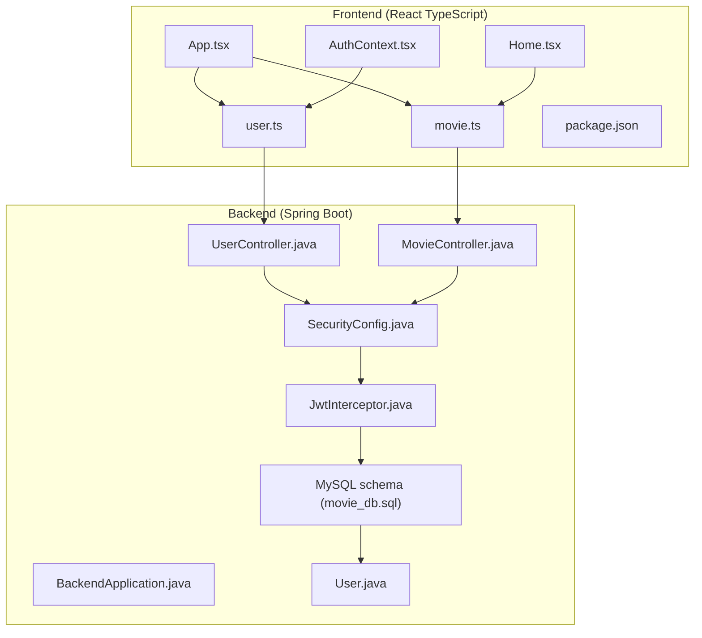
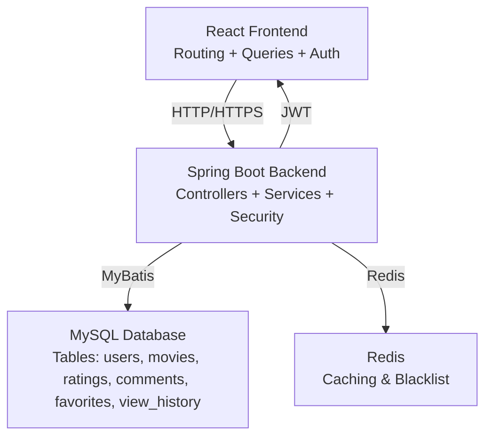
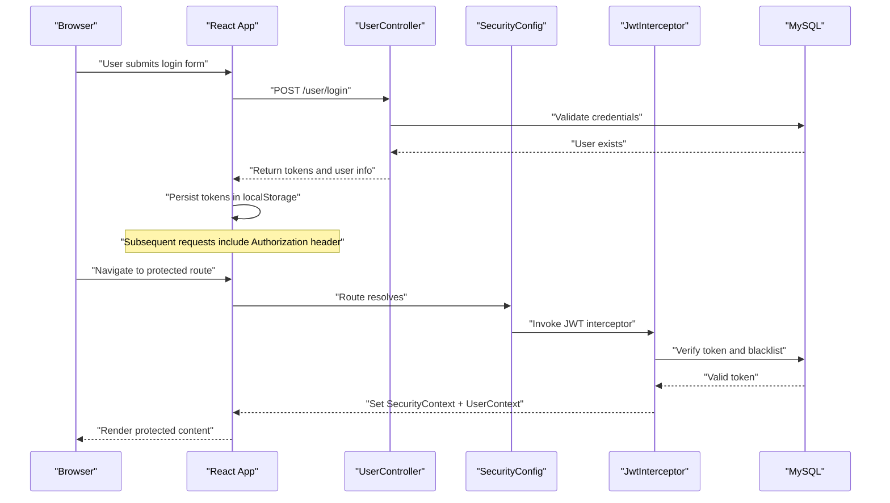
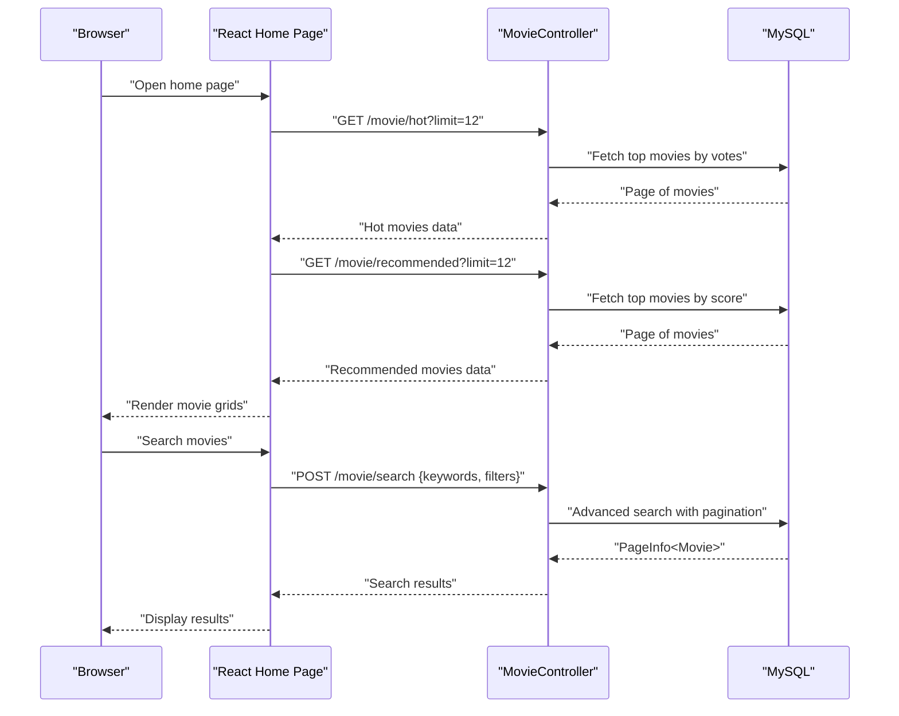
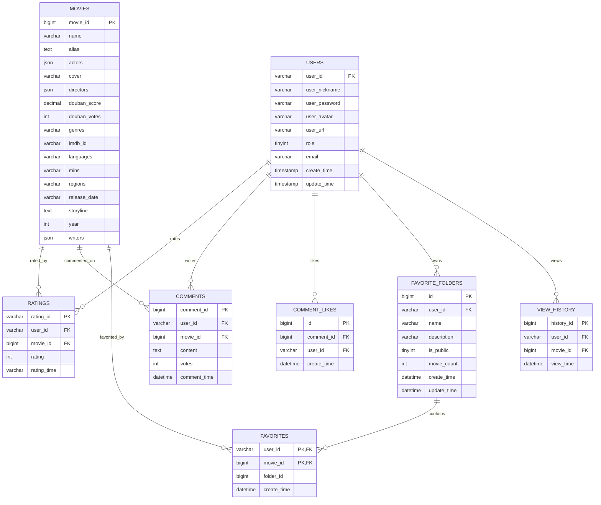
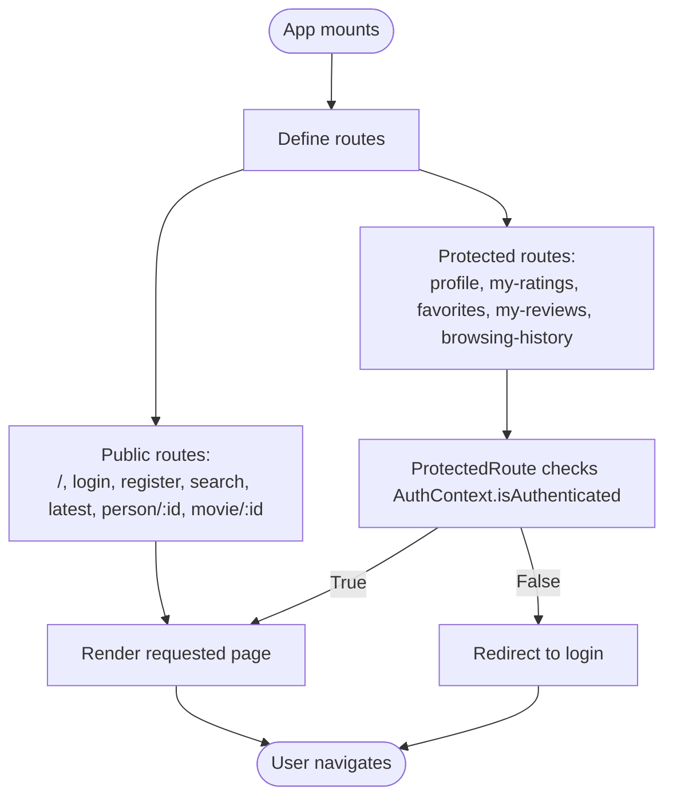
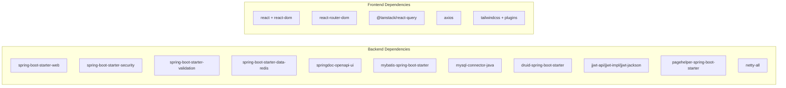

# Project Overview

<cite>
**Referenced Files in This Document**
- [BackendApplication.java](file://backend/src/main/java/com/movie/backend/BackendApplication.java)
- [pom.xml](file://backend/pom.xml)
- [application.yml](file://backend/src/main/resources/application.yml)
- [SecurityConfig.java](file://backend/src/main/java/com/movie/backend/config/SecurityConfig.java)
- [JwtInterceptor.java](file://backend/src/main/java/com/movie/backend/config/JwtInterceptor.java)
- [UserController.java](file://backend/src/main/java/com/movie/backend/controller/UserController.java)
- [MovieController.java](file://backend/src/main/java/com/movie/backend/controller/MovieController.java)
- [User.java](file://backend/src/main/java/com/movie/backend/entity/User.java)
- [movie_db.sql](file://backend/sql/movie_db.sql)
- [App.tsx](file://movie-review-web/src/App.tsx)
- [package.json](file://movie-review-web/package.json)
- [user.ts](file://movie-review-web/src/api/user.ts)
- [movie.ts](file://movie-review-web/src/api/movie.ts)
- [Home.tsx](file://movie-review-web/src/pages/Home.tsx)
- [AuthContext.tsx](file://movie-review-web/src/context/AuthContext.tsx)
</cite>

## Table of Contents
1. [Introduction](#introduction)
2. [Project Structure](#project-structure)
3. [Core Components](#core-components)
4. [Architecture Overview](#architecture-overview)
5. [Detailed Component Analysis](#detailed-component-analysis)
6. [Dependency Analysis](#dependency-analysis)
7. [Performance Considerations](#performance-considerations)
8. [Troubleshooting Guide](#troubleshooting-guide)
9. [Conclusion](#conclusion)
10. [Appendices](#appendices)

## Introduction
Movie System is a full-stack movie review and discovery platform designed to help users browse, discover, rate, and review movies. It emphasizes a modern, responsive web experience powered by a React TypeScript frontend and a robust Java Spring Boot backend. The platform supports user registration and authentication, a comprehensive movie catalog with advanced search and filtering, a rating and review system, and social features such as favorites and viewing history.

Core value proposition:
- Discover movies efficiently via hot/recommended lists, genres, years, and keyword search.
- Build a personalized collection with favorites and custom folders.
- Engage with the community through reviews and likes.
- Maintain a seamless experience with secure authentication and responsive UI.

Key features:
- User management: registration, login/logout, profile updates, and token refresh.
- Movie catalog: detailed views, hot/recommended lists, genre/year filters, and search.
- Review and rating system: submit, update, and manage personal ratings.
- Social features: favorites, custom folders, browsing history, and public profiles.

Technology stack:
- Backend: Java Spring Boot (Web, Security, Validation, MyBatis, Redis, Swagger/OpenAPI, PageHelper).
- Frontend: React 19 with TypeScript, React Router 7, TanStack React Query 5, Axios, TailwindCSS.
- Database: MySQL 8.0 with JSON fields for actors/directors/writers.
- Additional: JWT for stateless authentication, Redis for caching, Druid for connection pooling.

System boundaries:
- Backend exposes REST APIs under /user, /movie, /rating, /favorite, /comment, and related endpoints.
- Frontend consumes these APIs and renders pages for browsing, searching, reviewing, and managing user data.

## Project Structure
The repository is organized into two primary modules:
- backend: Spring Boot application with controllers, services, mappers, entities, configurations, and database scripts.
- movie-review-web: React SPA with routing, API clients, pages, components, and shared types.

**Diagram sources**
- [BackendApplication.java](file://backend/src/main/java/com/movie/backend/BackendApplication.java#L1-L17)
- [SecurityConfig.java](file://backend/src/main/java/com/movie/backend/config/SecurityConfig.java#L1-L51)
- [JwtInterceptor.java](file://backend/src/main/java/com/movie/backend/config/JwtInterceptor.java#L1-L105)
- [UserController.java](file://backend/src/main/java/com/movie/backend/controller/UserController.java#L1-L130)
- [MovieController.java](file://backend/src/main/java/com/movie/backend/controller/MovieController.java#L1-L209)
- [User.java](file://backend/src/main/java/com/movie/backend/entity/User.java#L1-L46)
- [movie_db.sql](file://backend/sql/movie_db.sql#L1-L164)
- [App.tsx](file://movie-review-web/src/App.tsx#L1-L50)
- [Home.tsx](file://movie-review-web/src/pages/Home.tsx#L1-L65)
- [AuthContext.tsx](file://movie-review-web/src/context/AuthContext.tsx#L1-L123)
- [user.ts](file://movie-review-web/src/api/user.ts#L1-L36)
- [movie.ts](file://movie-review-web/src/api/movie.ts#L1-L65)
- [package.json](file://movie-review-web/package.json#L1-L42)

**Section sources**
- [BackendApplication.java](file://backend/src/main/java/com/movie/backend/BackendApplication.java#L1-L17)
- [pom.xml](file://backend/pom.xml#L1-L300)
- [application.yml](file://backend/src/main/resources/application.yml#L1-L4)
- [App.tsx](file://movie-review-web/src/App.tsx#L1-L50)
- [package.json](file://movie-review-web/package.json#L1-L42)

## Core Components
- Backend entrypoint and configuration:
  - Application bootstrap and scheduling enablement.
  - Security configuration enabling method-level authorization and stateless JWT handling.
  - JWT interceptor validating tokens, setting Spring Security context, and populating thread-local user context.
- Controllers:
  - User management endpoints for login, register, info retrieval, avatar update, token refresh, logout, and password change.
  - Movie catalog endpoints for detail, search, hot/recommended lists, genre/year filters, latest releases, and filter metadata.
- Entities and persistence:
  - User entity with role, status, avatar, and password versioning for token invalidation upon password changes.
  - Database schema supporting movies, persons, ratings, comments, favorites, favorite folders, and view history.
- Frontend:
  - Routing with public and protected routes.
  - API clients for user and movie operations.
  - Pages for home, search, movie detail, favorites, ratings, and profile.
  - Authentication context managing tokens and user state with localStorage persistence.

Practical examples:
- Movie browsing:
  - Fetch hot and recommended movies on the home page.
  - Navigate to movie detail and record view history for logged-in users.
- User registration:
  - Submit registration form and automatically log in the new user.
- Review submission:
  - Submit or update a rating for a movie via the movie detail page.

**Section sources**
- [SecurityConfig.java](file://backend/src/main/java/com/movie/backend/config/SecurityConfig.java#L1-L51)
- [JwtInterceptor.java](file://backend/src/main/java/com/movie/backend/config/JwtInterceptor.java#L1-L105)
- [UserController.java](file://backend/src/main/java/com/movie/backend/controller/UserController.java#L1-L130)
- [MovieController.java](file://backend/src/main/java/com/movie/backend/controller/MovieController.java#L1-L209)
- [User.java](file://backend/src/main/java/com/movie/backend/entity/User.java#L1-L46)
- [movie_db.sql](file://backend/sql/movie_db.sql#L1-L164)
- [Home.tsx](file://movie-review-web/src/pages/Home.tsx#L1-L65)
- [AuthContext.tsx](file://movie-review-web/src/context/AuthContext.tsx#L1-L123)
- [user.ts](file://movie-review-web/src/api/user.ts#L1-L36)
- [movie.ts](file://movie-review-web/src/api/movie.ts#L1-L65)

## Architecture Overview
The system follows a clean separation of concerns:
- Frontend (React) handles UI, routing, state, and API interactions.
- Backend (Spring Boot) provides REST APIs, business logic, security, and persistence.
- Database stores structured and semi-structured data (JSON for cast/crew).
- Caching and session management leverage Redis and JWT respectively.

**Diagram sources**
- [App.tsx](file://movie-review-web/src/App.tsx#L1-L50)
- [pom.xml](file://backend/pom.xml#L1-L300)
- [movie_db.sql](file://backend/sql/movie_db.sql#L1-L164)

## Detailed Component Analysis

### Authentication and Authorization Flow
End-to-end flow for login and protected access:

**Diagram sources**
- [UserController.java](file://backend/src/main/java/com/movie/backend/controller/UserController.java#L1-L130)
- [SecurityConfig.java](file://backend/src/main/java/com/movie/backend/config/SecurityConfig.java#L1-L51)
- [JwtInterceptor.java](file://backend/src/main/java/com/movie/backend/config/JwtInterceptor.java#L1-L105)
- [user.ts](file://movie-review-web/src/api/user.ts#L1-L36)
- [AuthContext.tsx](file://movie-review-web/src/context/AuthContext.tsx#L1-L123)

**Section sources**
- [SecurityConfig.java](file://backend/src/main/java/com/movie/backend/config/SecurityConfig.java#L1-L51)
- [JwtInterceptor.java](file://backend/src/main/java/com/movie/backend/config/JwtInterceptor.java#L1-L105)
- [UserController.java](file://backend/src/main/java/com/movie/backend/controller/UserController.java#L1-L130)
- [AuthContext.tsx](file://movie-review-web/src/context/AuthContext.tsx#L1-L123)
- [user.ts](file://movie-review-web/src/api/user.ts#L1-L36)

### Movie Catalog and Search Workflow
End-to-end flow for browsing and searching movies:

**Diagram sources**
- [MovieController.java](file://backend/src/main/java/com/movie/backend/controller/MovieController.java#L1-L209)
- [Home.tsx](file://movie-review-web/src/pages/Home.tsx#L1-L65)
- [movie.ts](file://movie-review-web/src/api/movie.ts#L1-L65)
- [movie_db.sql](file://backend/sql/movie_db.sql#L1-L164)

**Section sources**
- [MovieController.java](file://backend/src/main/java/com/movie/backend/controller/MovieController.java#L1-L209)
- [Home.tsx](file://movie-review-web/src/pages/Home.tsx#L1-L65)
- [movie.ts](file://movie-review-web/src/api/movie.ts#L1-L65)
- [movie_db.sql](file://backend/sql/movie_db.sql#L1-L164)

### Data Model Overview
Core entities and relationships:

**Diagram sources**
- [movie_db.sql](file://backend/sql/movie_db.sql#L1-L164)

**Section sources**
- [movie_db.sql](file://backend/sql/movie_db.sql#L1-L164)

### Frontend Routing and Protected Access
Frontend routing structure and protected route enforcement:

**Diagram sources**
- [App.tsx](file://movie-review-web/src/App.tsx#L1-L50)
- [AuthContext.tsx](file://movie-review-web/src/context/AuthContext.tsx#L1-L123)

**Section sources**
- [App.tsx](file://movie-review-web/src/App.tsx#L1-L50)
- [AuthContext.tsx](file://movie-review-web/src/context/AuthContext.tsx#L1-L123)

## Dependency Analysis
Backend dependencies and their roles:
- Spring Boot starters: web, validation, security, data-redis, openapi/ui.
- MyBatis Spring Boot starter for ORM.
- MySQL connector and Druid for connection pooling.
- Redis for caching and token blacklist storage.
- JWT libraries for token generation/refresh/validation.
- PageHelper for pagination support.
- Hive JDBC included with exclusions and replacements to avoid conflicts.

Frontend dependencies and their roles:
- React 19, React Router 7 for routing.
- TanStack React Query 5 for server state management.
- Axios for HTTP client.
- TailwindCSS and related plugins for styling.

**Diagram sources**
- [pom.xml](file://backend/pom.xml#L1-L300)
- [package.json](file://movie-review-web/package.json#L1-L42)

**Section sources**
- [pom.xml](file://backend/pom.xml#L1-L300)
- [package.json](file://movie-review-web/package.json#L1-L42)

## Performance Considerations
- Pagination: Use page and size parameters for list endpoints to avoid large payloads.
- Caching: Leverage Redis for frequently accessed metadata and reduce DB load.
- Token management: Stateless JWT eliminates session overhead; maintain blacklist for revoked tokens.
- Database indexing: Ensure proper indexes on foreign keys and frequently filtered columns (e.g., movie_id, user_id).
- Frontend caching: React Query’s built-in caching reduces redundant network calls.

## Troubleshooting Guide
Common issues and resolutions:
- Unauthorized access:
  - Verify Authorization header presence and validity.
  - Confirm token is not blacklisted and matches the user context.
- Token refresh failures:
  - Ensure refresh token is provided and valid; backend returns a new access token on success.
- Registration/login errors:
  - Check DTO validation and backend error responses.
  - Confirm localStorage persistence for tokens and user data.
- Search/filter anomalies:
  - Validate search DTO payload and pagination parameters.
  - Confirm database filter metadata endpoints return expected segments.

**Section sources**
- [JwtInterceptor.java](file://backend/src/main/java/com/movie/backend/config/JwtInterceptor.java#L1-L105)
- [UserController.java](file://backend/src/main/java/com/movie/backend/controller/UserController.java#L1-L130)
- [MovieController.java](file://backend/src/main/java/com/movie/backend/controller/MovieController.java#L1-L209)
- [AuthContext.tsx](file://movie-review-web/src/context/AuthContext.tsx#L1-L123)

## Conclusion
Movie System delivers a modern, scalable platform for movie discovery and engagement. Its clean separation of concerns, robust authentication with JWT, and comprehensive catalog APIs enable a smooth user experience. The React frontend integrates seamlessly with Spring Boot backend services, supported by a relational database with JSON fields for flexible casting/crew data. By following the outlined patterns and best practices, teams can extend functionality while maintaining performance and reliability.

## Appendices
- Environment configuration:
  - Active profile is dev, enabling development-specific settings.
- API exposure:
  - OpenAPI/Swagger UI available for endpoint exploration and testing.

**Section sources**
- [application.yml](file://backend/src/main/resources/application.yml#L1-L4)