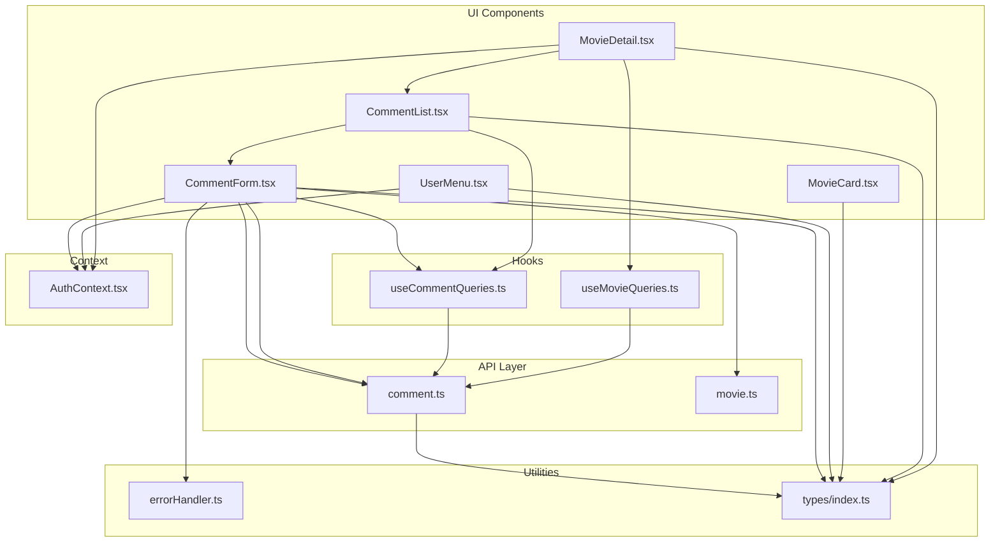
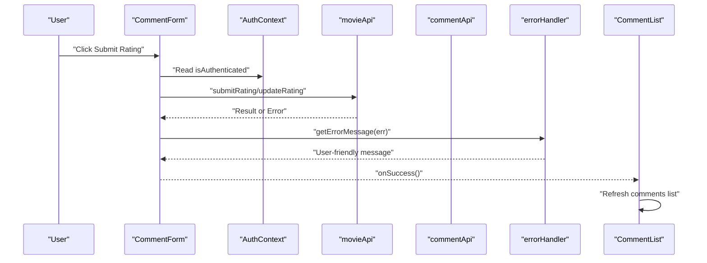
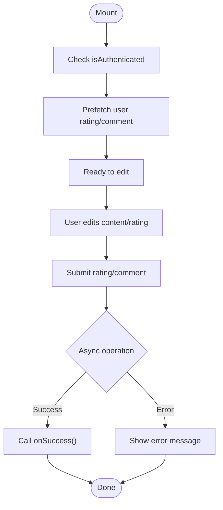
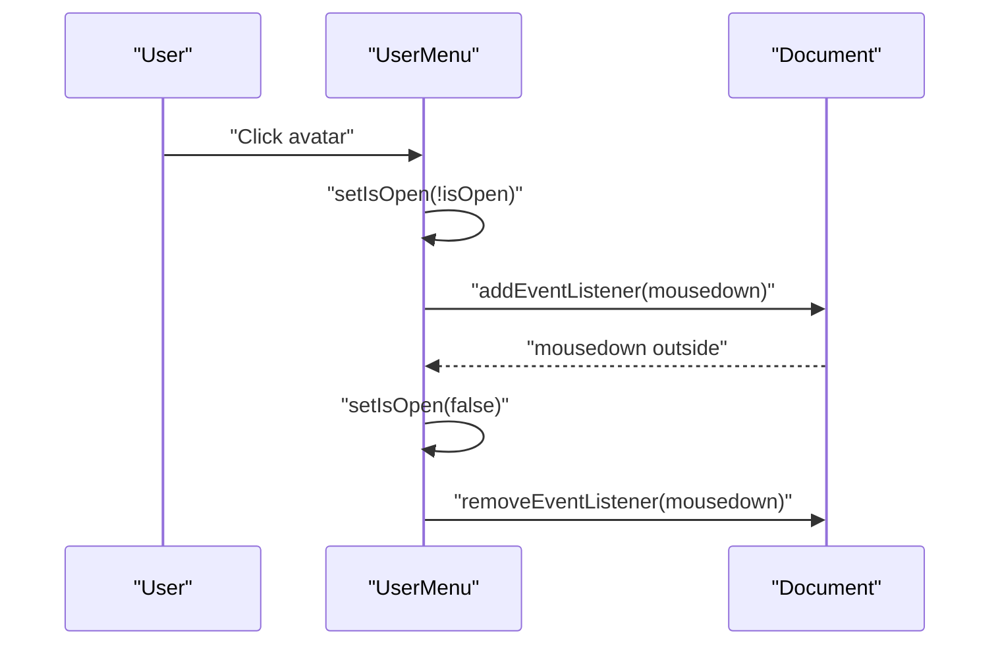
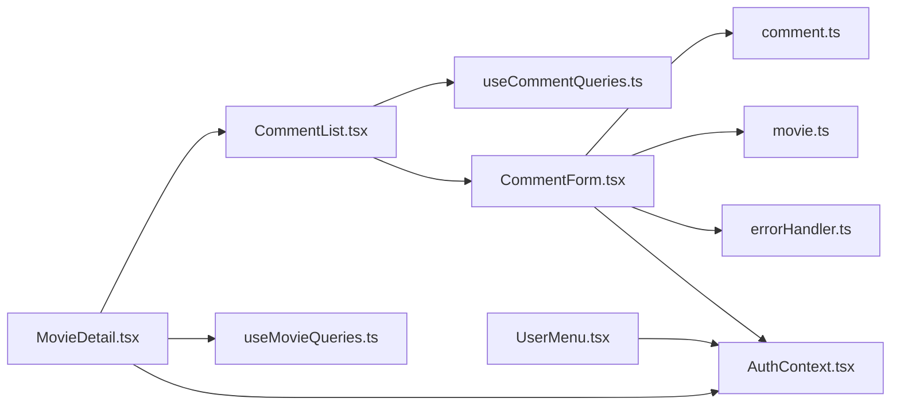

# Local Component State

<cite>
**Referenced Files in This Document**
- [CommentForm.tsx](file://movie-review-web/src/components/CommentForm.tsx)
- [UserMenu.tsx](file://movie-review-web/src/components/UserMenu.tsx)
- [MovieCard.tsx](file://movie-review-web/src/components/MovieCard.tsx)
- [CommentList.tsx](file://movie-review-web/src/components/CommentList.tsx)
- [MovieDetail.tsx](file://movie-review-web/src/pages/MovieDetail.tsx)
- [AuthContext.tsx](file://movie-review-web/src/context/AuthContext.tsx)
- [useCommentQueries.ts](file://movie-review-web/src/hooks/useCommentQueries.ts)
- [useMovieQueries.ts](file://movie-review-web/src/hooks/useMovieQueries.ts)
- [errorHandler.ts](file://movie-review-web/src/utils/errorHandler.ts)
- [comment.ts](file://movie-review-web/src/api/comment.ts)
- [movie.ts](file://movie-review-web/src/api/movie.ts)
- [index.ts](file://movie-review-web/src/types/index.ts)
</cite>

## Table of Contents
1. [Introduction](#introduction)
2. [Project Structure](#project-structure)
3. [Core Components](#core-components)
4. [Architecture Overview](#architecture-overview)
5. [Detailed Component Analysis](#detailed-component-analysis)
6. [Dependency Analysis](#dependency-analysis)
7. [Performance Considerations](#performance-considerations)
8. [Troubleshooting Guide](#troubleshooting-guide)
9. [Conclusion](#conclusion)

## Introduction
This document explains local component state management patterns in the frontend codebase, focusing on how React hooks and controlled components are used to manage UI and form state. It covers:
- useState usage for form state, UI toggles, and transient feedback
- Controlled vs uncontrolled patterns
- Side effects and cleanup
- State lifting strategies and prop drilling alternatives
- When to use local vs global state
- State composition and composition with React Query

The analysis centers on three representative components:
- CommentForm: form state handling, controlled inputs, and optimistic UI updates
- UserMenu: dropdown state and click-outside behavior
- MovieCard: minimal UI state for hover effects

## Project Structure
The frontend is a Vite/React application with TypeScript. State management spans:
- Local component state with useState/useEffect
- Global authentication state via a React Context
- Remote data caching and invalidation via React Query hooks
- Utility functions for error handling and API interactions

**Diagram sources**
- [CommentForm.tsx](file://movie-review-web/src/components/CommentForm.tsx#L1-L222)
- [UserMenu.tsx](file://movie-review-web/src/components/UserMenu.tsx#L1-L120)
- [MovieCard.tsx](file://movie-review-web/src/components/MovieCard.tsx#L1-L38)
- [CommentList.tsx](file://movie-review-web/src/components/CommentList.tsx#L1-L107)
- [MovieDetail.tsx](file://movie-review-web/src/pages/MovieDetail.tsx#L1-L343)
- [AuthContext.tsx](file://movie-review-web/src/context/AuthContext.tsx#L1-L123)
- [useCommentQueries.ts](file://movie-review-web/src/hooks/useCommentQueries.ts#L1-L102)
- [useMovieQueries.ts](file://movie-review-web/src/hooks/useMovieQueries.ts#L1-L95)
- [comment.ts](file://movie-review-web/src/api/comment.ts#L1-L49)
- [movie.ts](file://movie-review-web/src/api/movie.ts#L1-L65)
- [errorHandler.ts](file://movie-review-web/src/utils/errorHandler.ts#L1-L60)
- [index.ts](file://movie-review-web/src/types/index.ts#L1-L204)

**Section sources**
- [CommentForm.tsx](file://movie-review-web/src/components/CommentForm.tsx#L1-L222)
- [UserMenu.tsx](file://movie-review-web/src/components/UserMenu.tsx#L1-L120)
- [MovieCard.tsx](file://movie-review-web/src/components/MovieCard.tsx#L1-L38)
- [CommentList.tsx](file://movie-review-web/src/components/CommentList.tsx#L1-L107)
- [MovieDetail.tsx](file://movie-review-web/src/pages/MovieDetail.tsx#L1-L343)
- [AuthContext.tsx](file://movie-review-web/src/context/AuthContext.tsx#L1-L123)
- [useCommentQueries.ts](file://movie-review-web/src/hooks/useCommentQueries.ts#L1-L102)
- [useMovieQueries.ts](file://movie-review-web/src/hooks/useMovieQueries.ts#L1-L95)
- [comment.ts](file://movie-review-web/src/api/comment.ts#L1-L49)
- [movie.ts](file://movie-review-web/src/api/movie.ts#L1-L65)
- [errorHandler.ts](file://movie-review-web/src/utils/errorHandler.ts#L1-L60)
- [index.ts](file://movie-review-web/src/types/index.ts#L1-L204)

## Core Components
This section highlights the primary patterns demonstrated by the selected components.

- CommentForm
  - Manages form state with useState for content, rating, hoverRating, and flags like hasRated, hasCommented, checkingStatus
  - Uses controlled inputs (textarea and button handlers) and disables inputs during async operations
  - Implements side effects with useEffect to prefill user’s rating/comment on mount and cleanup via a ref flag
  - Handles errors via a shared error handler utility and displays user-friendly messages
  - Calls APIs for submission and updates, and triggers parent callbacks to refresh lists

- UserMenu
  - Maintains a single local state isOpen for dropdown visibility
  - Uses a ref to capture the dropdown container and a document-level event listener to close the menu when clicking outside
  - Demonstrates controlled component behavior by toggling isOpen in response to user actions

- MovieCard
  - Minimal local state: hover scaling via CSS classes and a star badge for score
  - No internal React state is needed; it relies on props and external styles

- CommentList
  - Manages pagination and list state with useState and a callback memoized via useCallback
  - Uses useEffect to initialize the first page load
  - Composes with CommentForm and passes a success callback to refresh the list

- MovieDetail
  - Uses React Query for remote data and mutations
  - Manages local UI state for modal visibility and navigation behavior
  - Integrates with AuthContext for authentication checks and redirects

**Section sources**
- [CommentForm.tsx](file://movie-review-web/src/components/CommentForm.tsx#L14-L222)
- [UserMenu.tsx](file://movie-review-web/src/components/UserMenu.tsx#L6-L120)
- [MovieCard.tsx](file://movie-review-web/src/components/MovieCard.tsx#L11-L38)
- [CommentList.tsx](file://movie-review-web/src/components/CommentList.tsx#L12-L107)
- [MovieDetail.tsx](file://movie-review-web/src/pages/MovieDetail.tsx#L11-L343)

## Architecture Overview
The state lifecycle across components follows a predictable pattern:
- Local state for UI toggles and form inputs
- Controlled components bound to local state
- Side effects for initialization and cleanup
- Global state via AuthContext for user identity
- Remote data via React Query with cache invalidation
- Error handling centralized in a utility

**Diagram sources**
- [CommentForm.tsx](file://movie-review-web/src/components/CommentForm.tsx#L67-L88)
- [AuthContext.tsx](file://movie-review-web/src/context/AuthContext.tsx#L8-L14)
- [movie.ts](file://movie-review-web/src/api/movie.ts#L38-L48)
- [errorHandler.ts](file://movie-review-web/src/utils/errorHandler.ts#L17-L60)
- [CommentList.tsx](file://movie-review-web/src/components/CommentList.tsx#L51-L55)

## Detailed Component Analysis

### CommentForm: Form State and Controlled Inputs
CommentForm demonstrates robust local state management for a dual-purpose form (rating and comment):
- Form state
  - content: string for comment body
  - rating: number for star rating
  - hoverRating: number for interactive hover preview
  - hasRated, hasCommented: flags indicating persisted state
  - checkingStatus: loading indicator while prefetching user’s existing data
  - loading and error: transient UI state during async operations
- Controlled inputs
  - textarea bound to content
  - star buttons bound to rating and hoverRating
  - Buttons disabled when loading or when inputs are empty/invalid
- Side effects and cleanup
  - useEffect to prefetch user’s rating and comment on authentication change
  - Cleanup via a mounted ref to prevent state updates after unmount
- Error handling
  - Centralized error extraction and user-friendly messages
- Composition
  - onSuccess callback to trigger list refresh in parent

**Diagram sources**
- [CommentForm.tsx](file://movie-review-web/src/components/CommentForm.tsx#L34-L64)
- [CommentForm.tsx](file://movie-review-web/src/components/CommentForm.tsx#L67-L112)
- [CommentForm.tsx](file://movie-review-web/src/components/CommentForm.tsx#L28-L31)

**Section sources**
- [CommentForm.tsx](file://movie-review-web/src/components/CommentForm.tsx#L14-L222)
- [errorHandler.ts](file://movie-review-web/src/utils/errorHandler.ts#L17-L60)
- [movie.ts](file://movie-review-web/src/api/movie.ts#L38-L48)
- [comment.ts](file://movie-review-web/src/api/comment.ts#L17-L39)

### UserMenu: Dropdown State and Click-Outsite Behavior
UserMenu manages a simple dropdown:
- Local state
  - isOpen: boolean controlling visibility
- Ref and event listener
  - menuRef captures the dropdown element
  - A document-level mousedown listener closes the menu when clicking outside
- Controlled behavior
  - Toggle isOpen on button click
  - Close on item click or logout action

**Diagram sources**
- [UserMenu.tsx](file://movie-review-web/src/components/UserMenu.tsx#L6-L120)

**Section sources**
- [UserMenu.tsx](file://movie-review-web/src/components/UserMenu.tsx#L6-L120)

### MovieCard: Minimal UI State
MovieCard does not require local state:
- Hover scaling and star badge are handled via props and CSS classes
- No internal React state is needed

**Section sources**
- [MovieCard.tsx](file://movie-review-web/src/components/MovieCard.tsx#L11-L38)

### CommentList: Pagination and List State
CommentList composes local state with API-driven data:
- Local state
  - comments: Comment[]
  - loading: boolean
  - total: number
  - page: number
  - hasMore: boolean
- Memoized fetch callback
  - useCallback to stabilize the function reference across renders
- Initialization and pagination
  - useEffect to load the first page
  - handleLoadMore increments page and fetches more data
- Composition
  - Passes onSuccess to CommentForm to refresh the list after successful submissions

**Section sources**
- [CommentList.tsx](file://movie-review-web/src/components/CommentList.tsx#L12-L107)
- [CommentForm.tsx](file://movie-review-web/src/components/CommentForm.tsx#L14-L222)

### MovieDetail: Local UI State and Global Authentication
MovieDetail integrates local UI state with global authentication and React Query:
- Local state
  - showFolderModal: boolean for folder selection modal
- Authentication
  - Uses AuthContext to check isAuthenticated and redirect to login when needed
- React Query
  - Fetches movie details, favorite status, and folders
  - Uses mutations for add/remove favorite with cache invalidation
- Controlled behavior
  - Button clicks trigger navigation or mutation calls
  - Modal visibility controlled by local state

**Section sources**
- [MovieDetail.tsx](file://movie-review-web/src/pages/MovieDetail.tsx#L11-L343)
- [AuthContext.tsx](file://movie-review-web/src/context/AuthContext.tsx#L8-L14)
- [useMovieQueries.ts](file://movie-review-web/src/hooks/useMovieQueries.ts#L1-L95)

## Dependency Analysis
This section maps how components depend on each other and on shared utilities.

**Diagram sources**
- [CommentForm.tsx](file://movie-review-web/src/components/CommentForm.tsx#L1-L222)
- [CommentList.tsx](file://movie-review-web/src/components/CommentList.tsx#L1-L107)
- [MovieDetail.tsx](file://movie-review-web/src/pages/MovieDetail.tsx#L1-L343)
- [UserMenu.tsx](file://movie-review-web/src/components/UserMenu.tsx#L1-L120)
- [AuthContext.tsx](file://movie-review-web/src/context/AuthContext.tsx#L1-L123)
- [useCommentQueries.ts](file://movie-review-web/src/hooks/useCommentQueries.ts#L1-L102)
- [useMovieQueries.ts](file://movie-review-web/src/hooks/useMovieQueries.ts#L1-L95)
- [comment.ts](file://movie-review-web/src/api/comment.ts#L1-L49)
- [movie.ts](file://movie-review-web/src/api/movie.ts#L1-L65)
- [errorHandler.ts](file://movie-review-web/src/utils/errorHandler.ts#L1-L60)

**Section sources**
- [CommentForm.tsx](file://movie-review-web/src/components/CommentForm.tsx#L1-L222)
- [CommentList.tsx](file://movie-review-web/src/components/CommentList.tsx#L1-L107)
- [MovieDetail.tsx](file://movie-review-web/src/pages/MovieDetail.tsx#L1-L343)
- [UserMenu.tsx](file://movie-review-web/src/components/UserMenu.tsx#L1-L120)
- [AuthContext.tsx](file://movie-review-web/src/context/AuthContext.tsx#L1-L123)
- [useCommentQueries.ts](file://movie-review-web/src/hooks/useCommentQueries.ts#L1-L102)
- [useMovieQueries.ts](file://movie-review-web/src/hooks/useMovieQueries.ts#L1-L95)
- [comment.ts](file://movie-review-web/src/api/comment.ts#L1-L49)
- [movie.ts](file://movie-review-web/src/api/movie.ts#L1-L65)
- [errorHandler.ts](file://movie-review-web/src/utils/errorHandler.ts#L1-L60)

## Performance Considerations
- Prefer controlled components for inputs to keep UI state synchronized and predictable
- Use refs for DOM references (e.g., menu container) and attach/detach event listeners carefully to avoid leaks
- Use cleanup in useEffect to prevent state updates after unmount (mounted ref pattern)
- Memoize callbacks with useCallback when passing to child components to reduce re-renders
- Use React Query for caching and invalidation to minimize redundant network requests
- Disable inputs during async operations to prevent inconsistent state transitions
- Centralize error handling to avoid repeated logic and improve UX consistency

[No sources needed since this section provides general guidance]

## Troubleshooting Guide
Common issues and resolutions:
- Stale UI after form submission
  - Ensure onSuccess is called and the parent refreshes the list
  - Verify React Query cache invalidation keys match the affected queries
- Click-outside not closing dropdown
  - Confirm the ref is attached to the dropdown container and the event listener is removed on cleanup
- Unmounted component updates
  - Use a mounted ref and guard state updates in cleanup
- Confusing error messages
  - Use the centralized error handler to extract user-friendly messages from various error types

**Section sources**
- [CommentForm.tsx](file://movie-review-web/src/components/CommentForm.tsx#L28-L31)
- [UserMenu.tsx](file://movie-review-web/src/components/UserMenu.tsx#L12-L23)
- [errorHandler.ts](file://movie-review-web/src/utils/errorHandler.ts#L17-L60)
- [useCommentQueries.ts](file://movie-review-web/src/hooks/useCommentQueries.ts#L50-L63)
- [useMovieQueries.ts](file://movie-review-web/src/hooks/useMovieQueries.ts#L61-L66)

## Conclusion
The codebase demonstrates clear patterns for local component state:
- Controlled inputs and explicit state updates for forms
- Minimal UI state for simple interactions
- Careful side effect management with cleanup
- Composition with React Query for remote data and cache invalidation
- Centralized error handling for consistent user feedback

These patterns help maintain predictable UI behavior, efficient rendering, and a clean separation between local UI state and global authentication and data state.