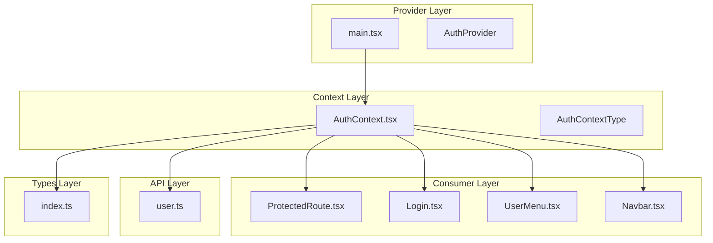
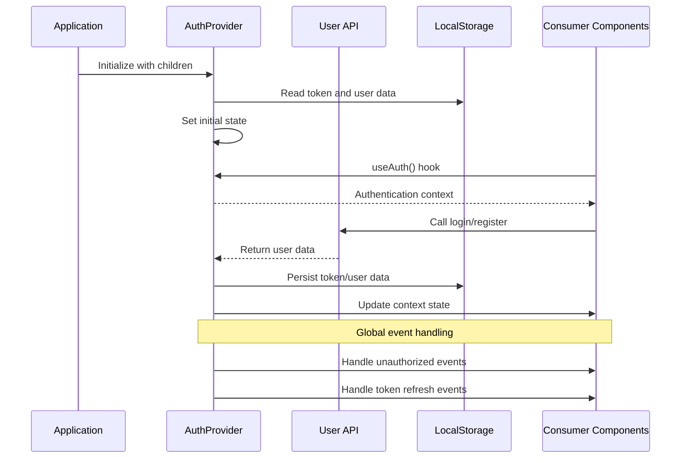
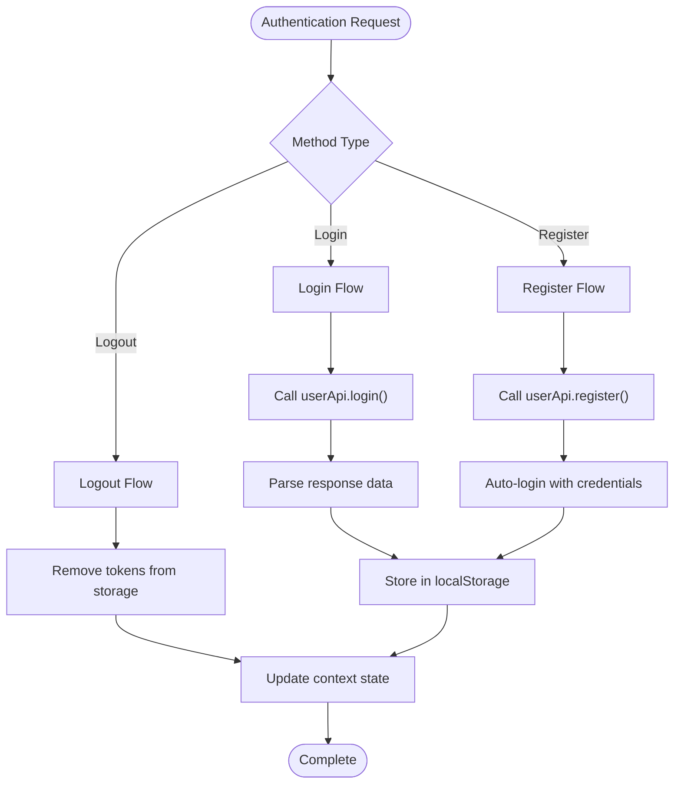
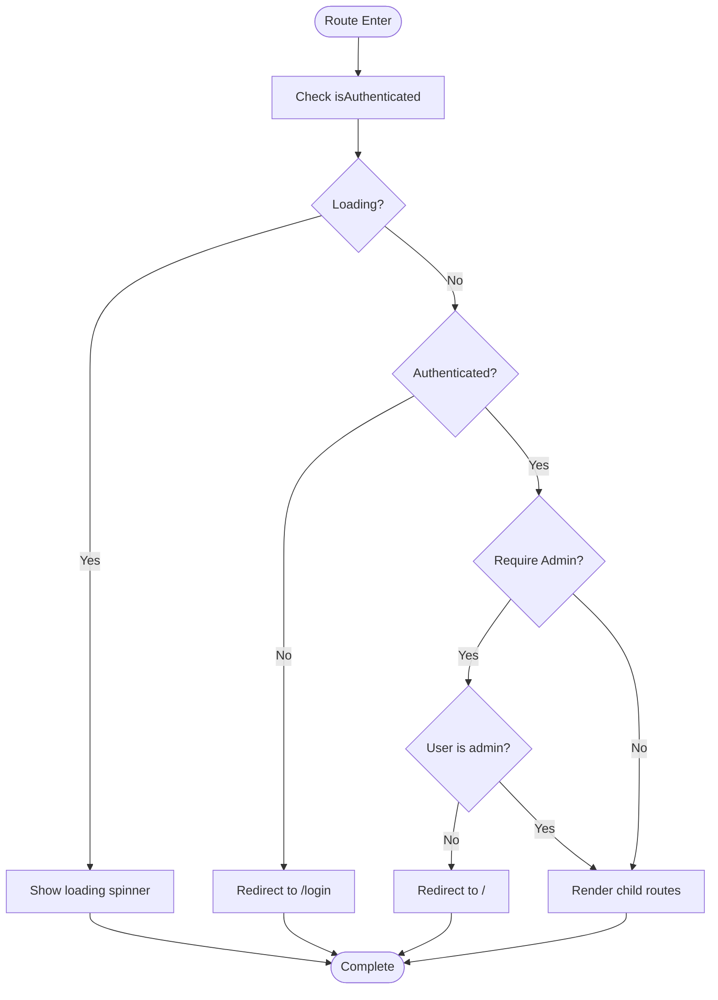
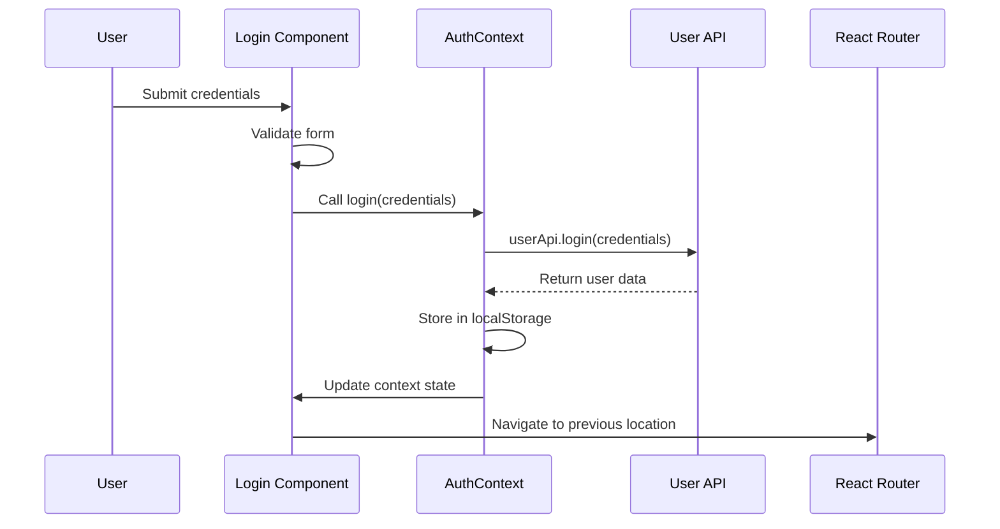
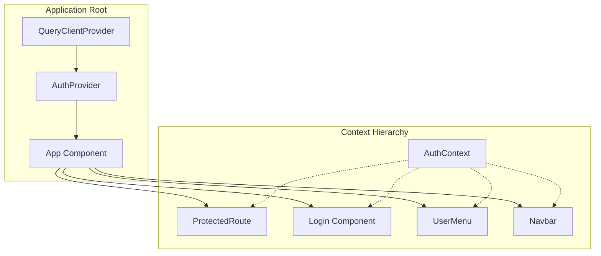
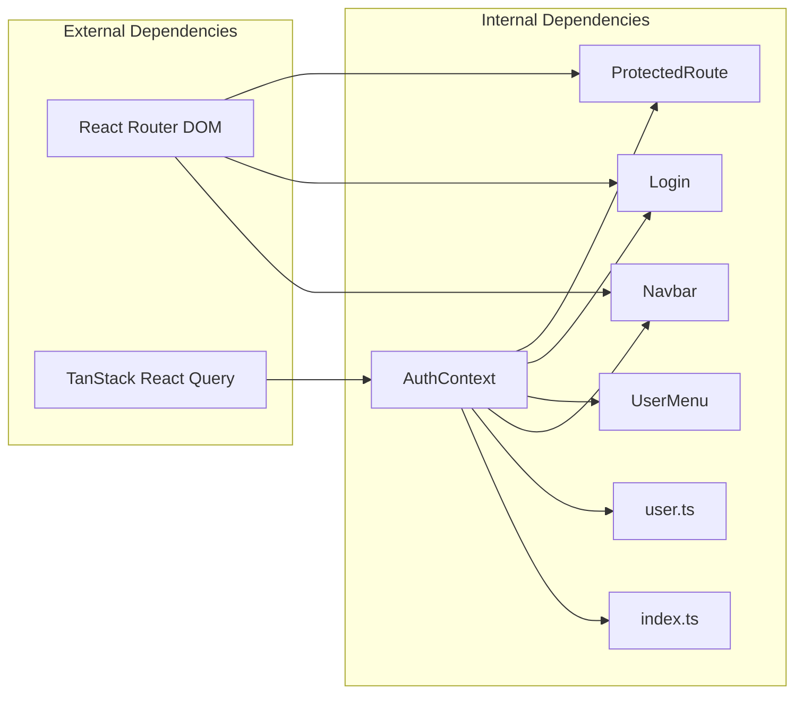

# React Context Implementation

<cite>
**Referenced Files in This Document**
- [AuthContext.tsx](file://movie-review-web/src/context/AuthContext.tsx)
- [index.ts](file://movie-review-web/src/types/index.ts)
- [main.tsx](file://movie-review-web/src/main.tsx)
- [App.tsx](file://movie-review-web/src/App.tsx)
- [ProtectedRoute.tsx](file://movie-review-web/src/components/ProtectedRoute.tsx)
- [Login.tsx](file://movie-review-web/src/pages/Login.tsx)
- [UserMenu.tsx](file://movie-review-web/src/components/UserMenu.tsx)
- [Navbar.tsx](file://movie-review-web/src/components/Navbar.tsx)
- [user.ts](file://movie-review-web/src/api/user.ts)
</cite>

## Table of Contents
1. [Introduction](#introduction)
2. [Project Structure](#project-structure)
3. [Core Components](#core-components)
4. [Architecture Overview](#architecture-overview)
5. [Detailed Component Analysis](#detailed-component-analysis)
6. [Dependency Analysis](#dependency-analysis)
7. [Performance Considerations](#performance-considerations)
8. [Troubleshooting Guide](#troubleshooting-guide)
9. [Conclusion](#conclusion)

## Introduction
This document provides comprehensive documentation for the React Context implementation in the movie system, focusing on the AuthContext provider setup, authentication state management, and user session handling. The implementation demonstrates modern React patterns for centralized authentication state, including provider configuration, consumer patterns, authentication flows, and performance optimization strategies.

## Project Structure
The authentication system is organized across several key files within the frontend application:

**Diagram sources**
- [AuthContext.tsx](file://movie-review-web/src/context/AuthContext.tsx#L1-L123)
- [main.tsx](file://movie-review-web/src/main.tsx#L1-L41)
- [index.ts](file://movie-review-web/src/types/index.ts#L105-L114)

**Section sources**
- [AuthContext.tsx](file://movie-review-web/src/context/AuthContext.tsx#L1-L123)
- [main.tsx](file://movie-review-web/src/main.tsx#L1-L41)

## Core Components
The authentication system centers around a single AuthContext provider that manages user authentication state and exposes authentication methods to consuming components.

### AuthContext Provider Setup
The AuthContext provider implements a sophisticated state management system with the following key features:

- **Persistent State Initialization**: Uses lazy initialization to read from localStorage during component mounting
- **Centralized Authentication Methods**: Provides login, register, and logout functionality
- **Global Event Handling**: Listens for unauthorized events and token refresh notifications
- **Type Safety**: Comprehensive TypeScript integration with strict typing

### Context Value Structure
The AuthContextType interface defines the complete authentication state surface:

| Property | Type | Description |
|----------|------|-------------|
| `user` | `User \| null` | Current authenticated user object or null |
| `token` | `string \| null` | JWT authentication token or null |
| `isAuthenticated` | `boolean` | Computed authentication status |
| `login` | `(credentials: LoginDTO) => Promise<void>` | User login method |
| `register` | `(userData: RegisterDTO) => Promise<void>` | User registration method |
| `logout` | `() => void` | User logout method |
| `loading` | `boolean` | Loading state indicator |

**Section sources**
- [AuthContext.tsx](file://movie-review-web/src/context/AuthContext.tsx#L105-L120)
- [index.ts](file://movie-review-web/src/types/index.ts#L105-L114)

## Architecture Overview
The authentication architecture follows a unidirectional data flow pattern with centralized state management:

**Diagram sources**
- [AuthContext.tsx](file://movie-review-web/src/context/AuthContext.tsx#L20-L123)
- [user.ts](file://movie-review-web/src/api/user.ts#L4-L36)

## Detailed Component Analysis

### AuthContext Provider Implementation
The AuthProvider component serves as the central state manager for authentication:

#### State Management Strategy
The provider implements three key optimizations for state initialization:

1. **Lazy Initialization Pattern**: Uses factory functions to initialize state from localStorage
2. **Synchronous State Setting**: Eliminates useEffect dependencies for immediate state availability
3. **Error Handling**: Robust parsing with fallback mechanisms for corrupted storage data

#### Authentication Methods
The provider exposes three primary authentication methods:

**Diagram sources**
- [AuthContext.tsx](file://movie-review-web/src/context/AuthContext.tsx#L44-L86)
- [user.ts](file://movie-review-web/src/api/user.ts#L6-L15)

#### Global Event Handling
The provider implements comprehensive event-driven state management:

| Event Type | Trigger | Action |
|------------|---------|---------|
| `auth:unauthorized` | Unauthorized API response | Logout user automatically |
| `auth:token-refreshed` | Token refresh completion | Update token in context |

**Section sources**
- [AuthContext.tsx](file://movie-review-web/src/context/AuthContext.tsx#L88-L110)

### Consumer Components

#### ProtectedRoute Component
The ProtectedRoute component demonstrates advanced route protection patterns:

**Diagram sources**
- [ProtectedRoute.tsx](file://movie-review-web/src/components/ProtectedRoute.tsx#L11-L36)

#### Login Component Integration
The Login component showcases proper form handling with authentication integration:

**Diagram sources**
- [Login.tsx](file://movie-review-web/src/pages/Login.tsx#L36-L61)
- [AuthContext.tsx](file://movie-review-web/src/context/AuthContext.tsx#L44-L63)

**Section sources**
- [ProtectedRoute.tsx](file://movie-review-web/src/components/ProtectedRoute.tsx#L1-L36)
- [Login.tsx](file://movie-review-web/src/pages/Login.tsx#L1-L148)

### Context Value Structure and Provider Configuration

#### Provider Composition Patterns
The AuthProvider is integrated at the application root level with proper composition:

**Diagram sources**
- [main.tsx](file://movie-review-web/src/main.tsx#L31-L39)
- [App.tsx](file://movie-review-web/src/App.tsx#L18-L48)

#### Consumer Patterns
Components consume authentication state through the useAuth hook:

| Component | Usage Pattern | State Dependencies |
|-----------|---------------|-------------------|
| ProtectedRoute | `useAuth().isAuthenticated` | Authentication status |
| Login | `useAuth().login()` | Authentication methods |
| UserMenu | `useAuth().user, useAuth().logout()` | User data and actions |
| Navbar | `useAuth().isAuthenticated` | Authentication status |

**Section sources**
- [main.tsx](file://movie-review-web/src/main.tsx#L31-L39)
- [ProtectedRoute.tsx](file://movie-review-web/src/components/ProtectedRoute.tsx#L11-L12)
- [Login.tsx](file://movie-review-web/src/pages/Login.tsx#L17-L17)
- [UserMenu.tsx](file://movie-review-web/src/components/UserMenu.tsx#L7-L7)
- [Navbar.tsx](file://movie-review-web/src/components/Navbar.tsx#L8-L8)

## Dependency Analysis
The authentication system exhibits clean dependency relationships with minimal coupling:

**Diagram sources**
- [main.tsx](file://movie-review-web/src/main.tsx#L3-L7)
- [AuthContext.tsx](file://movie-review-web/src/context/AuthContext.tsx#L1-L3)

**Section sources**
- [main.tsx](file://movie-review-web/src/main.tsx#L1-L41)
- [AuthContext.tsx](file://movie-review-web/src/context/AuthContext.tsx#L1-L5)

## Performance Considerations

### State Initialization Optimization
The provider implements lazy initialization to eliminate unnecessary re-renders:

- **Immediate State Availability**: State is populated during component mounting
- **Eliminated useEffect Dependencies**: No additional state updates after initial render
- **Reduced Re-render Cycles**: Stable initial state prevents cascading updates

### Memory Management Strategies
The implementation includes several memory optimization techniques:

- **Callback Memoization**: The logout function uses useCallback to prevent unnecessary re-creations
- **Event Listener Cleanup**: Proper cleanup of global event listeners in useEffect return functions
- **LocalStorage Management**: Efficient storage operations with error handling

### Rendering Performance
Consumer components benefit from optimized rendering patterns:

- **Selective Updates**: Components only re-render when their specific auth state changes
- **Minimal Context Subscriptions**: Each component consumes only required context properties
- **Stable Reference Patterns**: Consistent function references prevent unnecessary re-renders

## Troubleshooting Guide

### Common Context Issues
Several potential issues can arise in context implementations:

#### Context Provider Errors
**Problem**: `useAuth must be used within AuthProvider`
**Solution**: Ensure all components using the hook are wrapped in the AuthProvider

#### State Synchronization Issues
**Problem**: Inconsistent state between localStorage and context
**Solution**: Verify localStorage operations occur before state updates

#### Authentication Flow Problems
**Problem**: Users remain logged in despite token expiration
**Solution**: Implement proper unauthorized event handling and automatic logout

### Debugging Techniques
Recommended debugging approaches for context implementations:

1. **Console Logging**: Add strategic console.log statements in provider methods
2. **React DevTools**: Use Profiler to identify unnecessary re-renders
3. **Network Inspection**: Monitor API calls and response times
4. **Storage Inspection**: Verify localStorage state persistence

### Best Practices for State Sharing
Key practices for maintaining robust context implementations:

- **Immutable State Updates**: Always create new state objects rather than mutating existing ones
- **Error Boundaries**: Implement proper error handling for API failures
- **Type Safety**: Maintain strict TypeScript typing throughout the context
- **Cleanup Procedures**: Always clean up event listeners and subscriptions

**Section sources**
- [AuthContext.tsx](file://movie-review-web/src/context/AuthContext.tsx#L8-L14)
- [AuthContext.tsx](file://movie-review-web/src/context/AuthContext.tsx#L88-L110)

## Conclusion
The React Context implementation in the movie system demonstrates a mature approach to authentication state management. The AuthContext provider effectively centralizes authentication logic while maintaining excellent performance characteristics through lazy initialization and efficient state management. The implementation showcases best practices for context usage, including proper provider composition, consumer patterns, and error handling strategies.

The system's architecture supports scalable growth while maintaining simplicity for developers. The integration with React Router enables seamless protected routing, and the comprehensive event handling system ensures robust authentication state management across the application.

Key strengths of this implementation include:
- **Performance Optimization**: Lazy initialization eliminates unnecessary re-renders
- **Type Safety**: Complete TypeScript integration with strict typing
- **Error Handling**: Comprehensive error management and recovery strategies
- **Extensibility**: Clean architecture supporting future authentication enhancements

This implementation serves as an excellent reference for React applications requiring centralized authentication state management.