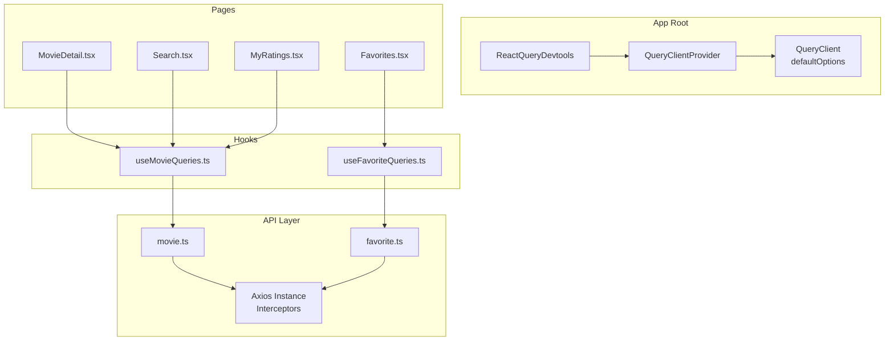
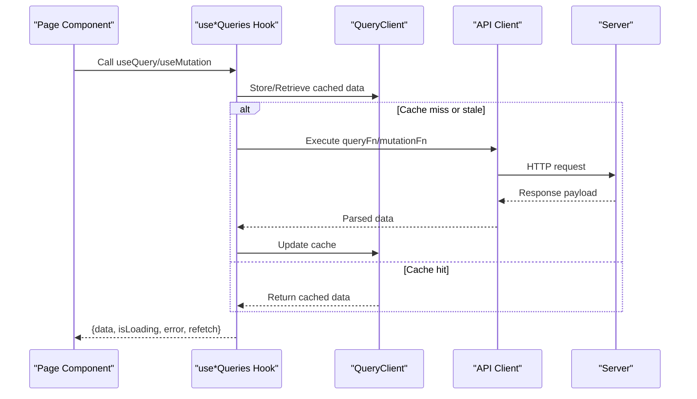
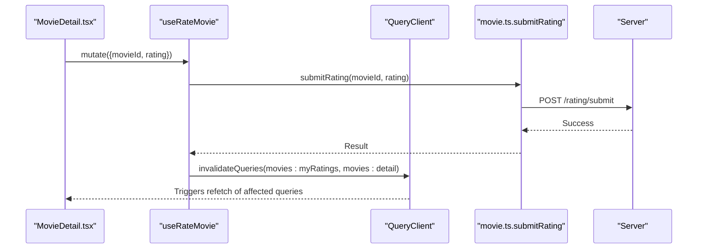
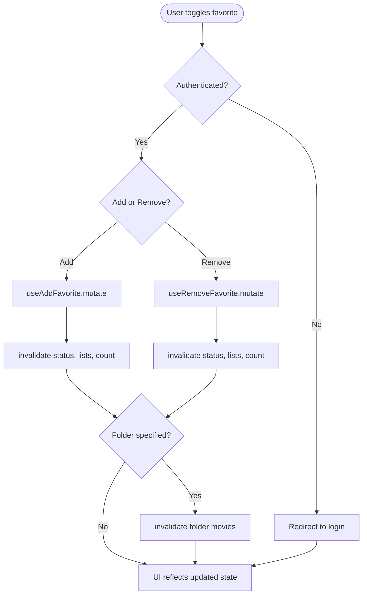
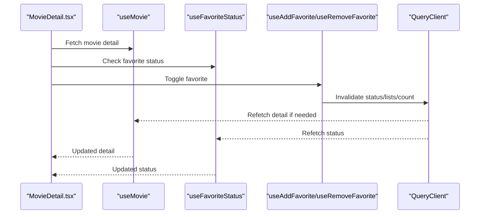
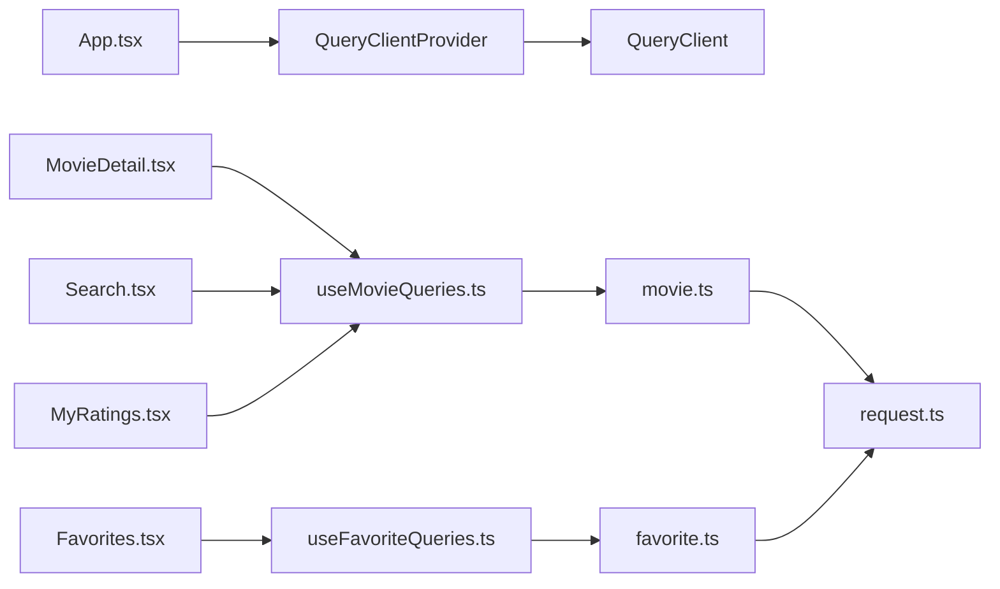

# React Query Data Management

<cite>
**Referenced Files in This Document**
- [main.tsx](file://movie-review-web/src/main.tsx)
- [App.tsx](file://movie-review-web/src/App.tsx)
- [request.ts](file://movie-review-web/src/api/request.ts)
- [movie.ts](file://movie-review-web/src/api/movie.ts)
- [favorite.ts](file://movie-review-web/src/api/favorite.ts)
- [useMovieQueries.ts](file://movie-review-web/src/hooks/useMovieQueries.ts)
- [useFavoriteQueries.ts](file://movie-review-web/src/hooks/useFavoriteQueries.ts)
- [index.ts](file://movie-review-web/src/types/index.ts)
- [MovieDetail.tsx](file://movie-review-web/src/pages/MovieDetail.tsx)
- [Search.tsx](file://movie-review-web/src/pages/Search.tsx)
- [Favorites.tsx](file://movie-review-web/src/pages/Favorites.tsx)
- [MyRatings.tsx](file://movie-review-web/src/pages/MyRatings.tsx)
</cite>

## Table of Contents
1. [Introduction](#introduction)
2. [Project Structure](#project-structure)
3. [Core Components](#core-components)
4. [Architecture Overview](#architecture-overview)
5. [Detailed Component Analysis](#detailed-component-analysis)
6. [Dependency Analysis](#dependency-analysis)
7. [Performance Considerations](#performance-considerations)
8. [Troubleshooting Guide](#troubleshooting-guide)
9. [Conclusion](#conclusion)

## Introduction
This document explains the React Query implementation and data management patterns used in the movie review web application. It covers query configuration, caching strategies, data synchronization, query hooks creation, mutation handling, cache invalidation, pagination, search queries, and real-time-like updates. It also documents error handling, loading states, and optimistic updates, with practical examples drawn from user queries, favorite management, and movie data fetching.

## Project Structure
The frontend uses React Query at the application root to configure default caching and refetching behavior. API clients encapsulate HTTP communication and authentication, while dedicated hooks centralize query and mutation logic. Pages consume these hooks to render UI and manage user interactions.

**Diagram sources**
- [main.tsx](file://movie-review-web/src/main.tsx#L9-L29)
- [request.ts](file://movie-review-web/src/api/request.ts#L1-L108)
- [movie.ts](file://movie-review-web/src/api/movie.ts#L1-L65)
- [favorite.ts](file://movie-review-web/src/api/favorite.ts#L1-L97)
- [useMovieQueries.ts](file://movie-review-web/src/hooks/useMovieQueries.ts#L1-L95)
- [useFavoriteQueries.ts](file://movie-review-web/src/hooks/useFavoriteQueries.ts#L1-L174)
- [MovieDetail.tsx](file://movie-review-web/src/pages/MovieDetail.tsx#L1-L343)
- [Search.tsx](file://movie-review-web/src/pages/Search.tsx#L1-L67)
- [Favorites.tsx](file://movie-review-web/src/pages/Favorites.tsx#L1-L803)
- [MyRatings.tsx](file://movie-review-web/src/pages/MyRatings.tsx#L1-L270)

**Section sources**
- [main.tsx](file://movie-review-web/src/main.tsx#L1-L41)
- [App.tsx](file://movie-review-web/src/App.tsx#L1-L50)

## Core Components
- QueryClient and defaults: Configured at app startup with staleTime, garbage collection time, retries, and refetch policies.
- API clients: Centralized HTTP client with interceptors for auth headers and 401 refresh logic.
- Query keys: Strongly typed keys for movies and favorites to enable precise cache invalidation.
- Query hooks: Encapsulate queries and mutations with proper error/loading handling.
- Page components: Consume hooks to render UI and orchestrate user actions.

**Section sources**
- [main.tsx](file://movie-review-web/src/main.tsx#L9-L29)
- [request.ts](file://movie-review-web/src/api/request.ts#L1-L108)
- [useMovieQueries.ts](file://movie-review-web/src/hooks/useMovieQueries.ts#L5-L12)
- [useFavoriteQueries.ts](file://movie-review-web/src/hooks/useFavoriteQueries.ts#L5-L16)
- [movie.ts](file://movie-review-web/src/api/movie.ts#L15-L65)
- [favorite.ts](file://movie-review-web/src/api/favorite.ts#L4-L97)

## Architecture Overview
React Query manages server state centrally. Queries are keyed per resource and parameter set, enabling automatic caching and deduplication. Mutations trigger targeted cache invalidations to keep views synchronized. The HTTP client handles authentication and transparently refreshes tokens when needed.

**Diagram sources**
- [main.tsx](file://movie-review-web/src/main.tsx#L9-L29)
- [useMovieQueries.ts](file://movie-review-web/src/hooks/useMovieQueries.ts#L14-L95)
- [useFavoriteQueries.ts](file://movie-review-web/src/hooks/useFavoriteQueries.ts#L18-L174)
- [request.ts](file://movie-review-web/src/api/request.ts#L21-L106)

## Detailed Component Analysis

### QueryClient Configuration
- Stale time: 5 minutes to balance freshness and performance.
- Garbage collection: 30 minutes to retain inactive data.
- Retry policy: One retry for queries; mutations do not retry automatically.
- Refetch policies: Window focus disabled; reconnect enabled to refresh on network reconnection.

These defaults ensure efficient caching and resilient data fetching.

**Section sources**
- [main.tsx](file://movie-review-web/src/main.tsx#L9-L29)

### HTTP Client and Authentication Interceptor
- Base URL and timeout configured.
- Authorization header injected from local storage.
- 401 handling:
  - Attempts silent refresh using refresh token.
  - Queues pending requests during refresh.
  - Dispatches global events to update auth state and logs out on failure.

This ensures seamless authentication continuity and prevents redundant errors.

**Section sources**
- [request.ts](file://movie-review-web/src/api/request.ts#L8-L11)
- [request.ts](file://movie-review-web/src/api/request.ts#L13-L19)
- [request.ts](file://movie-review-web/src/api/request.ts#L21-L106)

### Movie Queries and Mutations
- Query keys:
  - Shared base key for movies.
  - Detail, my ratings, search, and latest with parameterized segments.
- Queries:
  - useMovie: Enabled only when movieId > 0; merges optional options.
  - useMyRatings: Paginated personal ratings.
  - useMovieSearch: Enabled only when keyword is present.
  - useLatestMovies: Paginated latest movies.
- Mutations:
  - useRateMovie: Submits rating; invalidates my ratings and detail caches.
  - useDeleteRatingsBatch: Batch delete; invalidates all rating pages.
  - useClearMyRatings: Clear all ratings; invalidates rating cache.

**Diagram sources**
- [useMovieQueries.ts](file://movie-review-web/src/hooks/useMovieQueries.ts#L54-L68)
- [movie.ts](file://movie-review-web/src/api/movie.ts#L38-L48)

**Section sources**
- [useMovieQueries.ts](file://movie-review-web/src/hooks/useMovieQueries.ts#L5-L12)
- [useMovieQueries.ts](file://movie-review-web/src/hooks/useMovieQueries.ts#L14-L50)
- [useMovieQueries.ts](file://movie-review-web/src/hooks/useMovieQueries.ts#L52-L95)
- [movie.ts](file://movie-review-web/src/api/movie.ts#L15-L65)

### Favorite Queries and Mutations
- Query keys:
  - Lists, counts, statuses, folders, and folder movies with parameterized segments.
- Queries:
  - useMyFavorites, useFavoritesCount, useFavoriteStatus, useMyFolders, useFolderDetail, useFolderMovies.
- Mutations:
  - useAddFavorite, useRemoveFavorite: Invalidate status, lists, count, and optionally folder movies.
  - useBatchDeleteFavorites: Invalidate all favorites.
  - useCreateFolder, useUpdateFolder, useDeleteFolder: Invalidate related folder caches.

**Diagram sources**
- [useFavoriteQueries.ts](file://movie-review-web/src/hooks/useFavoriteQueries.ts#L79-L121)
- [useFavoriteQueries.ts](file://movie-review-web/src/hooks/useFavoriteQueries.ts#L135-L173)

**Section sources**
- [useFavoriteQueries.ts](file://movie-review-web/src/hooks/useFavoriteQueries.ts#L5-L16)
- [useFavoriteQueries.ts](file://movie-review-web/src/hooks/useFavoriteQueries.ts#L18-L75)
- [useFavoriteQueries.ts](file://movie-review-web/src/hooks/useFavoriteQueries.ts#L77-L174)
- [favorite.ts](file://movie-review-web/src/api/favorite.ts#L4-L97)

### Data Models and Types
- ApiResponse<T>: Standardized envelope for server responses.
- Movie, PageInfo<T>, Rating, MyFavoriteVO, FavoriteFolderVO, and related DTOs define shapes for queries and mutations.

These types unify data contracts across API boundaries and hooks.

**Section sources**
- [index.ts](file://movie-review-web/src/types/index.ts#L1-L6)
- [index.ts](file://movie-review-web/src/types/index.ts#L24-L51)
- [index.ts](file://movie-review-web/src/types/index.ts#L146-L187)
- [index.ts](file://movie-review-web/src/types/index.ts#L162-L168)

### Example: Movie Detail Page
- Uses useMovie for detail data and useFavoriteStatus for current favorite state.
- Handles loading, error, and disabled states during favorite operations.
- Integrates with AuthContext to gate protected actions.

**Diagram sources**
- [MovieDetail.tsx](file://movie-review-web/src/pages/MovieDetail.tsx#L11-L31)
- [useMovieQueries.ts](file://movie-review-web/src/hooks/useMovieQueries.ts#L14-L25)
- [useFavoriteQueries.ts](file://movie-review-web/src/hooks/useFavoriteQueries.ts#L39-L46)

**Section sources**
- [MovieDetail.tsx](file://movie-review-web/src/pages/MovieDetail.tsx#L11-L31)
- [useMovieQueries.ts](file://movie-review-web/src/hooks/useMovieQueries.ts#L14-L25)
- [useFavoriteQueries.ts](file://movie-review-web/src/hooks/useFavoriteQueries.ts#L39-L46)

### Example: Search Page
- Uses useMovieSearch with enabled guard to avoid empty queries.
- Renders loading and empty states; displays paginated results.

**Section sources**
- [Search.tsx](file://movie-review-web/src/pages/Search.tsx#L7-L16)
- [useMovieQueries.ts](file://movie-review-web/src/hooks/useMovieQueries.ts#L35-L42)

### Example: Favorites Page
- Manages folder navigation and pagination.
- Implements batch operations with targeted invalidations.

**Section sources**
- [Favorites.tsx](file://movie-review-web/src/pages/Favorites.tsx#L1-L803)
- [useFavoriteQueries.ts](file://movie-review-web/src/hooks/useFavoriteQueries.ts#L18-L75)
- [useFavoriteQueries.ts](file://movie-review-web/src/hooks/useFavoriteQueries.ts#L123-L133)

### Example: My Ratings Page
- Displays paginated ratings and supports batch delete and clear.
- Uses mutations with onSuccess callbacks to update UI and reset selection.

**Section sources**
- [MyRatings.tsx](file://movie-review-web/src/pages/MyRatings.tsx#L8-L79)
- [useMovieQueries.ts](file://movie-review-web/src/hooks/useMovieQueries.ts#L69-L95)

## Dependency Analysis
- QueryClientProvider wraps the app and exposes cache/mutations to all components.
- Hooks depend on API clients; API clients depend on the shared HTTP instance.
- Pages depend on hooks; hooks depend on query keys and QueryClient for cache invalidation.

**Diagram sources**
- [App.tsx](file://movie-review-web/src/App.tsx#L18-L48)
- [main.tsx](file://movie-review-web/src/main.tsx#L31-L39)
- [useMovieQueries.ts](file://movie-review-web/src/hooks/useMovieQueries.ts#L1-L3)
- [useFavoriteQueries.ts](file://movie-review-web/src/hooks/useFavoriteQueries.ts#L1-L3)
- [movie.ts](file://movie-review-web/src/api/movie.ts#L1-L3)
- [favorite.ts](file://movie-review-web/src/api/favorite.ts#L1-L2)
- [request.ts](file://movie-review-web/src/api/request.ts#L1-L1)

**Section sources**
- [App.tsx](file://movie-review-web/src/App.tsx#L18-L48)
- [main.tsx](file://movie-review-web/src/main.tsx#L31-L39)
- [useMovieQueries.ts](file://movie-review-web/src/hooks/useMovieQueries.ts#L1-L3)
- [useFavoriteQueries.ts](file://movie-review-web/src/hooks/useFavoriteQueries.ts#L1-L3)
- [movie.ts](file://movie-review-web/src/api/movie.ts#L1-L3)
- [favorite.ts](file://movie-review-web/src/api/favorite.ts#L1-L2)
- [request.ts](file://movie-review-web/src/api/request.ts#L1-L1)

## Performance Considerations
- Caching strategy:
  - Stale time of 5 minutes balances freshness and reduces network usage.
  - GC time of 30 minutes retains data efficiently.
- Automatic deduplication:
  - Same query keys prevent concurrent duplicate requests.
- Background refetching:
  - Enabled on reconnect to recover from offline scenarios.
- Pagination:
  - Parameterized keys ensure separate cache entries per page and filter set.
- Error handling:
  - Centralized interceptor surfaces meaningful messages and triggers logout on 401.

Recommendations:
- Prefer enabled guards for queries dependent on optional parameters.
- Use selective invalidations to minimize unnecessary refetches.
- Consider query prefetching on route transitions for smoother UX.

**Section sources**
- [main.tsx](file://movie-review-web/src/main.tsx#L9-L29)
- [useMovieQueries.ts](file://movie-review-web/src/hooks/useMovieQueries.ts#L35-L42)
- [useFavoriteQueries.ts](file://movie-review-web/src/hooks/useFavoriteQueries.ts#L20-L26)

## Troubleshooting Guide
Common issues and resolutions:
- Unauthorized requests:
  - Symptom: 401 errors and logout.
  - Resolution: Silent refresh flow runs automatically; ensure refresh token exists and retry logic completes.
- Stale data after mutation:
  - Symptom: UI not reflecting updates immediately.
  - Resolution: Verify invalidation keys match query keys; confirm onSuccess handlers are invoked.
- Duplicate requests:
  - Symptom: Multiple identical requests firing.
  - Resolution: Ensure query keys are parameterized and unique; avoid dynamic objects as keys.
- Infinite refetch loops:
  - Symptom: Queries refetch continuously.
  - Resolution: Review enabled conditions and parameter equality; adjust staleTime/refetch policies if needed.

**Section sources**
- [request.ts](file://movie-review-web/src/api/request.ts#L33-L106)
- [useMovieQueries.ts](file://movie-review-web/src/hooks/useMovieQueries.ts#L54-L68)
- [useFavoriteQueries.ts](file://movie-review-web/src/hooks/useFavoriteQueries.ts#L79-L101)

## Conclusion
The application leverages React Query to centralize data fetching, caching, and synchronization. Strongly typed query keys, targeted invalidations, and robust HTTP interceptors deliver a responsive and reliable user experience. The patterns demonstrated here—parameterized queries, pagination-aware cache keys, and mutation-driven invalidations—provide a solid foundation for scalable data management across user, favorite, and movie domains.