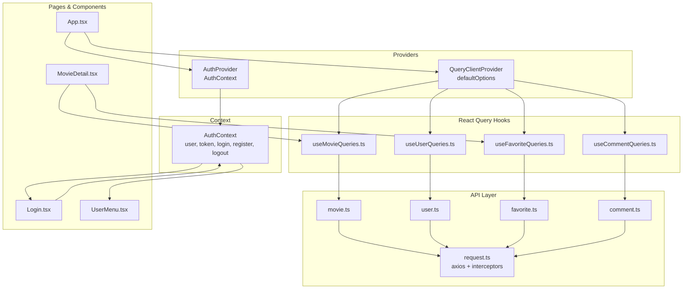
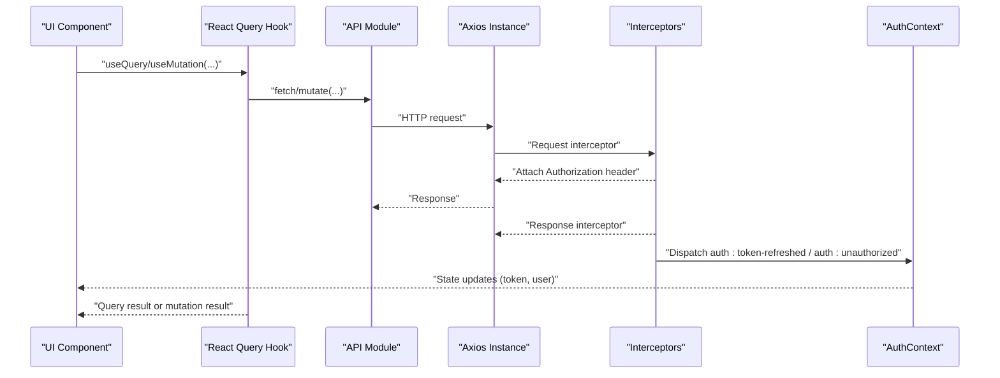
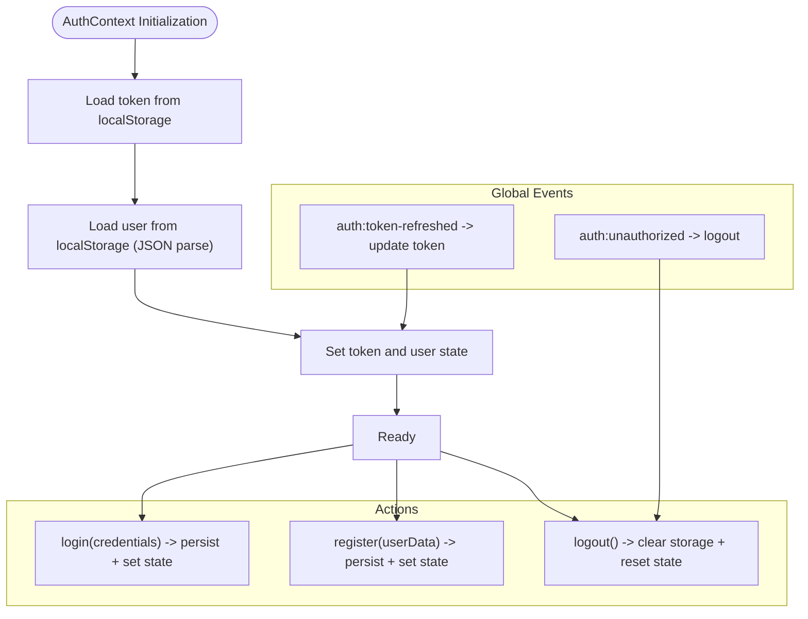
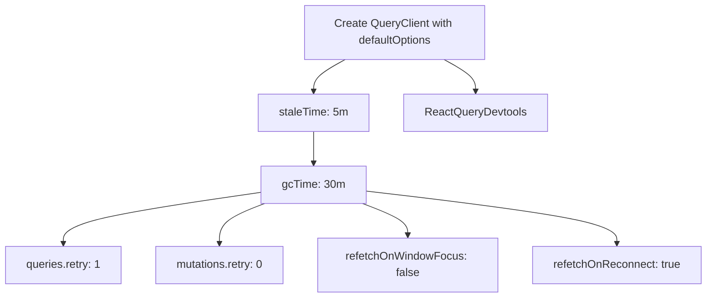
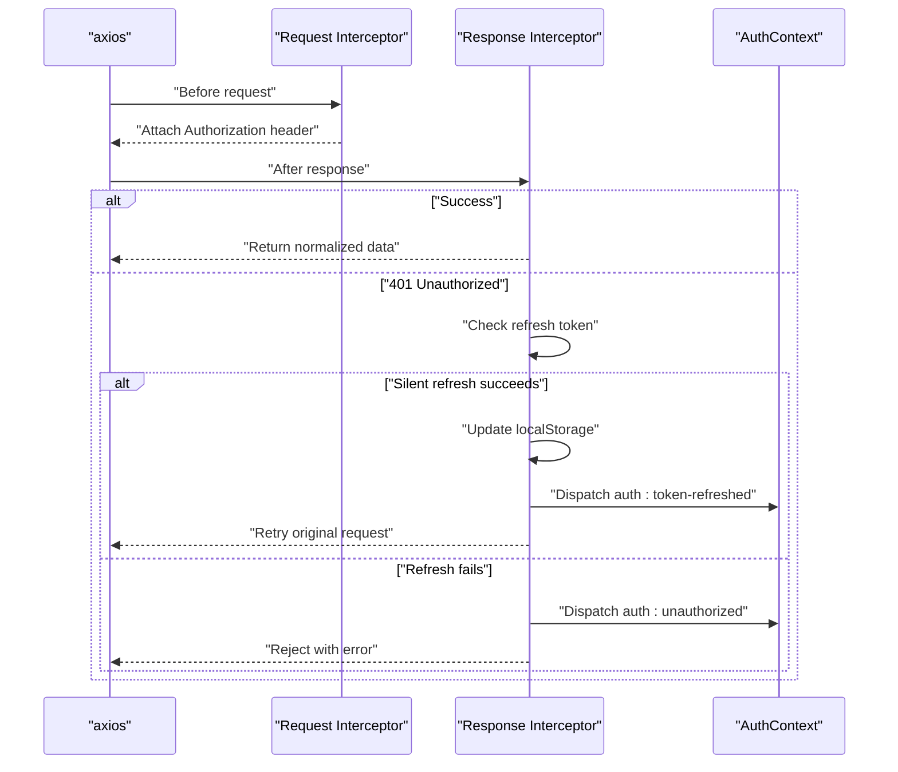
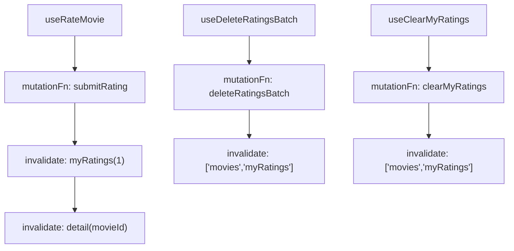
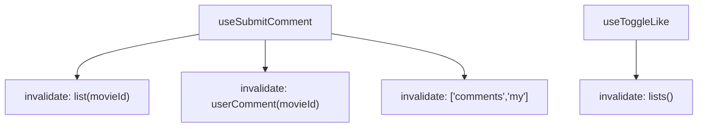
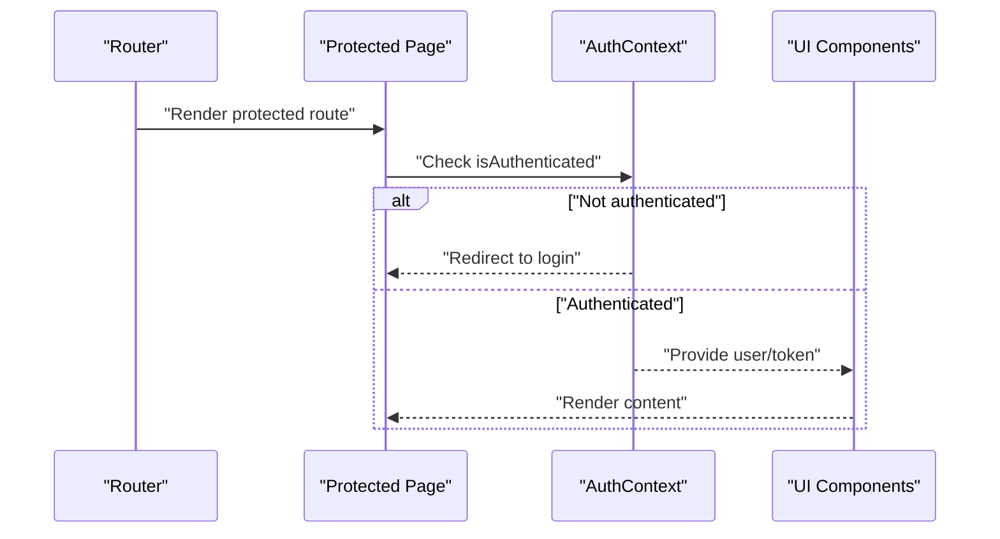
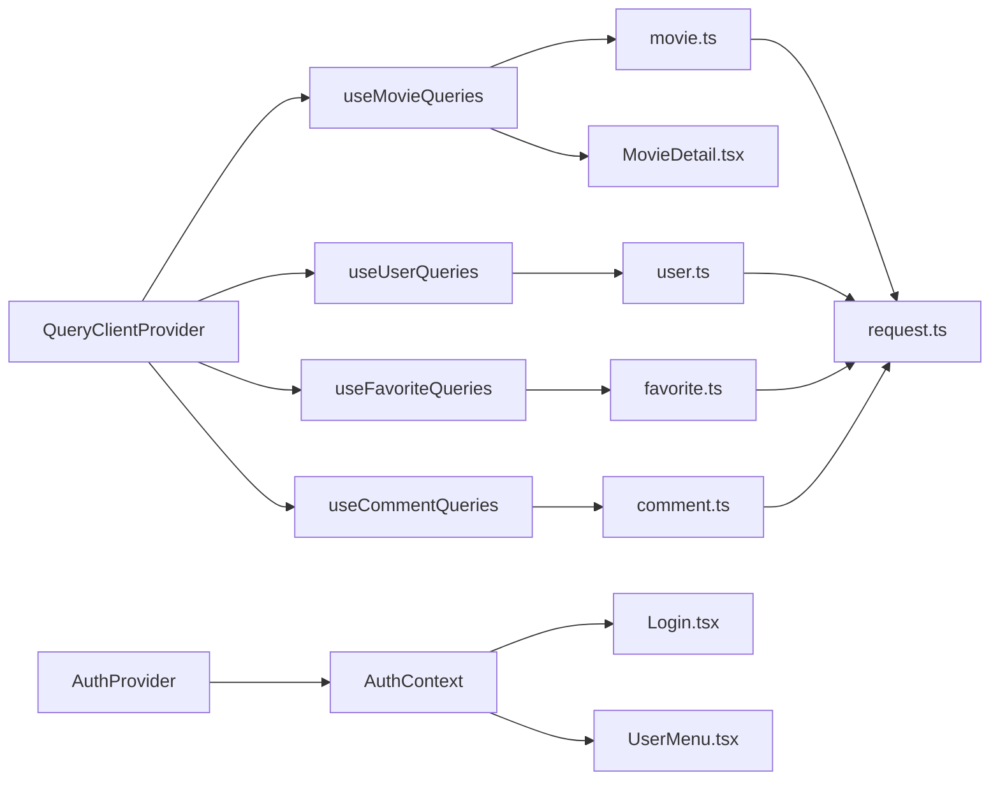

# State Management

<cite>
**Referenced Files in This Document**
- [AuthContext.tsx](file://movie-review-web/src/context/AuthContext.tsx)
- [request.ts](file://movie-review-web/src/api/request.ts)
- [user.ts](file://movie-review-web/src/api/user.ts)
- [movie.ts](file://movie-review-web/src/api/movie.ts)
- [favorite.ts](file://movie-review-web/src/api/favorite.ts)
- [comment.ts](file://movie-review-web/src/api/comment.ts)
- [useMovieQueries.ts](file://movie-review-web/src/hooks/useMovieQueries.ts)
- [useUserQueries.ts](file://movie-review-web/src/hooks/useUserQueries.ts)
- [useFavoriteQueries.ts](file://movie-review-web/src/hooks/useFavoriteQueries.ts)
- [useCommentQueries.ts](file://movie-review-web/src/hooks/useCommentQueries.ts)
- [main.tsx](file://movie-review-web/src/main.tsx)
- [App.tsx](file://movie-review-web/src/App.tsx)
- [Login.tsx](file://movie-review-web/src/pages/Login.tsx)
- [MovieDetail.tsx](file://movie-review-web/src/pages/MovieDetail.tsx)
- [UserMenu.tsx](file://movie-review-web/src/components/UserMenu.tsx)
- [index.ts](file://movie-review-web/src/types/index.ts)
</cite>

## Table of Contents
1. [Introduction](#introduction)
2. [Project Structure](#project-structure)
3. [Core Components](#core-components)
4. [Architecture Overview](#architecture-overview)
5. [Detailed Component Analysis](#detailed-component-analysis)
6. [Dependency Analysis](#dependency-analysis)
7. [Performance Considerations](#performance-considerations)
8. [Troubleshooting Guide](#troubleshooting-guide)
9. [Conclusion](#conclusion)
10. [Appendices](#appendices)

## Introduction
This document explains the state management patterns and implementation in the frontend application. It covers:
- React Context for authentication state and provider setup
- React Query configuration for data caching, invalidation, and synchronization
- Local state management strategies in components
- State synchronization across components and cache invalidation strategies
- Optimistic updates and error handling
- Examples of context usage, query configuration, and state update patterns
- Global state patterns, component communication, and performance optimization
- State persistence and hydration strategies
- Debugging approaches

## Project Structure
The state management stack is organized around three pillars:
- Authentication state via React Context
- Data fetching and caching via React Query
- Local UI state managed directly in components

**Diagram sources**
- [main.tsx](file://movie-review-web/src/main.tsx#L9-L29)
- [AuthContext.tsx](file://movie-review-web/src/context/AuthContext.tsx#L20-L123)
- [useMovieQueries.ts](file://movie-review-web/src/hooks/useMovieQueries.ts#L1-L95)
- [useUserQueries.ts](file://movie-review-web/src/hooks/useUserQueries.ts#L1-L36)
- [useFavoriteQueries.ts](file://movie-review-web/src/hooks/useFavoriteQueries.ts#L1-L174)
- [useCommentQueries.ts](file://movie-review-web/src/hooks/useCommentQueries.ts#L1-L102)
- [request.ts](file://movie-review-web/src/api/request.ts#L8-L108)
- [user.ts](file://movie-review-web/src/api/user.ts#L4-L36)
- [movie.ts](file://movie-review-web/src/api/movie.ts#L15-L65)
- [favorite.ts](file://movie-review-web/src/api/favorite.ts#L4-L97)
- [comment.ts](file://movie-review-web/src/api/comment.ts#L4-L49)
- [App.tsx](file://movie-review-web/src/App.tsx#L18-L48)
- [Login.tsx](file://movie-review-web/src/pages/Login.tsx#L14-L61)
- [MovieDetail.tsx](file://movie-review-web/src/pages/MovieDetail.tsx#L11-L89)
- [UserMenu.tsx](file://movie-review-web/src/components/UserMenu.tsx#L6-L25)

**Section sources**
- [main.tsx](file://movie-review-web/src/main.tsx#L9-L29)
- [AuthContext.tsx](file://movie-review-web/src/context/AuthContext.tsx#L20-L123)
- [App.tsx](file://movie-review-web/src/App.tsx#L18-L48)

## Core Components
- Authentication Context: Provides user, token, login, register, logout, and isAuthenticated. Hydrates from localStorage during initialization and listens for global events for token refresh and unauthorized actions.
- React Query Provider: Configures default caching behavior, stale times, garbage collection, retries, and window focus reconnect policies.
- API Layer: Centralized axios instance with request/response interceptors for token injection, response normalization, and automatic silent token refresh.
- Query Hooks: Encapsulate query keys, fetchers, and invalidation strategies per domain (movies, favorites, comments, users).

Key implementation highlights:
- Context hydration uses lazy initialization to avoid extra renders and flicker.
- Interceptors handle 401 errors by attempting silent refresh and dispatching global events to keep context and UI in sync.
- Query hooks centralize invalidation to maintain cache consistency after mutations.

**Section sources**
- [AuthContext.tsx](file://movie-review-web/src/context/AuthContext.tsx#L20-L123)
- [request.ts](file://movie-review-web/src/api/request.ts#L8-L108)
- [useMovieQueries.ts](file://movie-review-web/src/hooks/useMovieQueries.ts#L5-L95)
- [useFavoriteQueries.ts](file://movie-review-web/src/hooks/useFavoriteQueries.ts#L5-L174)
- [useCommentQueries.ts](file://movie-review-web/src/hooks/useCommentQueries.ts#L4-L102)
- [useUserQueries.ts](file://movie-review-web/src/hooks/useUserQueries.ts#L5-L36)

## Architecture Overview
The system follows a layered pattern:
- UI components consume React Query hooks and AuthContext
- Query hooks call typed API modules
- API modules use a shared axios instance with interceptors
- Interceptors manage tokens, normalize responses, and trigger global events
- Context listens to global events to keep state synchronized

**Diagram sources**
- [request.ts](file://movie-review-web/src/api/request.ts#L13-L105)
- [AuthContext.tsx](file://movie-review-web/src/context/AuthContext.tsx#L88-L110)
- [useMovieQueries.ts](file://movie-review-web/src/hooks/useMovieQueries.ts#L54-L68)
- [useFavoriteQueries.ts](file://movie-review-web/src/hooks/useFavoriteQueries.ts#L79-L101)
- [useCommentQueries.ts](file://movie-review-web/src/hooks/useCommentQueries.ts#L43-L65)

## Detailed Component Analysis

### Authentication Context (AuthContext)
- Hydration: Initializes token and user from localStorage using lazy state initialization to prevent extra renders and ensure immediate correctness.
- Login/Register: Persists tokens and user data to localStorage and updates context state.
- Logout: Clears storage and resets context state.
- Global Events: Listens for token refresh and unauthorized events to keep UI and context synchronized.

**Diagram sources**
- [AuthContext.tsx](file://movie-review-web/src/context/AuthContext.tsx#L20-L123)

**Section sources**
- [AuthContext.tsx](file://movie-review-web/src/context/AuthContext.tsx#L20-L123)

### React Query Provider and Defaults
- Default Options: staleTime, gcTime, retry, refetchOnWindowFocus, refetchOnReconnect configured centrally.
- Devtools: Enabled for development visibility.

**Diagram sources**
- [main.tsx](file://movie-review-web/src/main.tsx#L9-L29)

**Section sources**
- [main.tsx](file://movie-review-web/src/main.tsx#L9-L29)

### API Layer and Interceptors
- Request Interceptor: Injects Authorization header from localStorage.
- Response Interceptor: Normalizes responses and handles 401 errors.
- Silent Refresh: Attempts refresh using refresh token, updates localStorage, dispatches token-refreshed event, and retries queued requests.
- Unauthorized Handling: Dispatches auth:unauthorized to trigger logout and clears storage.

**Diagram sources**
- [request.ts](file://movie-review-web/src/api/request.ts#L13-L105)
- [AuthContext.tsx](file://movie-review-web/src/context/AuthContext.tsx#L88-L110)

**Section sources**
- [request.ts](file://movie-review-web/src/api/request.ts#L8-L108)

### Movies Queries and Mutations
- Query Keys: Centralized under movieKeys for detail, ratings, search, latest.
- Queries: useMovie, useMyRatings, useMovieSearch, useLatestMovies with enabled conditions and options.
- Mutations: useRateMovie, useDeleteRatingsBatch, useClearMyRatings with targeted invalidations.

**Diagram sources**
- [useMovieQueries.ts](file://movie-review-web/src/hooks/useMovieQueries.ts#L54-L94)

**Section sources**
- [useMovieQueries.ts](file://movie-review-web/src/hooks/useMovieQueries.ts#L5-L95)

### Favorites Queries and Mutations
- Query Keys: favorites, lists, counts, statuses, folders, folder details, folder movies.
- Queries: useMyFavorites, useFavoritesCount, useFavoriteStatus, useMyFolders, useFolderDetail, useFolderMovies.
- Mutations: useAddFavorite, useRemoveFavorite, useBatchDeleteFavorites, useCreateFolder, useUpdateFolder, useDeleteFolder with granular invalidations.

```mermaid
flowchart TD
Add["useAddFavorite"] --> Inv1["invalidate: status(movieId)"]
Add --> Inv2["invalidate: lists()"]
Add --> Inv3["invalidate: count()"]
Add --> Cond{"folderId?"}
Cond --> |Yes| Inv4["invalidate: folderMovies(folderId,...)"]
Cond --> |No| End
Remove["useRemoveFavorite"] --> Inv1
Remove --> Inv2
Remove --> Inv3
Remove --> Cond
```

**Diagram sources**
- [useFavoriteQueries.ts](file://movie-review-web/src/hooks/useFavoriteQueries.ts#L79-L121)

**Section sources**
- [useFavoriteQueries.ts](file://movie-review-web/src/hooks/useFavoriteQueries.ts#L5-L174)

### Comments Queries and Mutations
- Query Keys: comments, lists, user comments, my comments.
- Queries: useMovieComments, useMyComments, useUserComment.
- Mutations: useSubmitComment, useUpdateComment, useToggleLike with targeted invalidations.

**Diagram sources**
- [useCommentQueries.ts](file://movie-review-web/src/hooks/useCommentQueries.ts#L43-L101)

**Section sources**
- [useCommentQueries.ts](file://movie-review-web/src/hooks/useCommentQueries.ts#L4-L102)

### Users Queries
- Query Keys: users, current, public.
- Queries: useCurrentUser with staleTime, usePublicUserInfo with enabled condition.

**Section sources**
- [useUserQueries.ts](file://movie-review-web/src/hooks/useUserQueries.ts#L5-L36)

### Component Communication Patterns
- Protected Routes: Wrap routes requiring authentication.
- Context Consumption: Components like Login, MovieDetail, and UserMenu consume AuthContext for user state and actions.
- Synchronization: Global events keep context and UI in sync after token refresh/unauthorized events.

**Diagram sources**
- [App.tsx](file://movie-review-web/src/App.tsx#L34-L43)
- [Login.tsx](file://movie-review-web/src/pages/Login.tsx#L14-L61)
- [MovieDetail.tsx](file://movie-review-web/src/pages/MovieDetail.tsx#L11-L29)
- [UserMenu.tsx](file://movie-review-web/src/components/UserMenu.tsx#L6-L25)

**Section sources**
- [App.tsx](file://movie-review-web/src/App.tsx#L34-L43)
- [Login.tsx](file://movie-review-web/src/pages/Login.tsx#L14-L61)
- [MovieDetail.tsx](file://movie-review-web/src/pages/MovieDetail.tsx#L11-L29)
- [UserMenu.tsx](file://movie-review-web/src/components/UserMenu.tsx#L6-L25)

## Dependency Analysis
- Providers: QueryClientProvider wraps the app; AuthProvider wraps the app.
- Hooks depend on API modules; API modules depend on the shared axios instance.
- Interceptors depend on localStorage and AuthContext events.
- Components depend on both providers and hooks.

**Diagram sources**
- [main.tsx](file://movie-review-web/src/main.tsx#L31-L39)
- [AuthContext.tsx](file://movie-review-web/src/context/AuthContext.tsx#L20-L123)
- [useMovieQueries.ts](file://movie-review-web/src/hooks/useMovieQueries.ts#L1-L95)
- [useUserQueries.ts](file://movie-review-web/src/hooks/useUserQueries.ts#L1-L36)
- [useFavoriteQueries.ts](file://movie-review-web/src/hooks/useFavoriteQueries.ts#L1-L174)
- [useCommentQueries.ts](file://movie-review-web/src/hooks/useCommentQueries.ts#L1-L102)
- [request.ts](file://movie-review-web/src/api/request.ts#L8-L108)
- [movie.ts](file://movie-review-web/src/api/movie.ts#L15-L65)
- [user.ts](file://movie-review-web/src/api/user.ts#L4-L36)
- [favorite.ts](file://movie-review-web/src/api/favorite.ts#L4-L97)
- [comment.ts](file://movie-review-web/src/api/comment.ts#L4-L49)
- [Login.tsx](file://movie-review-web/src/pages/Login.tsx#L14-L61)
- [UserMenu.tsx](file://movie-review-web/src/components/UserMenu.tsx#L6-L25)
- [MovieDetail.tsx](file://movie-review-web/src/pages/MovieDetail.tsx#L11-L89)

**Section sources**
- [main.tsx](file://movie-review-web/src/main.tsx#L31-L39)
- [AuthContext.tsx](file://movie-review-web/src/context/AuthContext.tsx#L20-L123)

## Performance Considerations
- Caching Defaults: staleTime and gcTime reduce network usage and improve perceived performance.
- Retry Strategy: Limited retries for queries, none for mutations, balance reliability and UX.
- Window Focus/Reconnect: Controlled refetch policies minimize unnecessary reloads.
- Lazy Context Hydration: Prevents extra renders and eliminates loading flashes.
- Query Granularity: Fine-grained invalidations avoid over-fetching while keeping data fresh.
- Local State Minimization: Prefer React Query for server state; use component-local state for UI-only concerns.

[No sources needed since this section provides general guidance]

## Troubleshooting Guide
Common issues and resolutions:
- 401 Unauthorized
  - Symptom: Requests fail with 401.
  - Resolution: Interceptor attempts silent refresh; if successful, dispatches token-refreshed; otherwise dispatches unauthorized and logs out.
- Stale Data After Actions
  - Symptom: UI shows outdated data after add/remove/favorite.
  - Resolution: Ensure proper invalidation in onSuccess handlers for mutations.
- Token Not Persisted
  - Symptom: Session lost after refresh.
  - Resolution: Verify localStorage keys and AuthContext hydration logic.
- Infinite Refetch Loops
  - Symptom: Queries refetch continuously.
  - Resolution: Review enabled conditions and query keys; adjust staleTime/refetch policies.

**Section sources**
- [request.ts](file://movie-review-web/src/api/request.ts#L33-L105)
- [AuthContext.tsx](file://movie-review-web/src/context/AuthContext.tsx#L88-L110)
- [useMovieQueries.ts](file://movie-review-web/src/hooks/useMovieQueries.ts#L54-L94)
- [useFavoriteQueries.ts](file://movie-review-web/src/hooks/useFavoriteQueries.ts#L79-L121)
- [useCommentQueries.ts](file://movie-review-web/src/hooks/useCommentQueries.ts#L43-L101)

## Conclusion
The application employs a clean separation of concerns:
- AuthContext manages authentication state with robust hydration and global event synchronization.
- React Query provides efficient caching, invalidation, and synchronization across components.
- The API layer centralizes HTTP concerns with interceptors for token management and error handling.
Together, these patterns deliver responsive, reliable, and maintainable state management.

[No sources needed since this section summarizes without analyzing specific files]

## Appendices

### Types and Contracts
- AuthContextType defines the shape of authentication state and actions.
- ApiResponse generic normalizes backend responses.
- Domain-specific types for movies, users, comments, favorites, and ratings.

**Section sources**
- [index.ts](file://movie-review-web/src/types/index.ts#L105-L114)
- [index.ts](file://movie-review-web/src/types/index.ts#L1-L6)
- [index.ts](file://movie-review-web/src/types/index.ts#L34-L51)
- [index.ts](file://movie-review-web/src/types/index.ts#L75-L88)
- [index.ts](file://movie-review-web/src/types/index.ts#L116-L134)
- [index.ts](file://movie-review-web/src/types/index.ts#L146-L160)
- [index.ts](file://movie-review-web/src/types/index.ts#L162-L168)
- [index.ts](file://movie-review-web/src/types/index.ts#L170-L187)
- [index.ts](file://movie-review-web/src/types/index.ts#L189-L204)