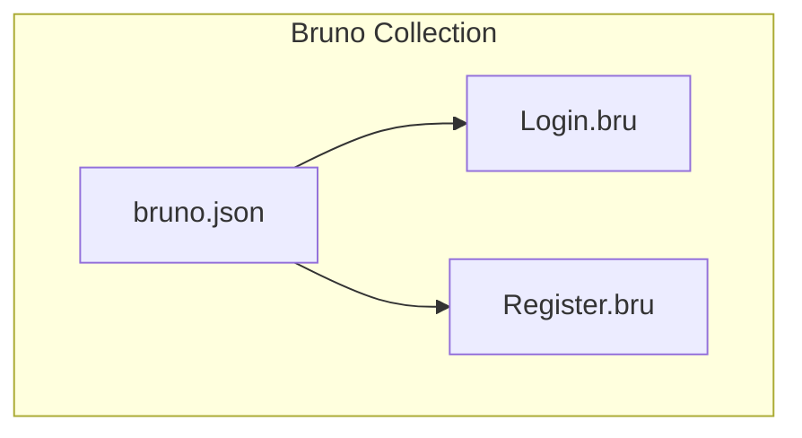
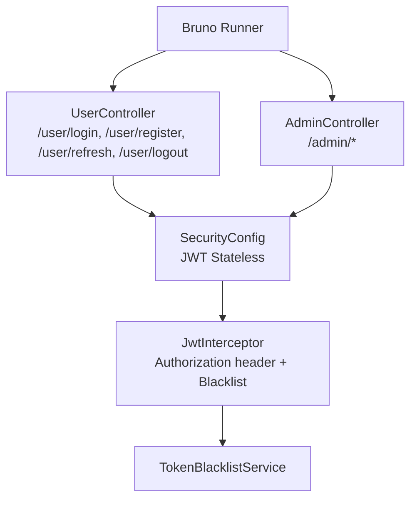
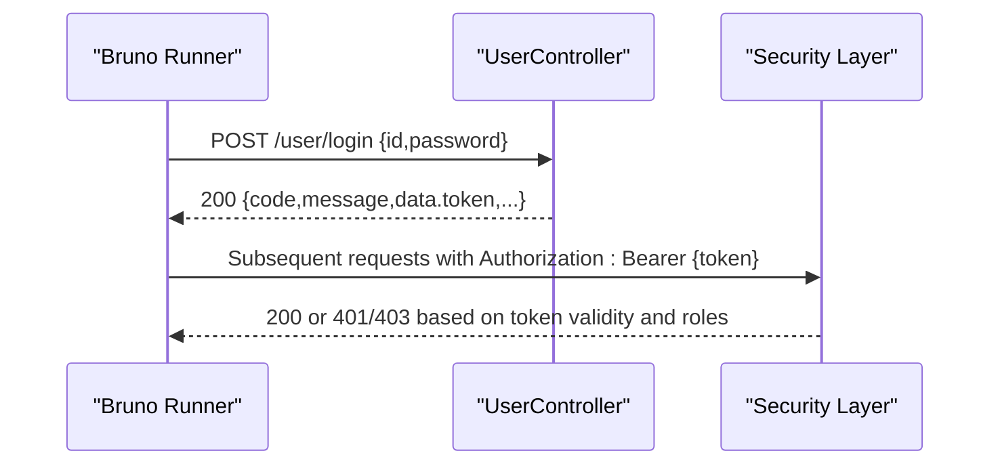
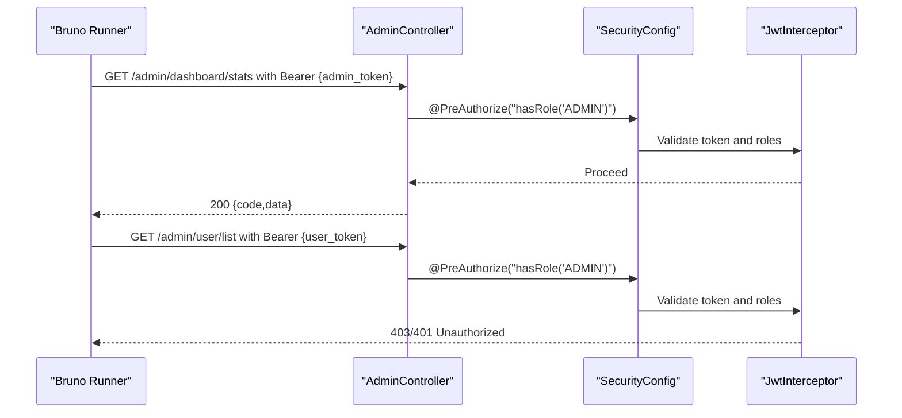
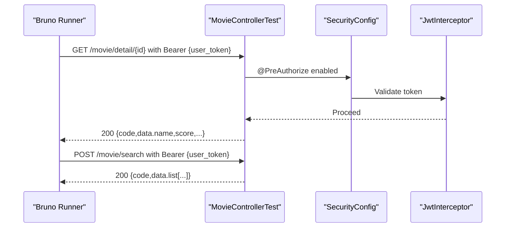
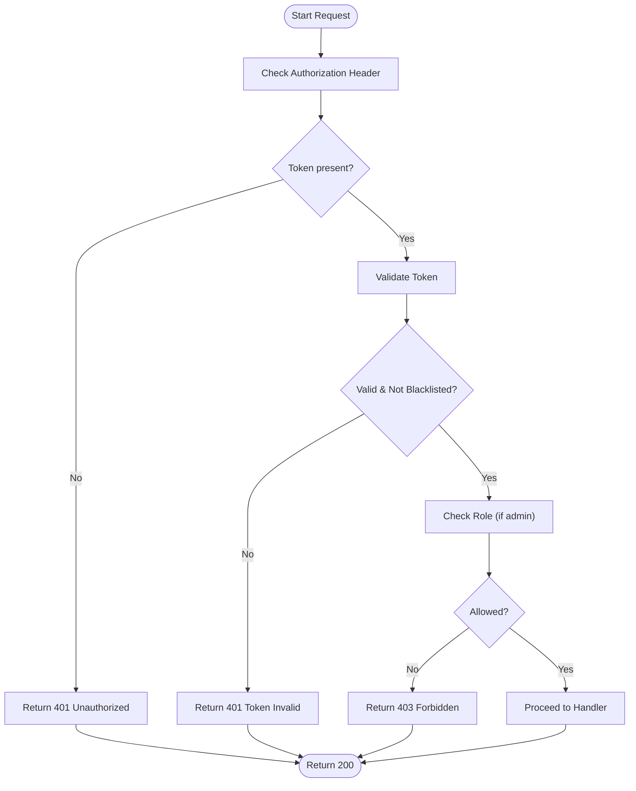
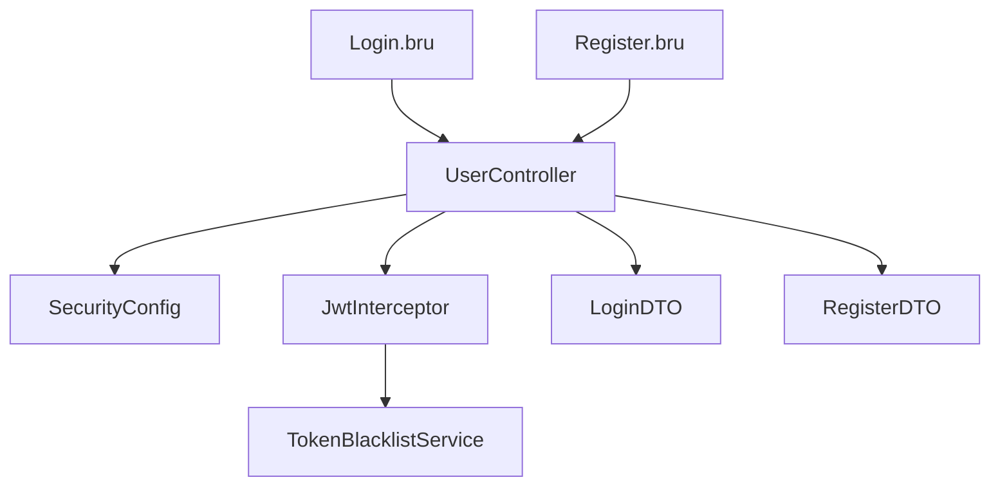

# API Testing

<cite>
**Referenced Files in This Document**
- [bruno.json](file://backend/movie_test/bruno.json)
- [Login.bru](file://backend/movie_test/Login.bru)
- [Register.bru](file://backend/movie_test/Register.bru)
- [UserController.java](file://backend/src/main/java/com/movie/backend/controller/UserController.java)
- [AdminController.java](file://backend/src/main/java/com/movie/backend/controller/admin/AdminController.java)
- [SecurityConfig.java](file://backend/src/main/java/com/movie/backend/config/SecurityConfig.java)
- [JwtInterceptor.java](file://backend/src/main/java/com/movie/backend/config/JwtInterceptor.java)
- [TokenBlacklistService.java](file://backend/src/main/java/com/movie/backend/service/TokenBlacklistService.java)
- [LoginDTO.java](file://backend/src/main/java/com/movie/backend/dto/LoginDTO.java)
- [RegisterDTO.java](file://backend/src/main/java/com/movie/backend/dto/RegisterDTO.java)
- [UserControllerTest.java](file://backend/src/test/java/com/movie/backend/controller/UserControllerTest.java)
- [MovieControllerTest.java](file://backend/src/test/java/com/movie/backend/controller/MovieControllerTest.java)
- [AdminControllerTest.java](file://backend/src/test/java/com/movie/backend/controller/admin/AdminControllerTest.java)
- [ProtectedRoute.tsx](file://movie-review-web/src/components/ProtectedRoute.tsx)
- [comment.ts](file://movie-review-web/src/api/comment.ts)
- [movie.ts](file://movie-review-web/src/api/movie.ts)
- [api-docs.json](file://movie-review-web/backend_api_doc/api-docs.json)
</cite>

## Table of Contents
1. [Introduction](#introduction)
2. [Project Structure](#project-structure)
3. [Core Components](#core-components)
4. [Architecture Overview](#architecture-overview)
5. [Detailed Component Analysis](#detailed-component-analysis)
6. [Dependency Analysis](#dependency-analysis)
7. [Performance Considerations](#performance-considerations)
8. [Troubleshooting Guide](#troubleshooting-guide)
9. [Conclusion](#conclusion)
10. [Appendices](#appendices)

## Introduction
This document describes how to implement API testing using Bruno for the Movie System backend. It covers Bruno configuration, request testing patterns, response validation strategies, authentication endpoints, CRUD operations, error scenarios, environment setup, variable management, test data handling, authentication tokens, role-based access control, API versioning considerations, organizing test suites, documenting test cases, maintaining consistency, debugging techniques, response validation, and automated workflows.

## Project Structure
The API tests are organized under the backend’s movie_test directory as a Bruno collection. The collection includes:
- Collection metadata
- HTTP requests for login and registration
- Optional request bodies and settings

**Diagram sources**
- [bruno.json](file://backend/movie_test/bruno.json#L1-L9)
- [Login.bru](file://backend/movie_test/Login.bru#L1-L16)
- [Register.bru](file://backend/movie_test/Register.bru#L1-L26)

**Section sources**
- [bruno.json](file://backend/movie_test/bruno.json#L1-L9)
- [Login.bru](file://backend/movie_test/Login.bru#L1-L16)
- [Register.bru](file://backend/movie_test/Register.bru#L1-L26)

## Core Components
- Bruno collection configuration defines the collection name, version, and ignored paths.
- HTTP request definitions for login and registration include endpoint URLs, method, body type, and encoding settings.
- DTOs define the shape of request payloads for login and registration.
- Controllers expose endpoints for user authentication, token refresh/logout, and protected admin routes.
- Security configuration enables JWT-based stateless authentication and method-level access control.
- Interceptor validates Authorization headers and checks token blacklist.
- Token blacklist service manages revoked tokens.

**Section sources**
- [bruno.json](file://backend/movie_test/bruno.json#L1-L9)
- [Login.bru](file://backend/movie_test/Login.bru#L1-L16)
- [Register.bru](file://backend/movie_test/Register.bru#L1-L26)
- [LoginDTO.java](file://backend/src/main/java/com/movie/backend/dto/LoginDTO.java#L1-L19)
- [RegisterDTO.java](file://backend/src/main/java/com/movie/backend/dto/RegisterDTO.java#L1-L34)
- [UserController.java](file://backend/src/main/java/com/movie/backend/controller/UserController.java#L1-L120)
- [AdminController.java](file://backend/src/main/java/com/movie/backend/controller/admin/AdminController.java#L1-L135)
- [SecurityConfig.java](file://backend/src/main/java/com/movie/backend/config/SecurityConfig.java#L1-L35)
- [JwtInterceptor.java](file://backend/src/main/java/com/movie/backend/config/JwtInterceptor.java#L35-L67)
- [TokenBlacklistService.java](file://backend/src/main/java/com/movie/backend/service/TokenBlacklistService.java#L1-L29)

## Architecture Overview
The API testing workflow integrates Bruno with the backend’s JWT-based authentication and RBAC. Requests are validated by the interceptor, and protected endpoints enforce role-based access.

**Diagram sources**
- [UserController.java](file://backend/src/main/java/com/movie/backend/controller/UserController.java#L1-L120)
- [AdminController.java](file://backend/src/main/java/com/movie/backend/controller/admin/AdminController.java#L1-L135)
- [SecurityConfig.java](file://backend/src/main/java/com/movie/backend/config/SecurityConfig.java#L1-L35)
- [JwtInterceptor.java](file://backend/src/main/java/com/movie/backend/config/JwtInterceptor.java#L35-L67)
- [TokenBlacklistService.java](file://backend/src/main/java/com/movie/backend/service/TokenBlacklistService.java#L1-L29)

## Detailed Component Analysis

### Bruno Collection Setup and Environment
- Collection metadata defines the collection name and version.
- Requests define base URLs, methods, body types, and encoding settings.
- Variables can be managed via Bruno’s environment and pre-request scripts to inject dynamic values (e.g., tokens, IDs).

Recommended Bruno setup steps:
- Create environments for local development and CI.
- Define reusable variables for host, port, and common payloads.
- Use pre-request scripts to compute dynamic values (e.g., timestamps, random suffixes for unique usernames).

**Section sources**
- [bruno.json](file://backend/movie_test/bruno.json#L1-L9)
- [Login.bru](file://backend/movie_test/Login.bru#L1-L16)
- [Register.bru](file://backend/movie_test/Register.bru#L1-L26)

### Authentication Endpoints Testing
Endpoints to test:
- POST /user/login
- POST /user/register
- POST /user/refresh
- POST /user/logout

Testing patterns:
- Validate successful login returns a token and user data.
- Validate registration payload validation errors for invalid inputs.
- Validate token refresh and logout revoke tokens.

Response validation strategies:
- Assert HTTP status codes (e.g., 200 OK).
- Assert top-level fields in the response envelope (code, message, data).
- Extract token from login response and reuse in subsequent requests.

**Diagram sources**
- [UserController.java](file://backend/src/main/java/com/movie/backend/controller/UserController.java#L32-L36)
- [JwtInterceptor.java](file://backend/src/main/java/com/movie/backend/config/JwtInterceptor.java#L40-L67)

**Section sources**
- [UserController.java](file://backend/src/main/java/com/movie/backend/controller/UserController.java#L32-L36)
- [UserController.java](file://backend/src/main/java/com/movie/backend/controller/UserController.java#L77-L104)
- [JwtInterceptor.java](file://backend/src/main/java/com/movie/backend/config/JwtInterceptor.java#L40-L67)

### Role-Based Access Control (RBAC) Testing
- Admin endpoints are protected with method-level security requiring ADMIN role.
- Test both authorized and unauthorized access attempts.

Testing patterns:
- Generate ADMIN token and call admin endpoints; assert success.
- Generate USER token and call admin endpoints; assert 403/401.

**Diagram sources**
- [AdminController.java](file://backend/src/main/java/com/movie/backend/controller/admin/AdminController.java#L22-L33)
- [SecurityConfig.java](file://backend/src/main/java/com/movie/backend/config/SecurityConfig.java#L16-L35)
- [JwtInterceptor.java](file://backend/src/main/java/com/movie/backend/config/JwtInterceptor.java#L62-L67)

**Section sources**
- [AdminController.java](file://backend/src/main/java/com/movie/backend/controller/admin/AdminController.java#L22-L33)
- [SecurityConfig.java](file://backend/src/main/java/com/movie/backend/config/SecurityConfig.java#L16-L35)

### CRUD Operations Testing
Examples include movie search and detail retrieval, protected by JWT.

Patterns:
- Use a valid USER token for authenticated endpoints.
- Validate pagination and filtering parameters.
- Verify data shapes returned by endpoints.

**Diagram sources**
- [MovieControllerTest.java](file://backend/src/test/java/com/movie/backend/controller/MovieControllerTest.java#L47-L64)
- [MovieControllerTest.java](file://backend/src/test/java/com/movie/backend/controller/MovieControllerTest.java#L66-L88)
- [SecurityConfig.java](file://backend/src/main/java/com/movie/backend/config/SecurityConfig.java#L16-L35)
- [JwtInterceptor.java](file://backend/src/main/java/com/movie/backend/config/JwtInterceptor.java#L40-L67)

**Section sources**
- [MovieControllerTest.java](file://backend/src/test/java/com/movie/backend/controller/MovieControllerTest.java#L47-L64)
- [MovieControllerTest.java](file://backend/src/test/java/com/movie/backend/controller/MovieControllerTest.java#L66-L88)

### Error Scenarios Testing
Common failure modes:
- Invalid credentials during login.
- Missing or malformed Authorization header.
- Expired or blacklisted tokens.
- Insufficient permissions for admin endpoints.

Validation strategies:
- Assert non-200 status codes.
- Assert error code/message fields in response envelope.
- Confirm token invalidation after logout or password change.

**Diagram sources**
- [JwtInterceptor.java](file://backend/src/main/java/com/movie/backend/config/JwtInterceptor.java#L40-L67)
- [TokenBlacklistService.java](file://backend/src/main/java/com/movie/backend/service/TokenBlacklistService.java#L16-L21)

**Section sources**
- [JwtInterceptor.java](file://backend/src/main/java/com/movie/backend/config/JwtInterceptor.java#L40-L67)
- [TokenBlacklistService.java](file://backend/src/main/java/com/movie/backend/service/TokenBlacklistService.java#L16-L21)

### User Registration Flow Testing
Steps:
- Send POST /user/register with a JSON body matching RegisterDTO.
- Validate success response envelope.
- On failure, assert validation errors for missing/invalid fields.

Payload structure references:
- id, password, nickname, email, url

**Section sources**
- [Register.bru](file://backend/movie_test/Register.bru#L7-L20)
- [RegisterDTO.java](file://backend/src/main/java/com/movie/backend/dto/RegisterDTO.java#L1-L34)

### Login Process Testing
Steps:
- Send POST /user/login with JSON body matching LoginDTO.
- Validate presence of token in response data.
- Store token for subsequent authenticated requests.

**Section sources**
- [Login.bru](file://backend/movie_test/Login.bru#L7-L11)
- [LoginDTO.java](file://backend/src/main/java/com/movie/backend/dto/LoginDTO.java#L1-L19)

### Protected Routes Testing
- Use Authorization header with Bearer token for authenticated endpoints.
- For admin-only endpoints, ensure ADMIN role token is used.

Frontend reference for token usage:
- Local storage token handling and conditional API selection.

**Section sources**
- [comment.ts](file://movie-review-web/src/api/comment.ts#L9-L15)
- [ProtectedRoute.tsx](file://movie-review-web/src/components/ProtectedRoute.tsx#L11-L31)

### API Versioning
- No explicit version prefix observed in current endpoints.
- Consider adopting versioned paths (e.g., /api/v1/) to support future changes.

[No sources needed since this section provides general guidance]

### Organizing API Test Suites
Recommendations:
- Group requests by domain (authentication, movies, comments, favorites, admin).
- Use Bruno folders to mirror API namespaces.
- Maintain a shared environment for host/port and common variables.
- Use pre-request scripts for dynamic data generation (unique usernames, timestamps).
- Centralize assertions in Bruno’s test scripts for consistent validation.

[No sources needed since this section provides general guidance]

### Documenting Test Cases
Guidelines:
- Describe purpose, prerequisites, and expected outcomes.
- Include request details (URL, method, headers, body).
- Define assertion criteria (status, response fields).
- Add negative test cases for validation and error paths.

[No sources needed since this section provides general guidance]

### Maintaining Test Consistency
Practices:
- Reuse environment variables for host/port.
- Centralize common payloads in variables.
- Normalize assertion logic across similar endpoints.
- Keep request order logical (register → login → protected actions).

[No sources needed since this section provides general guidance]

### Debugging Techniques
Techniques:
- Enable Bruno’s request/response logging.
- Inspect Authorization header and token validity.
- Verify interceptor logs and token blacklist entries.
- Compare expected vs. actual response envelopes.

**Section sources**
- [JwtInterceptor.java](file://backend/src/main/java/com/movie/backend/config/JwtInterceptor.java#L40-L67)

### Automated API Testing Workflows
Recommendations:
- Run Bruno collections in CI using Bruno CLI.
- Parameterize environments for dev/staging/prod.
- Integrate with artifact uploads for reports.

[No sources needed since this section provides general guidance]

## Dependency Analysis
The following diagram shows how Bruno requests interact with backend components and security layers.

**Diagram sources**
- [Login.bru](file://backend/movie_test/Login.bru#L7-L11)
- [Register.bru](file://backend/movie_test/Register.bru#L7-L20)
- [UserController.java](file://backend/src/main/java/com/movie/backend/controller/UserController.java#L32-L36)
- [SecurityConfig.java](file://backend/src/main/java/com/movie/backend/config/SecurityConfig.java#L24-L35)
- [JwtInterceptor.java](file://backend/src/main/java/com/movie/backend/config/JwtInterceptor.java#L40-L67)
- [TokenBlacklistService.java](file://backend/src/main/java/com/movie/backend/service/TokenBlacklistService.java#L1-L29)
- [LoginDTO.java](file://backend/src/main/java/com/movie/backend/dto/LoginDTO.java#L1-L19)
- [RegisterDTO.java](file://backend/src/main/java/com/movie/backend/dto/RegisterDTO.java#L1-L34)

**Section sources**
- [Login.bru](file://backend/movie_test/Login.bru#L7-L11)
- [Register.bru](file://backend/movie_test/Register.bru#L7-L20)
- [UserController.java](file://backend/src/main/java/com/movie/backend/controller/UserController.java#L32-L36)
- [JwtInterceptor.java](file://backend/src/main/java/com/movie/backend/config/JwtInterceptor.java#L40-L67)

## Performance Considerations
- Minimize network round trips by combining related validations.
- Use environment variables to avoid repeated computation.
- Prefer paginated queries for large datasets.

[No sources needed since this section provides general guidance]

## Troubleshooting Guide
Common issues and resolutions:
- 401 Unauthorized: Verify Authorization header format and token validity.
- 403 Forbidden: Confirm user role for admin endpoints.
- Token revoked: After logout or password change, ensure blacklist enforcement.
- Validation failures: Match DTO field constraints (length, format).

**Section sources**
- [JwtInterceptor.java](file://backend/src/main/java/com/movie/backend/config/JwtInterceptor.java#L40-L67)
- [TokenBlacklistService.java](file://backend/src/main/java/com/movie/backend/service/TokenBlacklistService.java#L16-L21)

## Conclusion
Using Bruno, you can systematically test authentication, protected routes, and admin endpoints while validating response envelopes and enforcing RBAC. Adopt environment-driven variables, shared assertions, and structured test suites to maintain reliability and scalability across iterations.

## Appendices

### API Reference and Payloads
- User authentication endpoints and DTOs:
  - POST /user/login with LoginDTO
  - POST /user/register with RegisterDTO
  - POST /user/refresh with refreshToken
  - POST /user/logout with optional refreshToken

- Admin endpoints:
  - GET /admin/dashboard/stats
  - GET /admin/user/list
  - DELETE /admin/user/delete/{id}
  - POST /admin/movie/add
  - PUT /admin/movie/update
  - DELETE /admin/movie/delete/{id}
  - GET /admin/movie/list
  - GET /admin/person/list
  - POST /admin/person/add
  - PUT /admin/person/update
  - DELETE /admin/person/delete/{id}
  - GET /admin/comment/list
  - DELETE /admin/comment/delete/{id}

- Frontend API usage patterns:
  - Conditional API selection based on token presence
  - Protected route enforcement by role

**Section sources**
- [UserController.java](file://backend/src/main/java/com/movie/backend/controller/UserController.java#L32-L104)
- [AdminController.java](file://backend/src/main/java/com/movie/backend/controller/admin/AdminController.java#L29-L133)
- [LoginDTO.java](file://backend/src/main/java/com/movie/backend/dto/LoginDTO.java#L1-L19)
- [RegisterDTO.java](file://backend/src/main/java/com/movie/backend/dto/RegisterDTO.java#L1-L34)
- [comment.ts](file://movie-review-web/src/api/comment.ts#L9-L15)
- [ProtectedRoute.tsx](file://movie-review-web/src/components/ProtectedRoute.tsx#L11-L31)
- [api-docs.json](file://movie-review-web/backend_api_doc/api-docs.json#L294-L2077)