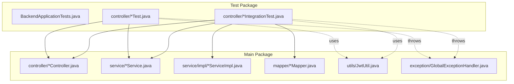
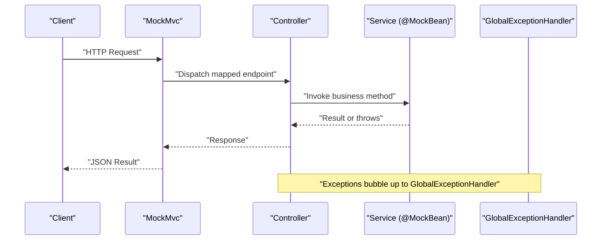
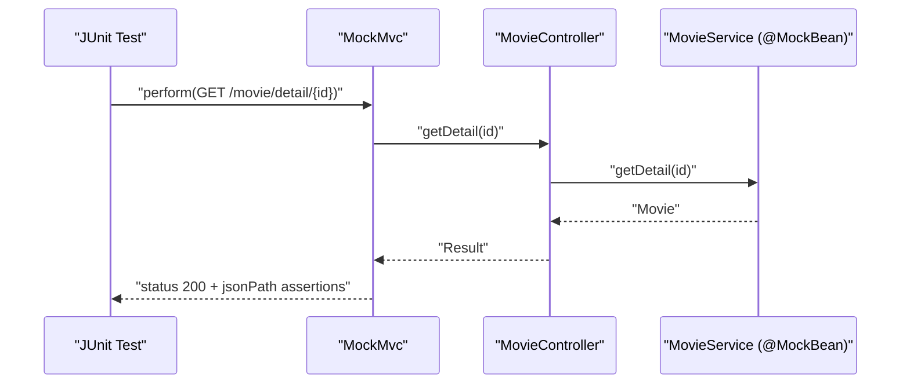
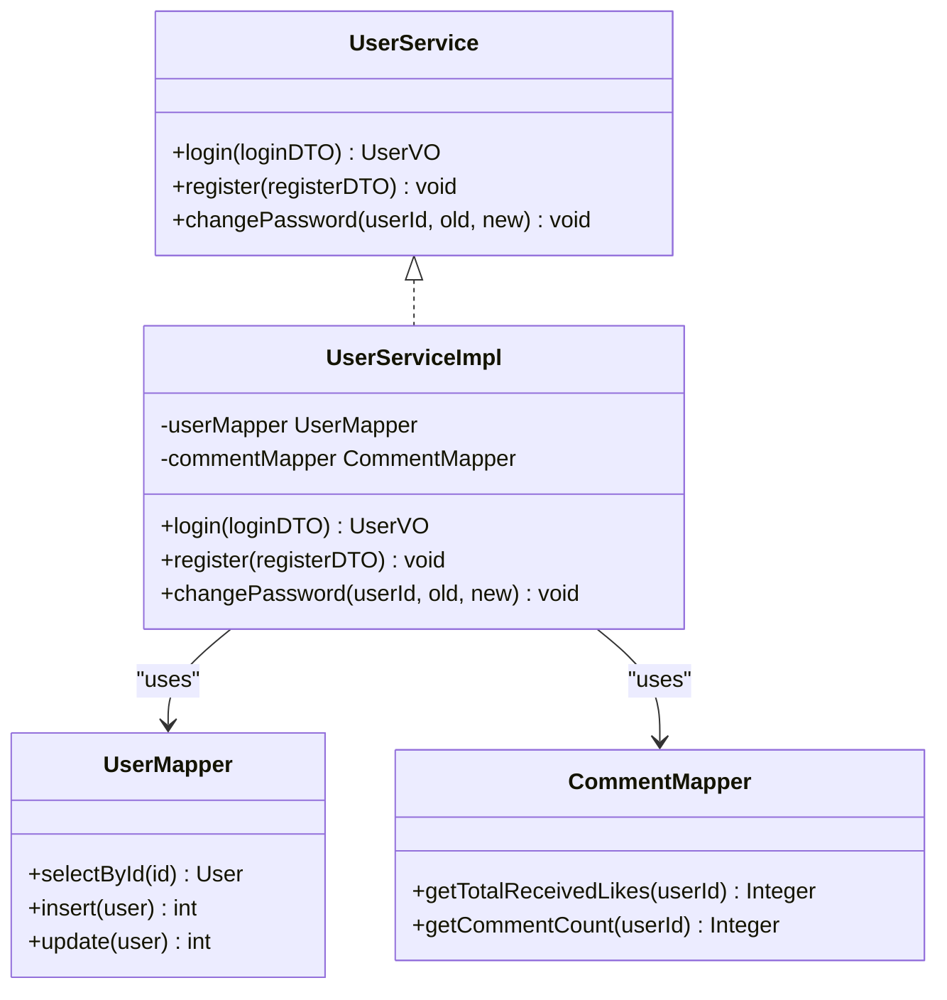
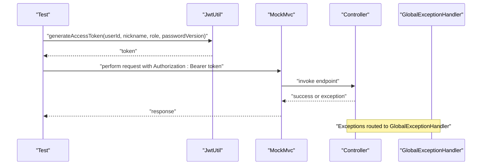
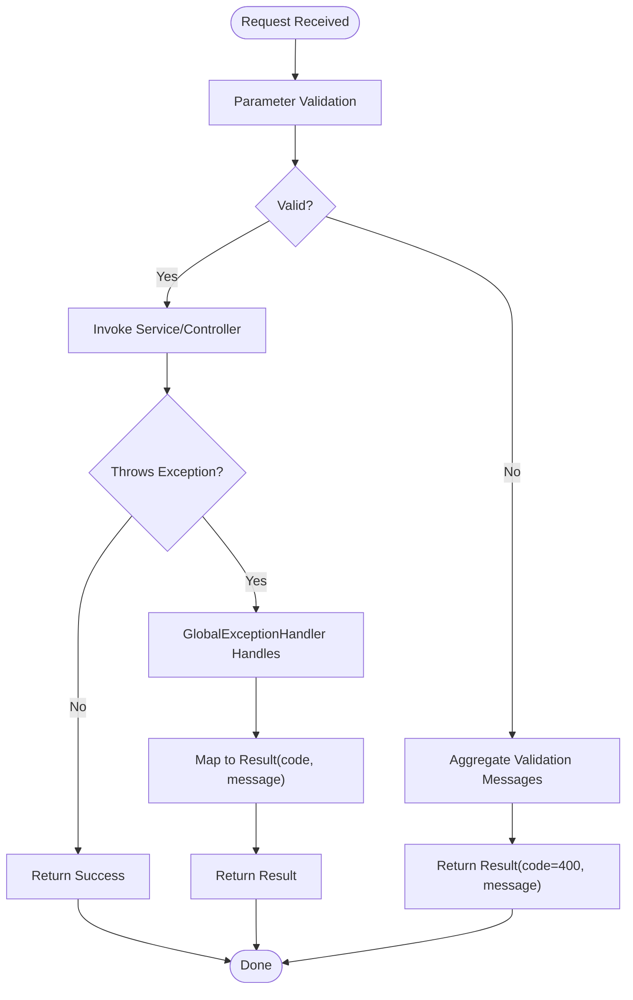
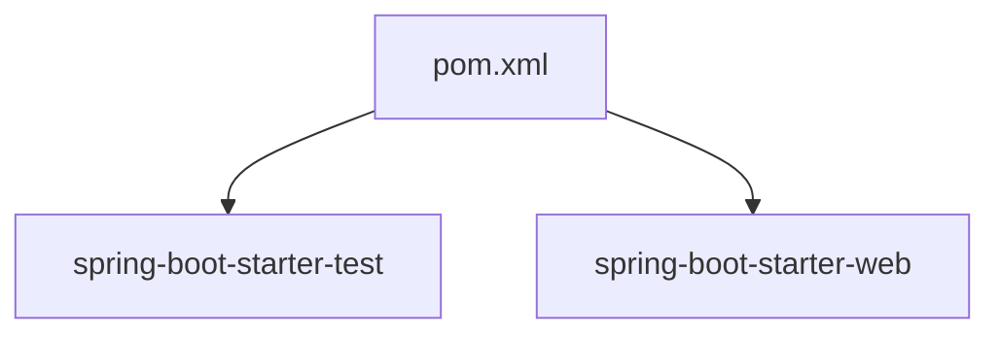

# Backend Testing

<cite>
**Referenced Files in This Document**
- [pom.xml](file://backend/pom.xml)
- [BackendApplicationTests.java](file://backend/src/test/java/com/movie/backend/BackendApplicationTests.java)
- [MovieControllerTest.java](file://backend/src/test/java/com/movie/backend/controller/MovieControllerTest.java)
- [UserControllerTest.java](file://backend/src/test/java/com/movie/backend/controller/UserControllerTest.java)
- [AdminControllerTest.java](file://backend/src/test/java/com/movie/backend/controller/admin/AdminControllerTest.java)
- [MovieControllerIntegrationTest.java](file://backend/src/test/java/com/movie/backend/controller/MovieControllerIntegrationTest.java)
- [README_MOVIE_TEST.md](file://backend/src/test/java/com/movie/backend/controller/README_MOVIE_TEST.md)
- [UserService.java](file://backend/src/main/java/com/movie/backend/service/UserService.java)
- [UserServiceImpl.java](file://backend/src/main/java/com/movie/backend/service/impl/UserServiceImpl.java)
- [UserMapper.java](file://backend/src/main/java/com/movie/backend/mapper/UserMapper.java)
- [JwtUtil.java](file://backend/src/main/java/com/movie/backend/utils/JwtUtil.java)
- [GlobalExceptionHandler.java](file://backend/src/main/java/com/movie/backend/exception/GlobalExceptionHandler.java)
- [application.yml](file://backend/src/main/resources/application.yml)
- [application-dev.yml](file://backend/src/main/resources/application-dev.yml)
</cite>

## Table of Contents
1. [Introduction](#introduction)
2. [Project Structure](#project-structure)
3. [Core Components](#core-components)
4. [Architecture Overview](#architecture-overview)
5. [Detailed Component Analysis](#detailed-component-analysis)
6. [Dependency Analysis](#dependency-analysis)
7. [Performance Considerations](#performance-considerations)
8. [Troubleshooting Guide](#troubleshooting-guide)
9. [Conclusion](#conclusion)
10. [Appendices](#appendices)

## Introduction
This document describes the backend testing implementation for the movie system. It covers JUnit test setup, Mockito mocking strategies, Spring Boot test configurations, and testing approaches for controllers, services, and repositories. It also documents authentication flows, business logic validation, exception handling, integration testing patterns, database testing with embedded databases, transaction rollback strategies, test data management, test fixtures, mocking external dependencies, test organization and naming conventions, assertion patterns, performance testing approaches, and test coverage measurement.

## Project Structure
The backend module uses Maven with Spring Boot and includes a dedicated test package under src/test/java. Tests are organized by feature and layer:
- Unit tests for controllers using MockMvc and @MockBean
- Integration-style tests for controllers validating parameter validation and error handling
- Application context test to verify container startup

**Diagram sources**
- [BackendApplicationTests.java](file://backend/src/test/java/com/movie/backend/BackendApplicationTests.java#L1-L14)
- [MovieControllerTest.java](file://backend/src/test/java/com/movie/backend/controller/MovieControllerTest.java#L1-L90)
- [MovieControllerIntegrationTest.java](file://backend/src/test/java/com/movie/backend/controller/MovieControllerIntegrationTest.java#L1-L375)
- [UserControllerTest.java](file://backend/src/test/java/com/movie/backend/controller/UserControllerTest.java#L1-L72)
- [AdminControllerTest.java](file://backend/src/test/java/com/movie/backend/controller/admin/AdminControllerTest.java#L1-L137)
- [UserService.java](file://backend/src/main/java/com/movie/backend/service/UserService.java#L1-L29)
- [UserServiceImpl.java](file://backend/src/main/java/com/movie/backend/service/impl/UserServiceImpl.java#L1-L176)
- [UserMapper.java](file://backend/src/main/java/com/movie/backend/mapper/UserMapper.java#L1-L41)
- [JwtUtil.java](file://backend/src/main/java/com/movie/backend/utils/JwtUtil.java#L1-L179)
- [GlobalExceptionHandler.java](file://backend/src/main/java/com/movie/backend/exception/GlobalExceptionHandler.java#L1-L102)

**Section sources**
- [pom.xml](file://backend/pom.xml#L1-L300)
- [BackendApplicationTests.java](file://backend/src/test/java/com/movie/backend/BackendApplicationTests.java#L1-L14)
- [MovieControllerTest.java](file://backend/src/test/java/com/movie/backend/controller/MovieControllerTest.java#L1-L90)
- [MovieControllerIntegrationTest.java](file://backend/src/test/java/com/movie/backend/controller/MovieControllerIntegrationTest.java#L1-L375)
- [UserControllerTest.java](file://backend/src/test/java/com/movie/backend/controller/UserControllerTest.java#L1-L72)
- [AdminControllerTest.java](file://backend/src/test/java/com/movie/backend/controller/admin/AdminControllerTest.java#L1-L137)
- [README_MOVIE_TEST.md](file://backend/src/test/java/com/movie/backend/controller/README_MOVIE_TEST.md#L1-L123)

## Core Components
- JUnit 5 with Spring Boot Test starter for test lifecycle and assertions
- Mockito for mocking collaborators (e.g., service beans) in controller tests
- MockMvc for end-to-end HTTP request simulation against controllers
- @MockBean to replace real beans with mocks during web layer tests
- @SpringBootTest and @AutoConfigureMockMvc for web MVC tests
- GlobalExceptionHandler for centralized error response formatting

Key capabilities demonstrated:
- Authentication flow testing via JWT generation and Authorization header injection
- Business logic validation via parameterized requests and DTOs
- Exception handling verification via global exception mapper returning standardized Result
- Integration-style validation of parameter constraints and boundary conditions

**Section sources**
- [pom.xml](file://backend/pom.xml#L24-L29)
- [MovieControllerTest.java](file://backend/src/test/java/com/movie/backend/controller/MovieControllerTest.java#L10-L28)
- [MovieControllerIntegrationTest.java](file://backend/src/test/java/com/movie/backend/controller/MovieControllerIntegrationTest.java#L14-L38)
- [UserControllerTest.java](file://backend/src/test/java/com/movie/backend/controller/UserControllerTest.java#L10-L24)
- [AdminControllerTest.java](file://backend/src/test/java/com/movie/backend/controller/admin/AdminControllerTest.java#L13-L33)
- [GlobalExceptionHandler.java](file://backend/src/main/java/com/movie/backend/exception/GlobalExceptionHandler.java#L16-L102)

## Architecture Overview
The testing architecture separates concerns across layers:
- Controller tests validate HTTP endpoints, parameter binding, and response structure
- Service tests (conceptual) would validate business logic and interactions
- Repository tests (conceptual) would validate persistence logic
- GlobalExceptionHandler ensures consistent error responses across all layers

**Diagram sources**
- [MovieControllerTest.java](file://backend/src/test/java/com/movie/backend/controller/MovieControllerTest.java#L46-L88)
- [MovieControllerIntegrationTest.java](file://backend/src/test/java/com/movie/backend/controller/MovieControllerIntegrationTest.java#L68-L111)
- [GlobalExceptionHandler.java](file://backend/src/main/java/com/movie/backend/exception/GlobalExceptionHandler.java#L26-L99)

## Detailed Component Analysis

### Controller Layer Testing
- MovieControllerTest validates detail retrieval and search with mocked MovieService
- UserControllerTest validates registration and login flows with mocked UserService
- AdminControllerTest validates admin dashboard stats, user/person/comment listings, and movie creation with mocked AdminService
- MovieControllerIntegrationTest demonstrates comprehensive parameter validation and error scenarios using nested tests and display names

Testing patterns:
- Use @MockBean to isolate controller from real service/repository dependencies
- Use @AutoConfigureMockMvc to enable MockMvc without a full server
- Use @SpringBootTest to load the application context for integration-style tests
- Assert JSON responses using jsonPath for structured assertions

**Diagram sources**
- [MovieControllerTest.java](file://backend/src/test/java/com/movie/backend/controller/MovieControllerTest.java#L46-L64)

**Section sources**
- [MovieControllerTest.java](file://backend/src/test/java/com/movie/backend/controller/MovieControllerTest.java#L1-L90)
- [UserControllerTest.java](file://backend/src/test/java/com/movie/backend/controller/UserControllerTest.java#L1-L72)
- [AdminControllerTest.java](file://backend/src/test/java/com/movie/backend/controller/admin/AdminControllerTest.java#L1-L137)
- [MovieControllerIntegrationTest.java](file://backend/src/test/java/com/movie/backend/controller/MovieControllerIntegrationTest.java#L1-L375)

### Service Layer Testing
While dedicated service tests are not present in the current repository snapshot, the service layer is designed for testability:
- UserServiceImpl depends on mappers and utilities; can be tested by injecting mocks for mappers and verifying interactions
- Password hashing and JWT generation are encapsulated in PasswordUtil and JwtUtil, which can be stubbed or verified

Recommended service test patterns:
- Inject @Mock UserMapper and CommentMapper into UserServiceImpl
- Verify method calls and argument matchers for insert/update operations
- Validate exceptions thrown for invalid states (e.g., user not found, disabled account)

**Diagram sources**
- [UserService.java](file://backend/src/main/java/com/movie/backend/service/UserService.java#L1-L29)
- [UserServiceImpl.java](file://backend/src/main/java/com/movie/backend/service/impl/UserServiceImpl.java#L1-L176)
- [UserMapper.java](file://backend/src/main/java/com/movie/backend/mapper/UserMapper.java#L1-L41)

**Section sources**
- [UserService.java](file://backend/src/main/java/com/movie/backend/service/UserService.java#L1-L29)
- [UserServiceImpl.java](file://backend/src/main/java/com/movie/backend/service/impl/UserServiceImpl.java#L1-L176)
- [UserMapper.java](file://backend/src/main/java/com/movie/backend/mapper/UserMapper.java#L1-L41)

### Repository Layer Testing
Repository tests are not included in the current snapshot. Recommended patterns:
- Use @DataJpaTest or @MybatisTest (depending on persistence framework) to test mapper interfaces
- Use @AutoConfigureTestDatabase(replace = AutoConfigureTestDatabase.Replace.NONE) and an embedded database (e.g., H2) for isolation
- Apply @Rollback(true) semantics implicitly via test transaction management

[No sources needed since this section doesn't analyze specific files]

### Authentication and Authorization Testing
Authentication flows are validated by generating tokens and attaching Authorization headers:
- JwtUtil generates access and refresh tokens with claims including id, nickname, role, and passwordVersion
- Tests inject Authorization: Bearer <token> headers to simulate authenticated requests
- GlobalExceptionHandler centralizes error responses for validation failures and runtime errors

**Diagram sources**
- [JwtUtil.java](file://backend/src/main/java/com/movie/backend/utils/JwtUtil.java#L52-L81)
- [MovieControllerTest.java](file://backend/src/test/java/com/movie/backend/controller/MovieControllerTest.java#L42-L44)
- [MovieControllerIntegrationTest.java](file://backend/src/test/java/com/movie/backend/controller/MovieControllerIntegrationTest.java#L68-L78)
- [GlobalExceptionHandler.java](file://backend/src/main/java/com/movie/backend/exception/GlobalExceptionHandler.java#L26-L99)

**Section sources**
- [JwtUtil.java](file://backend/src/main/java/com/movie/backend/utils/JwtUtil.java#L1-L179)
- [MovieControllerTest.java](file://backend/src/test/java/com/movie/backend/controller/MovieControllerTest.java#L39-L44)
- [MovieControllerIntegrationTest.java](file://backend/src/test/java/com/movie/backend/controller/MovieControllerIntegrationTest.java#L52-L61)
- [GlobalExceptionHandler.java](file://backend/src/main/java/com/movie/backend/exception/GlobalExceptionHandler.java#L1-L102)

### Exception Handling Testing
GlobalExceptionHandler standardizes error responses for validation failures, bind exceptions, constraint violations, runtime exceptions, and general exceptions. Tests assert that:
- Validation errors return 200 with code 400 and aggregated messages
- Parameter validation errors return 200 with code 400 and specific messages
- Runtime exceptions return 200 with code 500 and error messages

**Diagram sources**
- [GlobalExceptionHandler.java](file://backend/src/main/java/com/movie/backend/exception/GlobalExceptionHandler.java#L26-L99)
- [MovieControllerIntegrationTest.java](file://backend/src/test/java/com/movie/backend/controller/MovieControllerIntegrationTest.java#L137-L221)

**Section sources**
- [GlobalExceptionHandler.java](file://backend/src/main/java/com/movie/backend/exception/GlobalExceptionHandler.java#L1-L102)
- [MovieControllerIntegrationTest.java](file://backend/src/test/java/com/movie/backend/controller/MovieControllerIntegrationTest.java#L1-L375)

### Integration Testing Patterns
- Use @SpringBootTest to load the full application context for integration tests
- Combine @AutoConfigureMockMvc with @MockBean to simulate collaborators while keeping the web stack intact
- Organize tests with @Nested and @DisplayName for readability and maintainability
- Validate parameter constraints and boundary conditions across endpoints

**Section sources**
- [MovieControllerIntegrationTest.java](file://backend/src/test/java/com/movie/backend/controller/MovieControllerIntegrationTest.java#L1-L375)
- [README_MOVIE_TEST.md](file://backend/src/test/java/com/movie/backend/controller/README_MOVIE_TEST.md#L1-L123)

### Database Testing with Embedded MySQL
Embedded database testing is recommended for repository and service tests:
- Use @AutoConfigureTestDatabase(replace = AutoConfigureTestDatabase.Replace.NONE) and H2 for MyBatis/MySQL compatibility
- Configure test-specific datasource properties in application-test.yml
- Use @Sql to preload test fixtures and @Rollback for transactional cleanup

[No sources needed since this section provides general guidance]

### Transaction Rollback Strategies
- Use @Transactional on test methods or classes to wrap tests in transactions
- Apply @Rollback(true) to revert changes after each test
- For repository tests, rely on test transaction management to keep the database clean

[No sources needed since this section provides general guidance]

### Test Data Management and Fixtures
- Create lightweight test entities and DTOs per test method
- Use @BeforeEach to initialize shared test fixtures
- For controller tests, construct minimal objects sufficient to exercise the endpoint logic

**Section sources**
- [MovieControllerIntegrationTest.java](file://backend/src/test/java/com/movie/backend/controller/MovieControllerIntegrationTest.java#L52-L61)

### Mocking External Dependencies
- Use @MockBean to replace service and repository beans with mocks
- Stub method calls with when(...).thenReturn(...) to control behavior
- Use ArgumentMatchers (any, anyString, anyInt) to decouple tests from exact arguments

**Section sources**
- [MovieControllerTest.java](file://backend/src/test/java/com/movie/backend/controller/MovieControllerTest.java#L13-L20)
- [MovieControllerIntegrationTest.java](file://backend/src/test/java/com/movie/backend/controller/MovieControllerIntegrationTest.java#L24-L25)

### Test Organization and Naming Conventions
- Group related tests using @Nested classes named after the endpoint or feature
- Use @DisplayName to describe test intent in readable form
- Name test methods descriptively (e.g., testGetDetail_Success, testSearch_KeywordTooLong)
- Separate unit controller tests from integration-style tests

**Section sources**
- [MovieControllerIntegrationTest.java](file://backend/src/test/java/com/movie/backend/controller/MovieControllerIntegrationTest.java#L63-L111)
- [README_MOVIE_TEST.md](file://backend/src/test/java/com/movie/backend/controller/README_MOVIE_TEST.md#L96-L109)

### Assertion Patterns
- Use MockMvcResultMatchers for HTTP status and jsonPath for body assertions
- Assert standardized Result structure (code, message, data)
- Validate error messages for parameter validation failures

**Section sources**
- [MovieControllerTest.java](file://backend/src/test/java/com/movie/backend/controller/MovieControllerTest.java#L23-L24)
- [MovieControllerIntegrationTest.java](file://backend/src/test/java/com/movie/backend/controller/MovieControllerIntegrationTest.java#L74-L78)

## Dependency Analysis
The test dependencies are declared in the Maven POM. The key testing dependencies include Spring Boot Starter Test and web MVC auto-configuration for MockMvc.

**Diagram sources**
- [pom.xml](file://backend/pom.xml#L24-L29)

**Section sources**
- [pom.xml](file://backend/pom.xml#L1-L300)

## Performance Considerations
- Prefer unit tests with @MockBean over integration tests to reduce test execution time
- Use @DirtiesContext selectively; avoid if possible to prevent container restarts
- Minimize external dependencies in tests to improve speed and reliability
- For performance profiling, use JVM profilers and measure controller and service method execution times separately

[No sources needed since this section provides general guidance]

## Troubleshooting Guide
Common issues and resolutions:
- Missing Authorization header: Ensure tests attach Authorization: Bearer <token> for protected endpoints
- Parameter validation failures: Confirm DTO fields meet constraints; verify GlobalExceptionHandler returns 400 with aggregated messages
- JSON path mismatches: Align expected keys with the Result wrapper structure (code, message, data)
- Context loading failures: Verify application-dev.yml is present and contains valid datasource and JWT configurations

**Section sources**
- [MovieControllerTest.java](file://backend/src/test/java/com/movie/backend/controller/MovieControllerTest.java#L56-L63)
- [MovieControllerIntegrationTest.java](file://backend/src/test/java/com/movie/backend/controller/MovieControllerIntegrationTest.java#L94-L110)
- [GlobalExceptionHandler.java](file://backend/src/main/java/com/movie/backend/exception/GlobalExceptionHandler.java#L26-L45)
- [application-dev.yml](file://backend/src/main/resources/application-dev.yml#L1-L67)

## Conclusion
The backend testing implementation leverages JUnit 5, Spring Boot Test, and Mockito to deliver fast, isolated controller tests and comprehensive integration-style validations. Authentication flows, business logic validation, and exception handling are consistently covered. The architecture supports extension to service and repository tests using embedded databases and transactional rollbacks. Adopting the recommended patterns will improve test organization, reliability, and maintainability.

## Appendices
- Test execution commands and filtering are documented in the controller test README
- Application configuration for development and JWT settings are available in application.yml and application-dev.yml

**Section sources**
- [README_MOVIE_TEST.md](file://backend/src/test/java/com/movie/backend/controller/README_MOVIE_TEST.md#L41-L66)
- [application.yml](file://backend/src/main/resources/application.yml#L1-L4)
- [application-dev.yml](file://backend/src/main/resources/application-dev.yml#L62-L67)