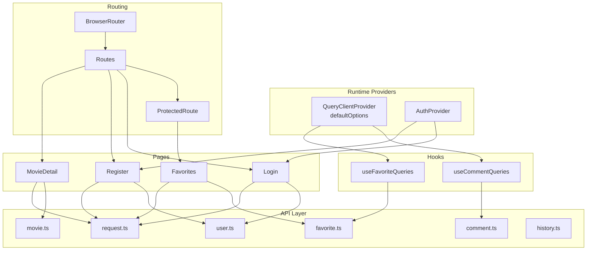
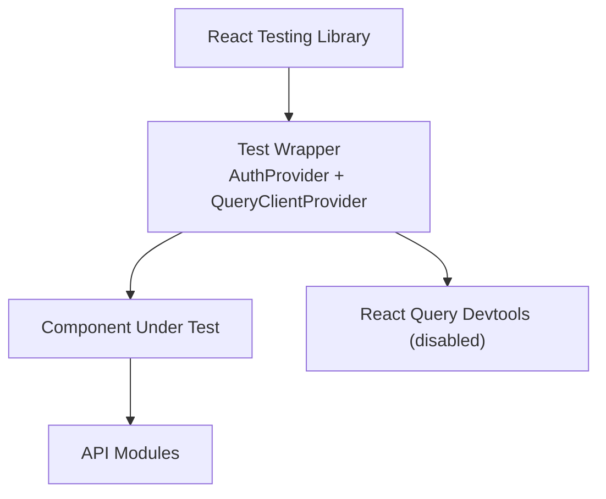
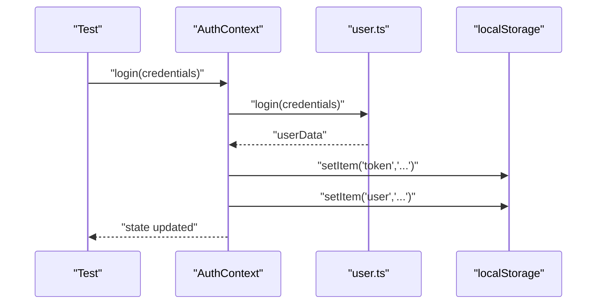
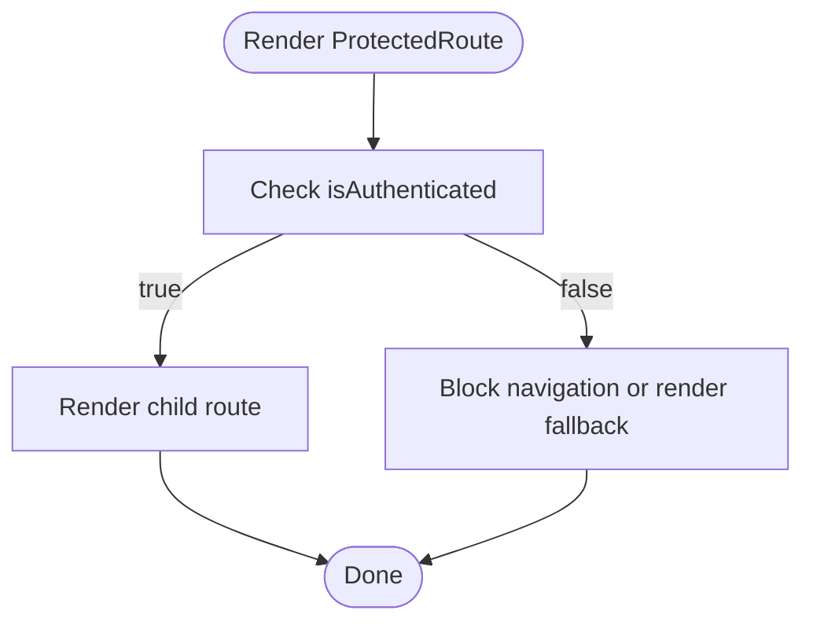
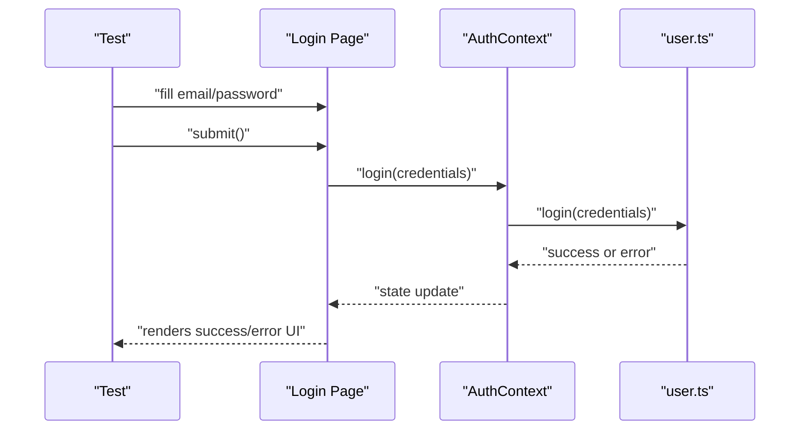
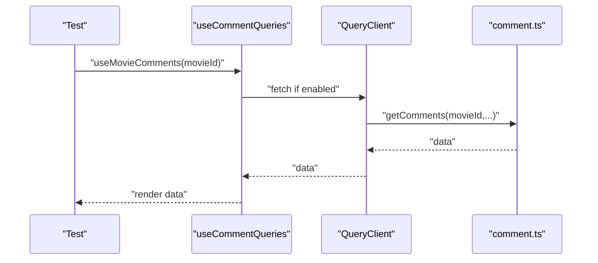
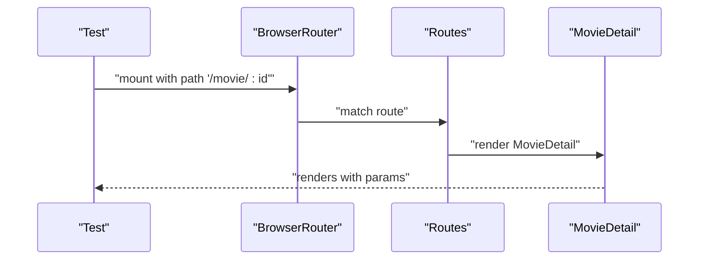
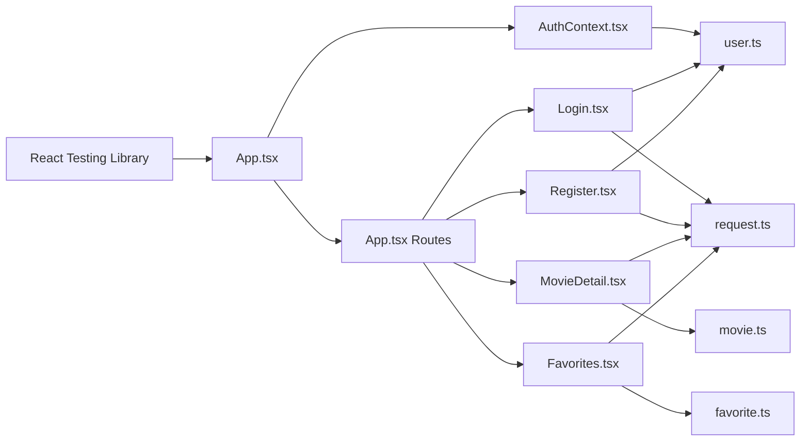

# Frontend Testing

<cite>
**Referenced Files in This Document**
- [package.json](file://movie-review-web/package.json)
- [vite.config.ts](file://movie-review-web/vite.config.ts)
- [README.md](file://movie-review-web/README.md)
- [src/main.tsx](file://movie-review-web/src/main.tsx)
- [src/App.tsx](file://movie-review-web/src/App.tsx)
- [src/context/AuthContext.tsx](file://movie-review-web/src/context/AuthContext.tsx)
- [src/hooks/useCommentQueries.ts](file://movie-review-web/src/hooks/useCommentQueries.ts)
- [src/hooks/useFavoriteQueries.ts](file://movie-review-web/src/hooks/useFavoriteQueries.ts)
- [src/components/ProtectedRoute.tsx](file://movie-review-web/src/components/ProtectedRoute.tsx)
- [src/pages/Login.tsx](file://movie-review-web/src/pages/Login.tsx)
- [src/pages/Register.tsx](file://movie-review-web/src/pages/Register.tsx)
- [src/pages/MovieDetail.tsx](file://movie-review-web/src/pages/MovieDetail.tsx)
- [src/pages/Favorites.tsx](file://movie-review-web/src/pages/Favorites.tsx)
- [src/api/request.ts](file://movie-review-web/src/api/request.ts)
- [src/api/user.ts](file://movie-review-web/src/api/user.ts)
- [src/api/movie.ts](file://movie-review-web/src/api/movie.ts)
- [src/api/comment.ts](file://movie-review-web/src/api/comment.ts)
- [src/api/favorite.ts](file://movie-review-web/src/api/favorite.ts)
- [src/api/history.ts](file://movie-review-web/src/api/history.ts)
- [src/types/index.ts](file://movie-review-web/src/types/index.ts)
</cite>

## Table of Contents
1. [Introduction](#introduction)
2. [Project Structure](#project-structure)
3. [Core Components](#core-components)
4. [Architecture Overview](#architecture-overview)
5. [Detailed Component Analysis](#detailed-component-analysis)
6. [Dependency Analysis](#dependency-analysis)
7. [Performance Considerations](#performance-considerations)
8. [Troubleshooting Guide](#troubleshooting-guide)
9. [Conclusion](#conclusion)
10. [Appendices](#appendices)

## Introduction
This document provides a comprehensive guide to implementing frontend testing for the React application. It covers setup with React Testing Library, component testing strategies, hook testing patterns, and practical examples for authentication flows, form validation, and API integration. It also addresses testing custom hooks, context providers, routing scenarios, snapshot testing, accessibility testing, and performance testing. Finally, it outlines test organization, mock strategies, testing utilities, and continuous integration setup with coverage reporting.

## Project Structure
The frontend is a React + TypeScript + Vite application with the following key areas relevant to testing:
- Application bootstrap and providers: React Query client, Auth provider, routing
- Pages and components: Feature pages, shared components, protected routes
- Hooks: TanStack Query-based hooks for comments, favorites, movies, and users
- API layer: Axios-based request utilities and typed API modules
- Types: Shared TypeScript types for requests, responses, and contexts

**Diagram sources**
- [src/main.tsx](file://movie-review-web/src/main.tsx#L1-L41)
- [src/App.tsx](file://movie-review-web/src/App.tsx#L1-L50)
- [src/context/AuthContext.tsx](file://movie-review-web/src/context/AuthContext.tsx#L1-L123)
- [src/hooks/useCommentQueries.ts](file://movie-review-web/src/hooks/useCommentQueries.ts#L1-L102)
- [src/hooks/useFavoriteQueries.ts](file://movie-review-web/src/hooks/useFavoriteQueries.ts#L1-L174)
- [src/api/request.ts](file://movie-review-web/src/api/request.ts)
- [src/api/user.ts](file://movie-review-web/src/api/user.ts)
- [src/api/movie.ts](file://movie-review-web/src/api/movie.ts)
- [src/api/comment.ts](file://movie-review-web/src/api/comment.ts)
- [src/api/favorite.ts](file://movie-review-web/src/api/favorite.ts)
- [src/api/history.ts](file://movie-review-web/src/api/history.ts)

**Section sources**
- [src/main.tsx](file://movie-review-web/src/main.tsx#L1-L41)
- [src/App.tsx](file://movie-review-web/src/App.tsx#L1-L50)
- [src/context/AuthContext.tsx](file://movie-review-web/src/context/AuthContext.tsx#L1-L123)
- [src/hooks/useCommentQueries.ts](file://movie-review-web/src/hooks/useCommentQueries.ts#L1-L102)
- [src/hooks/useFavoriteQueries.ts](file://movie-review-web/src/hooks/useFavoriteQueries.ts#L1-L174)
- [src/api/request.ts](file://movie-review-web/src/api/request.ts)
- [src/api/user.ts](file://movie-review-web/src/api/user.ts)
- [src/api/movie.ts](file://movie-review-web/src/api/movie.ts)
- [src/api/comment.ts](file://movie-review-web/src/api/comment.ts)
- [src/api/favorite.ts](file://movie-review-web/src/api/favorite.ts)
- [src/api/history.ts](file://movie-review-web/src/api/history.ts)

## Core Components
- React Query client configured with default caching and retry policies
- Authentication context managing tokens, user state, and global events
- Protected route guard enforcing authentication for private pages
- TanStack Query hooks for comments and favorites with cache invalidation
- API modules encapsulating HTTP requests via a shared request utility

Key testing implications:
- Use a test wrapper that provides QueryClientProvider and AuthProvider
- Mock API modules and React Query cache behavior
- Simulate user interactions and route transitions
- Verify side effects like localStorage updates and navigation

**Section sources**
- [src/main.tsx](file://movie-review-web/src/main.tsx#L1-L41)
- [src/context/AuthContext.tsx](file://movie-review-web/src/context/AuthContext.tsx#L1-L123)
- [src/components/ProtectedRoute.tsx](file://movie-review-web/src/components/ProtectedRoute.tsx)
- [src/hooks/useCommentQueries.ts](file://movie-review-web/src/hooks/useCommentQueries.ts#L1-L102)
- [src/hooks/useFavoriteQueries.ts](file://movie-review-web/src/hooks/useFavoriteQueries.ts#L1-L174)
- [src/api/request.ts](file://movie-review-web/src/api/request.ts)
- [src/api/user.ts](file://movie-review-web/src/api/user.ts)

## Architecture Overview
The testing architecture centers around a test renderer that wraps the app with providers and a test query client. Tests interact with components through React Testing Library, simulate user actions, and assert UI state and API calls.

**Diagram sources**
- [src/main.tsx](file://movie-review-web/src/main.tsx#L1-L41)
- [src/context/AuthContext.tsx](file://movie-review-web/src/context/AuthContext.tsx#L1-L123)
- [src/api/request.ts](file://movie-review-web/src/api/request.ts)

## Detailed Component Analysis

### Authentication Context Testing
Testing strategy:
- Wrap tests with AuthProvider
- Mock localStorage and user API
- Assert state updates and event-driven logout
- Verify guards for useAuth hook usage

**Diagram sources**
- [src/context/AuthContext.tsx](file://movie-review-web/src/context/AuthContext.tsx#L44-L63)
- [src/api/user.ts](file://movie-review-web/src/api/user.ts)

**Section sources**
- [src/context/AuthContext.tsx](file://movie-review-web/src/context/AuthContext.tsx#L1-L123)
- [src/api/user.ts](file://movie-review-web/src/api/user.ts)

### Protected Route Testing
Testing strategy:
- Render ProtectedRoute with mocked AuthContext
- Simulate authenticated vs unauthenticated states
- Assert navigation behavior and fallback rendering

**Diagram sources**
- [src/context/AuthContext.tsx](file://movie-review-web/src/context/AuthContext.tsx#L112-L120)
- [src/components/ProtectedRoute.tsx](file://movie-review-web/src/components/ProtectedRoute.tsx)

**Section sources**
- [src/context/AuthContext.tsx](file://movie-review-web/src/context/AuthContext.tsx#L1-L123)
- [src/components/ProtectedRoute.tsx](file://movie-review-web/src/components/ProtectedRoute.tsx)

### Form Validation and Authentication Flows
Testing strategy:
- Render Login and Register pages
- Fill forms and submit
- Mock user API responses and errors
- Assert UI feedback and navigation

**Diagram sources**
- [src/pages/Login.tsx](file://movie-review-web/src/pages/Login.tsx)
- [src/pages/Register.tsx](file://movie-review-web/src/pages/Register.tsx)
- [src/context/AuthContext.tsx](file://movie-review-web/src/context/AuthContext.tsx#L44-L77)
- [src/api/user.ts](file://movie-review-web/src/api/user.ts)

**Section sources**
- [src/pages/Login.tsx](file://movie-review-web/src/pages/Login.tsx)
- [src/pages/Register.tsx](file://movie-review-web/src/pages/Register.tsx)
- [src/context/AuthContext.tsx](file://movie-review-web/src/context/AuthContext.tsx#L1-L123)
- [src/api/user.ts](file://movie-review-web/src/api/user.ts)

### API Integration Testing with React Query
Testing strategy:
- Wrap tests with QueryClientProvider
- Mock API modules and network responses
- Assert query keys, enabled conditions, and cache invalidation
- Simulate mutations and optimistic updates

**Diagram sources**
- [src/hooks/useCommentQueries.ts](file://movie-review-web/src/hooks/useCommentQueries.ts#L15-L22)
- [src/api/comment.ts](file://movie-review-web/src/api/comment.ts)

**Section sources**
- [src/hooks/useCommentQueries.ts](file://movie-review-web/src/hooks/useCommentQueries.ts#L1-L102)
- [src/hooks/useFavoriteQueries.ts](file://movie-review-web/src/hooks/useFavoriteQueries.ts#L1-L174)
- [src/api/comment.ts](file://movie-review-web/src/api/comment.ts)
- [src/api/favorite.ts](file://movie-review-web/src/api/favorite.ts)

### Routing Scenarios
Testing strategy:
- Use a testing router to mount pages
- Navigate programmatically and assert rendered content
- Test nested routes and protected routes

**Diagram sources**
- [src/App.tsx](file://movie-review-web/src/App.tsx#L31-L33)
- [src/pages/MovieDetail.tsx](file://movie-review-web/src/pages/MovieDetail.tsx)

**Section sources**
- [src/App.tsx](file://movie-review-web/src/App.tsx#L1-L50)
- [src/pages/MovieDetail.tsx](file://movie-review-web/src/pages/MovieDetail.tsx)

### Snapshot Testing
Approach:
- Capture snapshots of rendered components under baseline conditions
- Update snapshots after intentional UI changes
- Keep snapshots focused on stable UI structures

Guidelines:
- Use deterministic props and controlled environments
- Avoid snapshotting dynamic or frequently changing content

[No sources needed since this section provides general guidance]

### Accessibility Testing
Approach:
- Use automated tools to check color contrast, ARIA attributes, and keyboard navigation
- Add manual checks for focus order and screen reader compatibility
- Validate that interactive elements are properly labeled

Guidelines:
- Run accessibility scans as part of CI
- Treat accessibility failures as test failures

[No sources needed since this section provides general guidance]

### Performance Testing
Approach:
- Measure component render times and re-render frequency
- Track hydration and initial load metrics
- Monitor React Query cache hits and refetches

Guidelines:
- Use profiling tools and browser devtools
- Establish baselines and alert thresholds

[No sources needed since this section provides general guidance]

## Dependency Analysis
The testing stack integrates with the runtime providers and API layer. Dependencies include:
- React Testing Library for rendering and user interactions
- React Router for routing tests
- TanStack Query for query/mutation testing
- Axios-based API modules for network mocking

**Diagram sources**
- [src/App.tsx](file://movie-review-web/src/App.tsx#L1-L50)
- [src/context/AuthContext.tsx](file://movie-review-web/src/context/AuthContext.tsx#L1-L123)
- [src/pages/Login.tsx](file://movie-review-web/src/pages/Login.tsx)
- [src/pages/Register.tsx](file://movie-review-web/src/pages/Register.tsx)
- [src/pages/MovieDetail.tsx](file://movie-review-web/src/pages/MovieDetail.tsx)
- [src/pages/Favorites.tsx](file://movie-review-web/src/pages/Favorites.tsx)
- [src/api/user.ts](file://movie-review-web/src/api/user.ts)
- [src/api/movie.ts](file://movie-review-web/src/api/movie.ts)
- [src/api/favorite.ts](file://movie-review-web/src/api/favorite.ts)
- [src/api/request.ts](file://movie-review-web/src/api/request.ts)

**Section sources**
- [src/App.tsx](file://movie-review-web/src/App.tsx#L1-L50)
- [src/context/AuthContext.tsx](file://movie-review-web/src/context/AuthContext.tsx#L1-L123)
- [src/api/user.ts](file://movie-review-web/src/api/user.ts)
- [src/api/movie.ts](file://movie-review-web/src/api/movie.ts)
- [src/api/favorite.ts](file://movie-review-web/src/api/favorite.ts)
- [src/api/request.ts](file://movie-review-web/src/api/request.ts)

## Performance Considerations
- Prefer deterministic fixtures and controlled environments for consistent test runs
- Use React Query’s test-friendly defaults and cache invalidation patterns
- Minimize external network dependencies by mocking APIs
- Leverage React Testing Library’s act and waitFor patterns to stabilize async assertions

[No sources needed since this section provides general guidance]

## Troubleshooting Guide
Common issues and resolutions:
- Missing providers: Ensure AuthProvider and QueryClientProvider wrap tests
- React Query cache interference: Reset or mock queryClient between tests
- Authentication state leakage: Clear localStorage mocks between tests
- Asynchronous state: Use waitFor and screen queries to assert UI updates

**Section sources**
- [src/main.tsx](file://movie-review-web/src/main.tsx#L1-L41)
- [src/context/AuthContext.tsx](file://movie-review-web/src/context/AuthContext.tsx#L1-L123)
- [src/hooks/useCommentQueries.ts](file://movie-review-web/src/hooks/useCommentQueries.ts#L1-L102)
- [src/hooks/useFavoriteQueries.ts](file://movie-review-web/src/hooks/useFavoriteQueries.ts#L1-L174)

## Conclusion
This guide establishes a robust testing foundation for the React application. By leveraging React Testing Library, TanStack Query’s testing patterns, and provider-based wrappers, teams can confidently test authentication flows, form validation, API integrations, custom hooks, context providers, and routing scenarios. Adopt snapshot, accessibility, and performance testing alongside CI and coverage reporting to maintain quality and reliability.

[No sources needed since this section summarizes without analyzing specific files]

## Appendices

### Test Organization Guidelines
- Group tests by feature folders mirroring src structure
- Use a single test setup file for providers and helpers
- Name test files with .test.tsx suffix
- Separate unit, integration, and component tests appropriately

[No sources needed since this section provides general guidance]

### Mock Strategies
- Mock API modules per test file or globally in setup
- Use jest.mock for module replacement
- Stub network responses and error cases
- Reset mocks between tests

[No sources needed since this section provides general guidance]

### Testing Utilities
- Create a renderWithProviders helper that includes AuthProvider and QueryClientProvider
- Provide custom screen queries and user-event helpers
- Centralize common assertions and wait helpers

[No sources needed since this section provides general guidance]

### Continuous Integration Setup
- Add a CI job to run tests and collect coverage
- Configure coverage thresholds and reporting
- Integrate with your platform’s artifact storage for reports

**Section sources**
- [package.json](file://movie-review-web/package.json#L1-L42)
- [README.md](file://movie-review-web/README.md#L1-L74)