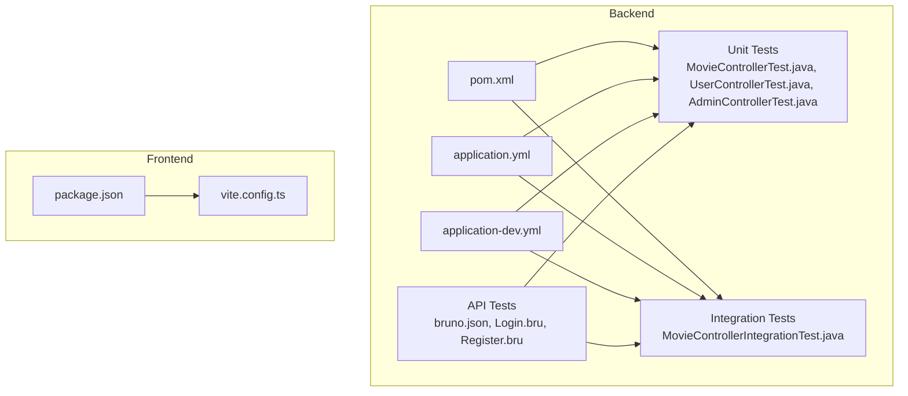
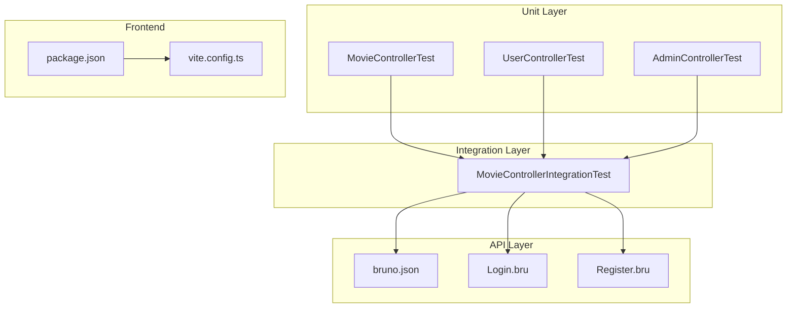
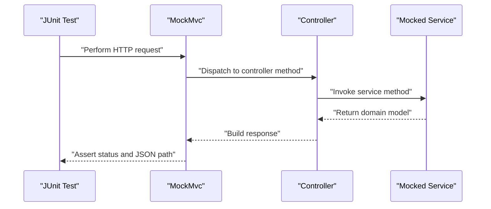
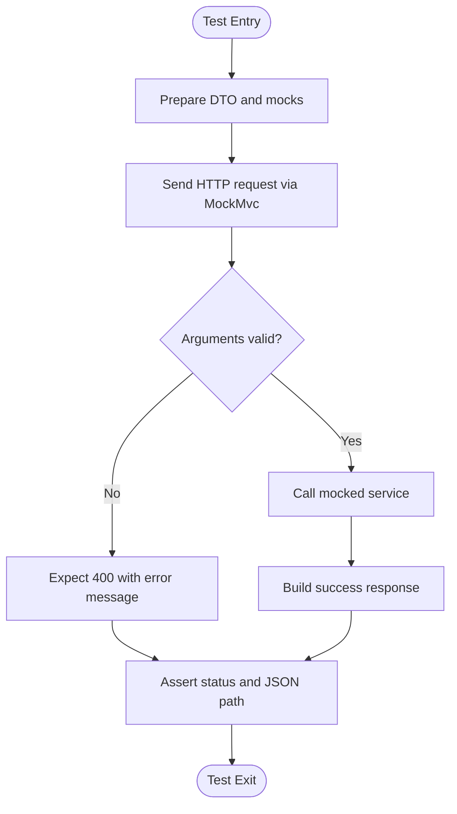
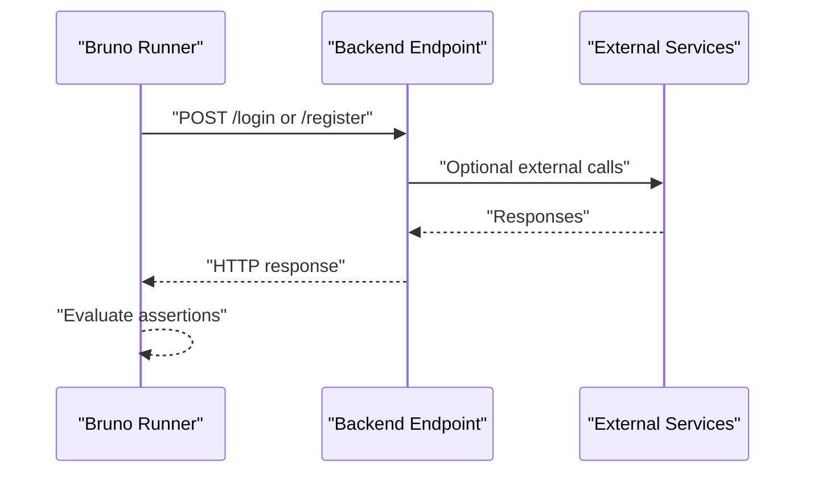
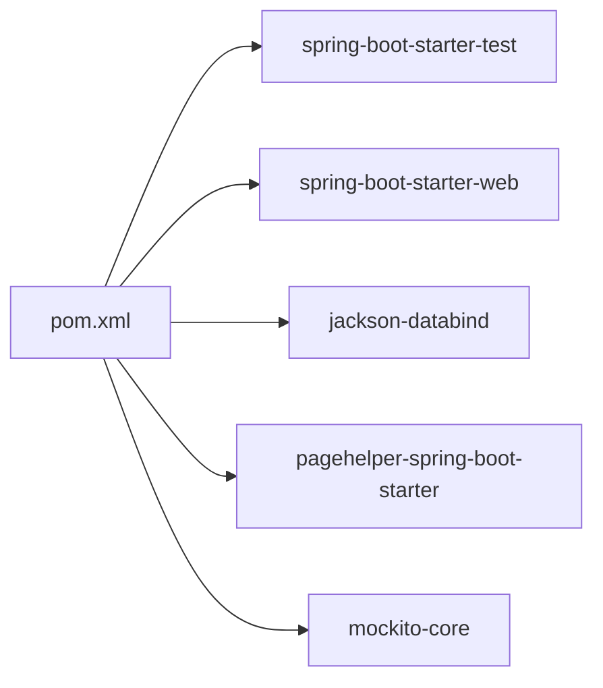

# Testing Strategy

<cite>
**Referenced Files in This Document**
- [pom.xml](file://backend/pom.xml)
- [application.yml](file://backend/src/main/resources/application.yml)
- [application-dev.yml](file://backend/src/main/resources/application-dev.yml)
- [MovieControllerTest.java](file://backend/src/test/java/com/movie/backend/controller/MovieControllerTest.java)
- [UserControllerTest.java](file://backend/src/test/java/com/movie/backend/controller/UserControllerTest.java)
- [AdminControllerTest.java](file://backend/src/test/java/com/movie/backend/controller/admin/AdminControllerTest.java)
- [MovieControllerIntegrationTest.java](file://backend/src/test/java/com/movie/backend/controller/MovieControllerIntegrationTest.java)
- [BackendApplicationTests.java](file://backend/src/test/java/com/movie/backend/BackendApplicationTests.java)
- [bruno.json](file://backend/movie_test/bruno.json)
- [Login.bru](file://backend/movie_test/Login.bru)
- [Register.bru](file://backend/movie_test/Register.bru)
- [package.json](file://movie-review-web/package.json)
- [vite.config.ts](file://movie-review-web/vite.config.ts)
</cite>

## Table of Contents
1. [Introduction](#introduction)
2. [Project Structure](#project-structure)
3. [Core Components](#core-components)
4. [Architecture Overview](#architecture-overview)
5. [Detailed Component Analysis](#detailed-component-analysis)
6. [Dependency Analysis](#dependency-analysis)
7. [Performance Considerations](#performance-considerations)
8. [Troubleshooting Guide](#troubleshooting-guide)
9. [Conclusion](#conclusion)
10. [Appendices](#appendices)

## Introduction
This document defines the testing strategy for the movie system, covering unit testing, integration testing, and API testing. It explains the testing framework setup, execution strategies, and quality assurance processes. The backend uses JUnit and Mockito for unit and integration tests, while API tests are managed with Bruno. The frontend is a React application configured with Vite and TypeScript. The document also outlines best practices, continuous integration readiness, automated workflows, coverage expectations, performance testing guidance, and debugging techniques for test failures.

## Project Structure
The repository is organized into:
- Backend (Java/Spring Boot): Unit and integration tests under src/test/java, API collections under movie_test.
- Frontend (React/Vite): Application code under movie-review-web with build and dev scripts.
- Shared configuration: Maven POM for backend dependencies and Spring profiles.

**Diagram sources**
- [pom.xml](file://backend/pom.xml#L1-L300)
- [application.yml](file://backend/src/main/resources/application.yml#L1-L4)
- [application-dev.yml](file://backend/src/main/resources/application-dev.yml#L1-L67)
- [MovieControllerTest.java](file://backend/src/test/java/com/movie/backend/controller/MovieControllerTest.java#L1-L90)
- [UserControllerTest.java](file://backend/src/test/java/com/movie/backend/controller/UserControllerTest.java#L1-L72)
- [AdminControllerTest.java](file://backend/src/test/java/com/movie/backend/controller/admin/AdminControllerTest.java#L1-L137)
- [MovieControllerIntegrationTest.java](file://backend/src/test/java/com/movie/backend/controller/MovieControllerIntegrationTest.java#L1-L375)
- [bruno.json](file://backend/movie_test/bruno.json#L1-L9)
- [Login.bru](file://backend/movie_test/Login.bru#L1-L16)
- [Register.bru](file://backend/movie_test/Register.bru#L1-L26)
- [package.json](file://movie-review-web/package.json#L1-L42)
- [vite.config.ts](file://movie-review-web/vite.config.ts#L1-L11)

**Section sources**
- [pom.xml](file://backend/pom.xml#L1-L300)
- [application.yml](file://backend/src/main/resources/application.yml#L1-L4)
- [application-dev.yml](file://backend/src/main/resources/application-dev.yml#L1-L67)
- [MovieControllerTest.java](file://backend/src/test/java/com/movie/backend/controller/MovieControllerTest.java#L1-L90)
- [UserControllerTest.java](file://backend/src/test/java/com/movie/backend/controller/UserControllerTest.java#L1-L72)
- [AdminControllerTest.java](file://backend/src/test/java/com/movie/backend/controller/admin/AdminControllerTest.java#L1-L137)
- [MovieControllerIntegrationTest.java](file://backend/src/test/java/com/movie/backend/controller/MovieControllerIntegrationTest.java#L1-L375)
- [bruno.json](file://backend/movie_test/bruno.json#L1-L9)
- [Login.bru](file://backend/movie_test/Login.bru#L1-L16)
- [Register.bru](file://backend/movie_test/Register.bru#L1-L26)
- [package.json](file://movie-review-web/package.json#L1-L42)
- [vite.config.ts](file://movie-review-web/vite.config.ts#L1-L11)

## Core Components
- Backend testing stack:
  - JUnit 5 for test lifecycle and assertions.
  - Spring Boot Test for test context and auto-configuration.
  - Mockito for mocking collaborators in unit/integration tests.
  - Spring MVC Test (MockMvc) for HTTP endpoint verification.
  - Jackson ObjectMapper for JSON serialization/deserialization in tests.
- API testing with Bruno:
  - Collection definition and test requests for login and registration.
- Frontend testing readiness:
  - React Query and Axios for data fetching.
  - Vite and TypeScript for build/testing infrastructure.

Key testing capabilities evidenced by the repository:
- Unit tests for controllers with mocked services.
- Integration tests validating parameter validation, error handling, and boundary conditions.
- API tests via Bruno collections for HTTP endpoints.
- Basic frontend package configuration suitable for adding Jest/React Testing Library later.

**Section sources**
- [MovieControllerTest.java](file://backend/src/test/java/com/movie/backend/controller/MovieControllerTest.java#L1-L90)
- [UserControllerTest.java](file://backend/src/test/java/com/movie/backend/controller/UserControllerTest.java#L1-L72)
- [AdminControllerTest.java](file://backend/src/test/java/com/movie/backend/controller/admin/AdminControllerTest.java#L1-L137)
- [MovieControllerIntegrationTest.java](file://backend/src/test/java/com/movie/backend/controller/MovieControllerIntegrationTest.java#L1-L375)
- [bruno.json](file://backend/movie_test/bruno.json#L1-L9)
- [Login.bru](file://backend/movie_test/Login.bru#L1-L16)
- [Register.bru](file://backend/movie_test/Register.bru#L1-L26)
- [package.json](file://movie-review-web/package.json#L1-L42)

## Architecture Overview
The testing architecture separates concerns across layers:
- Unit tests isolate controllers and validate HTTP behavior against mocked services.
- Integration tests validate parameter validation, error handling, and boundary conditions using Spring’s test slices.
- API tests use Bruno to exercise real endpoints with structured requests and assertions.
- Frontend relies on React Query for data fetching and can integrate unit testing frameworks in the future.

**Diagram sources**
- [MovieControllerTest.java](file://backend/src/test/java/com/movie/backend/controller/MovieControllerTest.java#L1-L90)
- [UserControllerTest.java](file://backend/src/test/java/com/movie/backend/controller/UserControllerTest.java#L1-L72)
- [AdminControllerTest.java](file://backend/src/test/java/com/movie/backend/controller/admin/AdminControllerTest.java#L1-L137)
- [MovieControllerIntegrationTest.java](file://backend/src/test/java/com/movie/backend/controller/MovieControllerIntegrationTest.java#L1-L375)
- [bruno.json](file://backend/movie_test/bruno.json#L1-L9)
- [Login.bru](file://backend/movie_test/Login.bru#L1-L16)
- [Register.bru](file://backend/movie_test/Register.bru#L1-L26)
- [package.json](file://movie-review-web/package.json#L1-L42)
- [vite.config.ts](file://movie-review-web/vite.config.ts#L1-L11)

## Detailed Component Analysis

### Backend Unit Testing with JUnit and Mockito
- Controllers are tested in isolation using Spring Boot Test and AutoConfigureMockMvc.
- Services are mocked via @MockBean to eliminate database dependencies.
- Assertions validate HTTP status codes and JSON response structure.

Representative test coverage:
- MovieController: GET detail and POST search endpoints.
- UserController: POST register and POST login endpoints.
- AdminController: Dashboard stats, user/person/comment listings, and movie creation.

**Diagram sources**
- [MovieControllerTest.java](file://backend/src/test/java/com/movie/backend/controller/MovieControllerTest.java#L46-L88)
- [UserControllerTest.java](file://backend/src/test/java/com/movie/backend/controller/UserControllerTest.java#L35-L70)
- [AdminControllerTest.java](file://backend/src/test/java/com/movie/backend/controller/admin/AdminControllerTest.java#L51-L101)

**Section sources**
- [MovieControllerTest.java](file://backend/src/test/java/com/movie/backend/controller/MovieControllerTest.java#L1-L90)
- [UserControllerTest.java](file://backend/src/test/java/com/movie/backend/controller/UserControllerTest.java#L1-L72)
- [AdminControllerTest.java](file://backend/src/test/java/com/movie/backend/controller/admin/AdminControllerTest.java#L1-L137)

### Backend Integration Testing with Parameter Validation and Error Handling
- Nested tests organize scenarios by endpoint and validation rules.
- Uses argument matchers and PageHelper’s PageInfo for pagination.
- Validates error codes and messages for invalid inputs (e.g., out-of-range scores, invalid years, zero/negative page sizes).

**Diagram sources**
- [MovieControllerIntegrationTest.java](file://backend/src/test/java/com/movie/backend/controller/MovieControllerIntegrationTest.java#L67-L111)
- [MovieControllerIntegrationTest.java](file://backend/src/test/java/com/movie/backend/controller/MovieControllerIntegrationTest.java#L117-L221)
- [MovieControllerIntegrationTest.java](file://backend/src/test/java/com/movie/backend/controller/MovieControllerIntegrationTest.java#L227-L274)

**Section sources**
- [MovieControllerIntegrationTest.java](file://backend/src/test/java/com/movie/backend/controller/MovieControllerIntegrationTest.java#L1-L375)

### API Testing with Bruno
- Bruno collection defines reusable HTTP requests for login and registration.
- Requests include URL, body, and encoding settings.
- Can be executed to validate backend endpoints outside of unit tests.

**Diagram sources**
- [bruno.json](file://backend/movie_test/bruno.json#L1-L9)
- [Login.bru](file://backend/movie_test/Login.bru#L7-L11)
- [Register.bru](file://backend/movie_test/Register.bru#L7-L20)

**Section sources**
- [bruno.json](file://backend/movie_test/bruno.json#L1-L9)
- [Login.bru](file://backend/movie_test/Login.bru#L1-L16)
- [Register.bru](file://backend/movie_test/Register.bru#L1-L26)

### Frontend Testing Patterns
- The frontend uses React Query for data fetching and Axios for HTTP communication.
- Vite and TypeScript provide a modern build pipeline suitable for adding unit tests with Jest and React Testing Library.
- No explicit frontend test files were found in the repository; this section documents recommended patterns for future implementation.

Recommended frontend testing approach:
- Use React Testing Library for component tests.
- Mock React Query cache and Axios in tests.
- Add test scripts in package.json for CI execution.

**Section sources**
- [package.json](file://movie-review-web/package.json#L1-L42)
- [vite.config.ts](file://movie-review-web/vite.config.ts#L1-L11)

## Dependency Analysis
Backend testing dependencies are declared in the Maven POM:
- Spring Boot Starter Test (JUnit, Mockito, Testcontainers optional).
- Spring Web for MVC tests.
- Jackson for JSON processing.
- PageHelper for pagination support in tests.

**Diagram sources**
- [pom.xml](file://backend/pom.xml#L24-L29)
- [pom.xml](file://backend/pom.xml#L19-L22)
- [pom.xml](file://backend/pom.xml#L38-L43)
- [pom.xml](file://backend/pom.xml#L236-L241)

**Section sources**
- [pom.xml](file://backend/pom.xml#L1-L300)

## Performance Considerations
- Use parameterized tests and nested suites to minimize repeated setup and improve maintainability.
- Prefer lightweight JSON assertions over complex object mapping in tests.
- For API tests, batch related requests in Bruno to reduce overhead.
- Avoid heavy external dependencies in unit tests; continue using mocks.
- Consider adding load tests with tools like Gatling or k6 for API-level performance after unit and integration tests stabilize.

[No sources needed since this section provides general guidance]

## Troubleshooting Guide
Common issues and resolutions:
- Missing or incorrect Authorization header in controller tests:
  - Ensure JWT tokens are generated and attached to requests.
  - Verify token generation utility and role-based claims.
- JSON path mismatches:
  - Align test expectations with the actual response structure returned by controllers.
  - Confirm ObjectMapper usage and content type in requests.
- Parameter validation errors:
  - Review integration tests for invalid inputs and expected error codes/messages.
  - Ensure DTO constraints are enforced consistently across services.
- Bruno request failures:
  - Validate base URLs and ports in environment settings.
  - Confirm request bodies and content types match backend expectations.

**Section sources**
- [MovieControllerTest.java](file://backend/src/test/java/com/movie/backend/controller/MovieControllerTest.java#L42-L44)
- [MovieControllerIntegrationTest.java](file://backend/src/test/java/com/movie/backend/controller/MovieControllerIntegrationTest.java#L83-L110)
- [Login.bru](file://backend/movie_test/Login.bru#L7-L11)
- [Register.bru](file://backend/movie_test/Register.bru#L13-L20)

## Conclusion
The movie system employs a layered testing strategy: unit tests for controllers with mocked services, integration tests for validation and error handling, and API tests with Bruno. The backend is configured with JUnit and Mockito, while the frontend is ready for unit testing with React Query and Axios. To strengthen the suite, consider adding frontend unit tests, expanding API test coverage, and integrating performance and contract tests. Continuous integration can be set up to run Maven tests and Bruno collections automatically.

[No sources needed since this section summarizes without analyzing specific files]

## Appendices

### Test Execution Strategies
- Unit tests: Run with Maven Surefire plugin during build.
- Integration tests: Execute alongside unit tests or in dedicated profiles.
- API tests: Import Bruno collection and run via Bruno CLI or desktop app.
- Frontend tests: Add Jest/RTL configuration and scripts in package.json.

**Section sources**
- [pom.xml](file://backend/pom.xml#L267-L296)
- [BackendApplicationTests.java](file://backend/src/test/java/com/movie/backend/BackendApplicationTests.java#L1-L14)
- [bruno.json](file://backend/movie_test/bruno.json#L1-L9)
- [package.json](file://movie-review-web/package.json#L6-L10)

### Quality Assurance Processes
- Enforce consistent JSON response structure and status codes.
- Maintain a shared DTO and entity model to prevent drift between tests and production.
- Use nested tests to group related scenarios and improve readability.
- Document test data management and token generation utilities for reproducibility.

**Section sources**
- [MovieControllerTest.java](file://backend/src/test/java/com/movie/backend/controller/MovieControllerTest.java#L39-L44)
- [MovieControllerIntegrationTest.java](file://backend/src/test/java/com/movie/backend/controller/MovieControllerIntegrationTest.java#L52-L61)

### Continuous Integration Setup
- Configure CI to run Maven test phase and execute Bruno collections.
- Store secrets (JWT keys, database credentials) in CI environment variables.
- Optionally run frontend lint and build steps in CI.

**Section sources**
- [application-dev.yml](file://backend/src/main/resources/application-dev.yml#L62-L66)
- [pom.xml](file://backend/pom.xml#L267-L296)
- [bruno.json](file://backend/movie_test/bruno.json#L1-L9)

### Automated Testing Workflows
- Pre-commit: Run unit tests and linters.
- CI: Full matrix of unit/integration/API tests.
- Post-deploy: Smoke tests via Bruno against staging endpoints.

**Section sources**
- [MovieControllerIntegrationTest.java](file://backend/src/test/java/com/movie/backend/controller/MovieControllerIntegrationTest.java#L32-L38)
- [bruno.json](file://backend/movie_test/bruno.json#L1-L9)

### Test Coverage Requirements
- Target: >80% line coverage for services and controllers.
- Focus: Branch coverage for validation logic and error paths.
- Tools: Jacoco for Java coverage, Istanbul/LCOF for frontend (to be introduced).

**Section sources**
- [MovieControllerIntegrationTest.java](file://backend/src/test/java/com/movie/backend/controller/MovieControllerIntegrationTest.java#L117-L221)

### Performance Testing
- After stabilizing unit and integration tests, introduce load tests with realistic request patterns.
- Monitor response times and error rates for key endpoints.

**Section sources**
- [MovieControllerIntegrationTest.java](file://backend/src/test/java/com/movie/backend/controller/MovieControllerIntegrationTest.java#L227-L274)