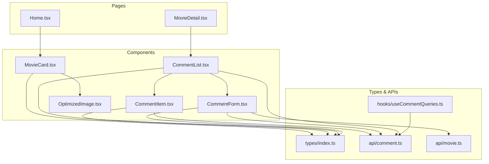
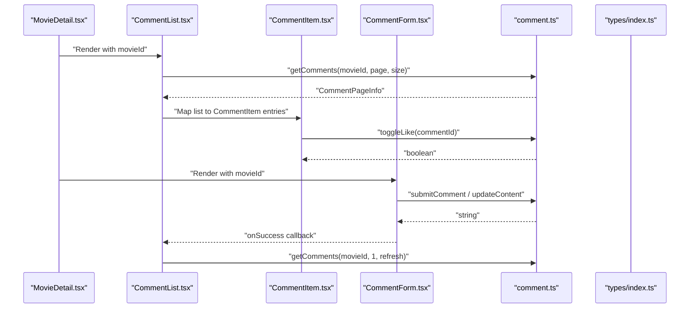
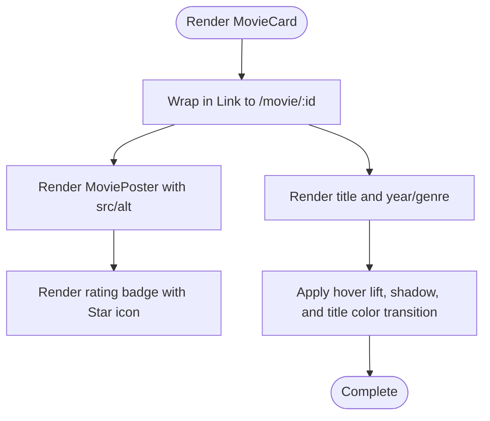
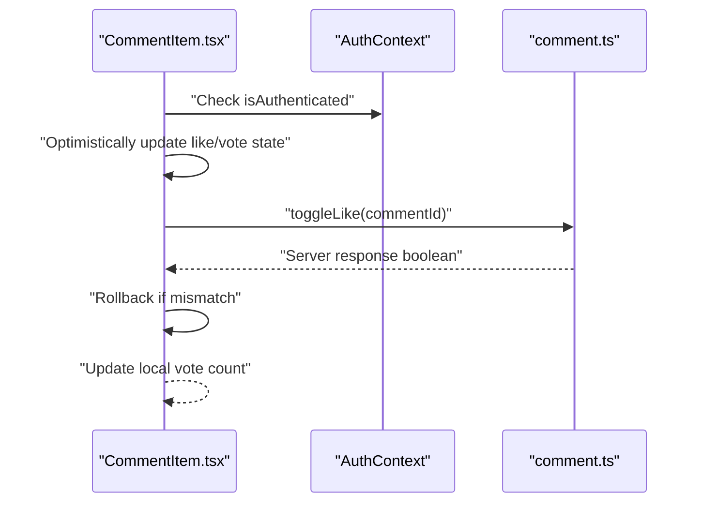
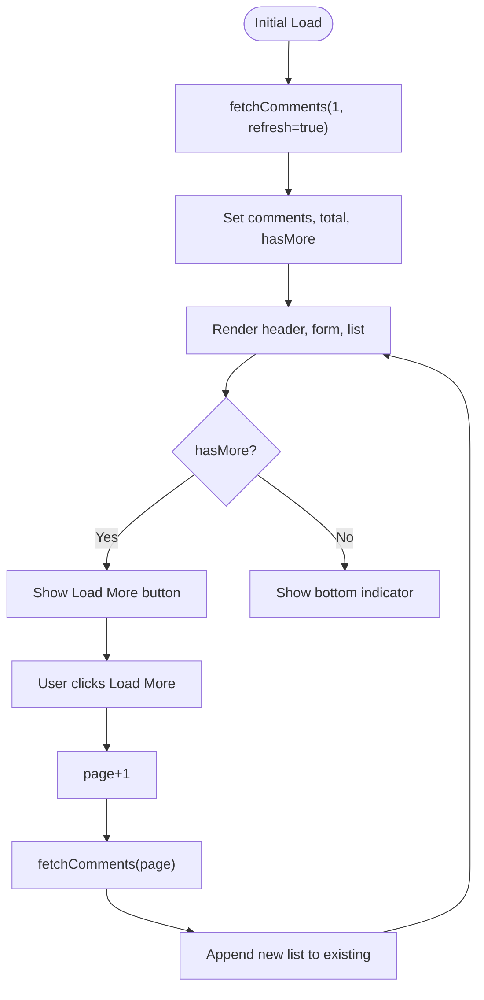
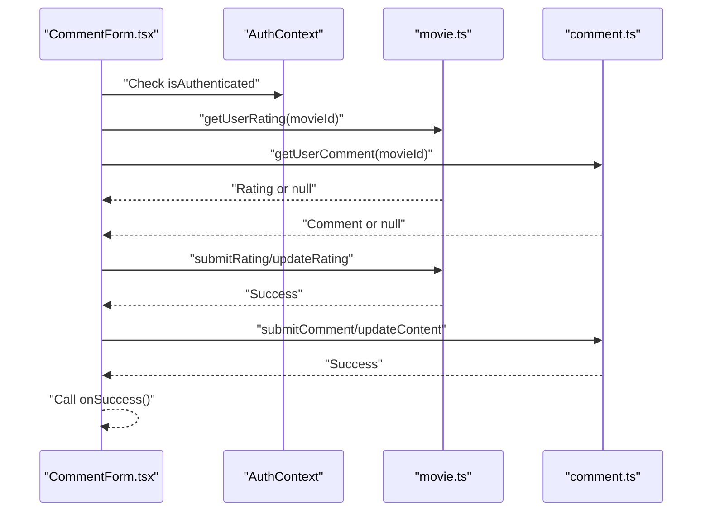
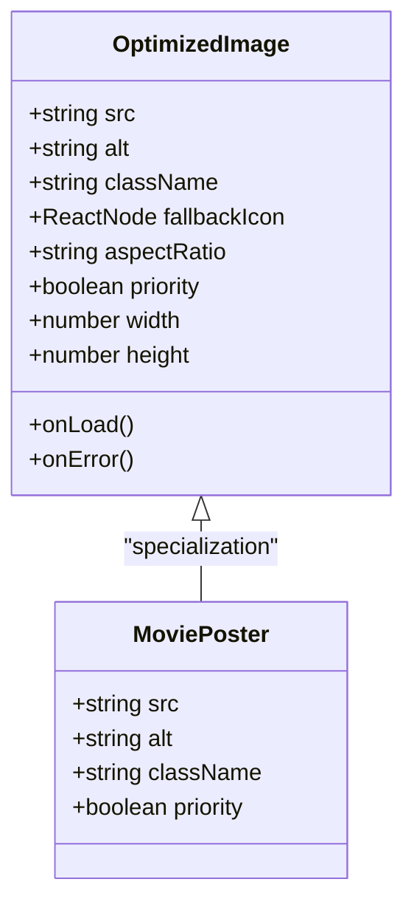
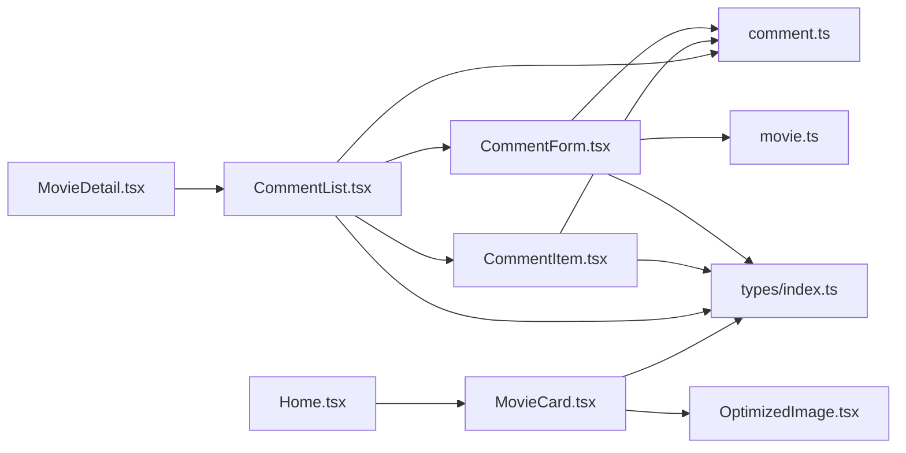

# Content Display Components

<cite>
**Referenced Files in This Document**
- [MovieCard.tsx](file://movie-review-web/src/components/MovieCard.tsx)
- [CommentItem.tsx](file://movie-review-web/src/components/CommentItem.tsx)
- [CommentList.tsx](file://movie-review-web/src/components/CommentList.tsx)
- [CommentForm.tsx](file://movie-review-web/src/components/CommentForm.tsx)
- [OptimizedImage.tsx](file://movie-review-web/src/components/OptimizedImage.tsx)
- [index.ts](file://movie-review-web/src/types/index.ts)
- [comment.ts](file://movie-review-web/src/api/comment.ts)
- [movie.ts](file://movie-review-web/src/api/movie.ts)
- [Home.tsx](file://movie-review-web/src/pages/Home.tsx)
- [MovieDetail.tsx](file://movie-review-web/src/pages/MovieDetail.tsx)
- [useCommentQueries.ts](file://movie-review-web/src/hooks/useCommentQueries.ts)
</cite>

## Table of Contents
1. [Introduction](#introduction)
2. [Project Structure](#project-structure)
3. [Core Components](#core-components)
4. [Architecture Overview](#architecture-overview)
5. [Detailed Component Analysis](#detailed-component-analysis)
6. [Dependency Analysis](#dependency-analysis)
7. [Performance Considerations](#performance-considerations)
8. [Troubleshooting Guide](#troubleshooting-guide)
9. [Conclusion](#conclusion)

## Introduction
This document provides comprehensive documentation for the content display components focused on movie information and user-generated reviews. It covers the MovieCard, CommentItem, and CommentList components, detailing their props interfaces, rendering patterns, data binding, layout designs, interactive behaviors, and integration with APIs and navigation. It also explains pagination and virtualization patterns, responsive design considerations, loading states, and performance optimization strategies for large lists.

## Project Structure
The content display components are part of the frontend React application under the movie-review-web directory. They integrate with:
- Type definitions for data models
- API clients for fetching and mutating data
- Navigation routing for deep linking to movie and user profiles
- Optimized image components for responsive media

**Diagram sources**
- [Home.tsx](file://movie-review-web/src/pages/Home.tsx#L1-L65)
- [MovieDetail.tsx](file://movie-review-web/src/pages/MovieDetail.tsx#L1-L343)
- [MovieCard.tsx](file://movie-review-web/src/components/MovieCard.tsx#L1-L38)
- [CommentList.tsx](file://movie-review-web/src/components/CommentList.tsx#L1-L107)
- [CommentItem.tsx](file://movie-review-web/src/components/CommentItem.tsx#L1-L161)
- [CommentForm.tsx](file://movie-review-web/src/components/CommentForm.tsx#L1-L222)
- [OptimizedImage.tsx](file://movie-review-web/src/components/OptimizedImage.tsx#L1-L179)
- [index.ts](file://movie-review-web/src/types/index.ts#L1-L204)
- [comment.ts](file://movie-review-web/src/api/comment.ts#L1-L49)
- [movie.ts](file://movie-review-web/src/api/movie.ts#L1-L65)
- [useCommentQueries.ts](file://movie-review-web/src/hooks/useCommentQueries.ts#L1-L102)

**Section sources**
- [Home.tsx](file://movie-review-web/src/pages/Home.tsx#L1-L65)
- [MovieDetail.tsx](file://movie-review-web/src/pages/MovieDetail.tsx#L1-L343)
- [MovieCard.tsx](file://movie-review-web/src/components/MovieCard.tsx#L1-L38)
- [CommentList.tsx](file://movie-review-web/src/components/CommentList.tsx#L1-L107)
- [CommentItem.tsx](file://movie-review-web/src/components/CommentItem.tsx#L1-L161)
- [CommentForm.tsx](file://movie-review-web/src/components/CommentForm.tsx#L1-L222)
- [OptimizedImage.tsx](file://movie-review-web/src/components/OptimizedImage.tsx#L1-L179)
- [index.ts](file://movie-review-web/src/types/index.ts#L1-L204)
- [comment.ts](file://movie-review-web/src/api/comment.ts#L1-L49)
- [movie.ts](file://movie-review-web/src/api/movie.ts#L1-L65)
- [useCommentQueries.ts](file://movie-review-web/src/hooks/useCommentQueries.ts#L1-L102)

## Core Components
This section documents the primary content display components and their responsibilities.

- MovieCard: Renders a single movie tile with poster, rating badge, title, and year/genre metadata. Provides navigation to the movie detail page.
- CommentItem: Displays a single user comment with avatar, author link, rating stars, content, timestamps, and interactive voting.
- CommentList: Manages paginated comment loading, renders CommentItem entries, and provides “Load More” and empty/loading states.

**Section sources**
- [MovieCard.tsx](file://movie-review-web/src/components/MovieCard.tsx#L1-L38)
- [CommentItem.tsx](file://movie-review-web/src/components/CommentItem.tsx#L1-L161)
- [CommentList.tsx](file://movie-review-web/src/components/CommentList.tsx#L1-L107)

## Architecture Overview
The components follow a unidirectional data flow:
- Pages orchestrate data fetching and pass props to components.
- Components render UI and delegate API interactions to dedicated modules.
- APIs encapsulate HTTP requests and normalize responses.
- Types define the shape of data passed around the app.

**Diagram sources**
- [MovieDetail.tsx](file://movie-review-web/src/pages/MovieDetail.tsx#L282-L284)
- [CommentList.tsx](file://movie-review-web/src/components/CommentList.tsx#L12-L55)
- [CommentItem.tsx](file://movie-review-web/src/components/CommentItem.tsx#L61-L97)
- [CommentForm.tsx](file://movie-review-web/src/components/CommentForm.tsx#L90-L112)
- [comment.ts](file://movie-review-web/src/api/comment.ts#L5-L46)
- [index.ts](file://movie-review-web/src/types/index.ts#L117-L144)

## Detailed Component Analysis

### MovieCard
- Purpose: Render a clickable movie tile with poster, rating badge, title, and metadata.
- Props interface:
  - movie: Movie (from types/index.ts)
- Rendering pattern:
  - Wraps content in a Link to navigate to the movie detail route.
  - Uses OptimizedImage.MoviePoster for responsive poster rendering with lazy loading and fallback.
  - Displays a rating badge with a star icon and score.
  - Truncates title and shows year/first genre.
- Hover effects and interactions:
  - Container lift and shadow on hover.
  - Poster scales up slightly on hover.
  - Title color transitions on hover.
- Data binding:
  - Reads movie.id, movie.cover, movie.name, movie.score, movie.year, movie.genres.
- Responsive design:
  - Grid layout in parent pages adapts column count based on screen size.
- Integration:
  - Navigates to /movie/:id route.

**Diagram sources**
- [MovieCard.tsx](file://movie-review-web/src/components/MovieCard.tsx#L11-L38)
- [OptimizedImage.tsx](file://movie-review-web/src/components/OptimizedImage.tsx#L129-L151)
- [index.ts](file://movie-review-web/src/types/index.ts#L34-L51)

**Section sources**
- [MovieCard.tsx](file://movie-review-web/src/components/MovieCard.tsx#L1-L38)
- [OptimizedImage.tsx](file://movie-review-web/src/components/OptimizedImage.tsx#L129-L151)
- [index.ts](file://movie-review-web/src/types/index.ts#L34-L51)

### CommentItem
- Purpose: Display a single comment with user profile, rating, content, and voting controls.
- Props interface:
  - comment: Comment (from types/index.ts)
- Rendering pattern:
  - Avatar with optional fallback icon; wraps in Link to user profile.
  - Author name with Link to user profile; optional rating stars.
  - Timestamp formatted in Chinese locale.
  - Content with pre-wrap and word breaking for long text.
  - Voting button with animated thumbs-up and vote count.
- Interactions:
  - Toggle like with optimistic UI updates and rollback on error.
  - Handles authentication gating for likes.
- Data binding:
  - Reads userNickname/userAvatar/rating/score/commentTime/content.
  - Normalizes legacy vs new field names.
- Accessibility and UX:
  - Animations for like feedback.
  - Disabled states during loading.
- Integration:
  - Calls commentApi.toggleLike for voting.

**Diagram sources**
- [CommentItem.tsx](file://movie-review-web/src/components/CommentItem.tsx#L61-L97)
- [comment.ts](file://movie-review-web/src/api/comment.ts#L21-L27)

**Section sources**
- [CommentItem.tsx](file://movie-review-web/src/components/CommentItem.tsx#L1-L161)
- [index.ts](file://movie-review-web/src/types/index.ts#L117-L134)
- [comment.ts](file://movie-review-web/src/api/comment.ts#L1-L49)

### CommentList
- Purpose: Manage paginated comments for a movie, render CommentItem entries, and provide “Load More” and empty/loading states.
- Props interface:
  - movieId: number
- Rendering pattern:
  - Header with icon and total count.
  - CommentForm for submitting/updating review.
  - List of CommentItem entries mapped from comments state.
  - Conditional rendering for loading spinner, empty state, and “Load More” button.
- Pagination and virtualization:
  - Fetches pages of 10 comments.
  - Concatenates new pages to existing list (no virtualization).
  - Uses a refresh mode to replace list on new submissions.
- Data binding:
  - Maintains comments[], total, page, hasMore, loading.
  - Calls commentApi.getComments(movieId, page, size).
- Integration:
  - Calls CommentForm with onSuccess to refresh list.
  - Uses commentApi.getComments for data.

**Diagram sources**
- [CommentList.tsx](file://movie-review-web/src/components/CommentList.tsx#L12-L55)
- [comment.ts](file://movie-review-web/src/api/comment.ts#L5-L15)

**Section sources**
- [CommentList.tsx](file://movie-review-web/src/components/CommentList.tsx#L1-L107)
- [CommentForm.tsx](file://movie-review-web/src/components/CommentForm.tsx#L1-L222)
- [comment.ts](file://movie-review-web/src/api/comment.ts#L1-L49)

### CommentForm
- Purpose: Allow authenticated users to submit or update ratings and comments for a movie.
- Props interface:
  - movieId: number
  - onSuccess: () => void
- Rendering pattern:
  - Displays user nickname and sync status.
  - Rating selector with 5-star interactive input and hover preview.
  - Textarea for comment content with placeholder hints.
  - Submit/update buttons with icons and loading states.
- Interactions:
  - Parallel checks for existing rating and comment via movieApi.getUserRating and commentApi.getUserComment.
  - Submits or updates rating and comment with confirmation prompts.
  - On success, triggers onSuccess to refresh CommentList.
- Data binding:
  - Reads user context and sets content/rating state.
  - Calls commentApi.submitComment/updateContent and movieApi.submitRating/updateRating.
- Integration:
  - Integrates with AuthContext and error handling utilities.

**Diagram sources**
- [CommentForm.tsx](file://movie-review-web/src/components/CommentForm.tsx#L34-L64)
- [CommentForm.tsx](file://movie-review-web/src/components/CommentForm.tsx#L67-L88)
- [CommentForm.tsx](file://movie-review-web/src/components/CommentForm.tsx#L90-L112)
- [movie.ts](file://movie-review-web/src/api/movie.ts#L42-L48)
- [comment.ts](file://movie-review-web/src/api/comment.ts#L34-L39)

**Section sources**
- [CommentForm.tsx](file://movie-review-web/src/components/CommentForm.tsx#L1-L222)
- [movie.ts](file://movie-review-web/src/api/movie.ts#L1-L65)
- [comment.ts](file://movie-review-web/src/api/comment.ts#L1-L49)

### OptimizedImage and MoviePoster
- Purpose: Provide responsive, lazy-loaded images with loading placeholders and error fallbacks.
- MoviePoster specializes MovieCard’s poster rendering with fixed aspect ratio and priority loading.
- Features:
  - IntersectionObserver-based lazy loading with a small root margin.
  - Pulse loader and fallback icon on error.
  - Priority prop to bypass lazy loading for above-the-fold images.
  - Aspect ratio support for consistent layouts.

**Diagram sources**
- [OptimizedImage.tsx](file://movie-review-web/src/components/OptimizedImage.tsx#L4-L15)
- [OptimizedImage.tsx](file://movie-review-web/src/components/OptimizedImage.tsx#L129-L151)

**Section sources**
- [OptimizedImage.tsx](file://movie-review-web/src/components/OptimizedImage.tsx#L1-L179)
- [MovieCard.tsx](file://movie-review-web/src/components/MovieCard.tsx#L15-L19)

## Dependency Analysis
- Component dependencies:
  - MovieCard depends on OptimizedImage and types.Movie.
  - CommentItem depends on commentApi and types.Comment.
  - CommentList depends on CommentItem, CommentForm, commentApi, and types.Comment.
  - CommentForm depends on AuthContext, commentApi, movieApi, and types.Comment.
- API dependencies:
  - comment.ts exposes getComments, submitComment, updateContent, toggleLike, getUserComment, getMyComments.
  - movie.ts exposes getUserRating, submitRating, updateRating, getMyRatings.
- Type dependencies:
  - types/index.ts defines Movie, Comment, CommentPageInfo, and PageInfo.

**Diagram sources**
- [MovieCard.tsx](file://movie-review-web/src/components/MovieCard.tsx#L1-L9)
- [CommentList.tsx](file://movie-review-web/src/components/CommentList.tsx#L1-L6)
- [CommentItem.tsx](file://movie-review-web/src/components/CommentItem.tsx#L1-L6)
- [CommentForm.tsx](file://movie-review-web/src/components/CommentForm.tsx#L1-L8)
- [comment.ts](file://movie-review-web/src/api/comment.ts#L1-L49)
- [movie.ts](file://movie-review-web/src/api/movie.ts#L1-L65)
- [index.ts](file://movie-review-web/src/types/index.ts#L34-L144)
- [MovieDetail.tsx](file://movie-review-web/src/pages/MovieDetail.tsx#L4-L4)
- [Home.tsx](file://movie-review-web/src/pages/Home.tsx#L3-L3)

**Section sources**
- [MovieCard.tsx](file://movie-review-web/src/components/MovieCard.tsx#L1-L38)
- [CommentList.tsx](file://movie-review-web/src/components/CommentList.tsx#L1-L107)
- [CommentItem.tsx](file://movie-review-web/src/components/CommentItem.tsx#L1-L161)
- [CommentForm.tsx](file://movie-review-web/src/components/CommentForm.tsx#L1-L222)
- [comment.ts](file://movie-review-web/src/api/comment.ts#L1-L49)
- [movie.ts](file://movie-review-web/src/api/movie.ts#L1-L65)
- [index.ts](file://movie-review-web/src/types/index.ts#L1-L204)
- [MovieDetail.tsx](file://movie-review-web/src/pages/MovieDetail.tsx#L1-L343)
- [Home.tsx](file://movie-review-web/src/pages/Home.tsx#L1-L65)

## Performance Considerations
- Lazy loading and responsive images:
  - OptimizedImage uses IntersectionObserver for lazy loading and loading placeholders to reduce initial bundle size and improve perceived performance.
- Pagination over concatenation:
  - CommentList fetches pages of 10 comments and concatenates to existing list. For very large lists, consider virtualization (e.g., react-window or react-virtual) to limit DOM nodes.
- Optimistic UI:
  - CommentItem optimistically updates like state and animates feedback, rolling back on server mismatch to prevent inconsistent UI.
- Priority loading:
  - MoviePoster uses priority for above-the-fold images to improve First Contentful Paint.
- Caching and invalidation:
  - useCommentQueries.ts invalidates queries on mutations to keep lists consistent without full reloads.
- Recommendations:
  - Implement windowing/virtualization for CommentList when comment counts exceed ~100–200.
  - Debounce search and infinite scroll thresholds to reduce API calls.
  - Use React.memo for CommentItem and memoized callbacks in CommentList to minimize re-renders.

[No sources needed since this section provides general guidance]

## Troubleshooting Guide
- Comments not loading:
  - Verify movieId prop is numeric and positive in CommentList.
  - Check network tab for 401 errors; commentApi automatically switches to public endpoints for guests.
- Like button not responding:
  - Ensure user is authenticated; CommentItem shows an alert and prevents action if not.
  - Confirm toggleLike endpoint returns expected boolean and that local state matches server response.
- Empty list state:
  - CommentList shows a friendly message when comments.length is zero and not loading.
- Pagination issues:
  - Confirm hasMore flag and hasNextPage from API; ensure page increments correctly.
- Image placeholders:
  - MoviePoster falls back to a placeholder when src is missing; verify backend image URLs.

**Section sources**
- [CommentList.tsx](file://movie-review-web/src/components/CommentList.tsx#L19-L55)
- [CommentItem.tsx](file://movie-review-web/src/components/CommentItem.tsx#L61-L97)
- [comment.ts](file://movie-review-web/src/api/comment.ts#L5-L15)

## Conclusion
The content display components provide a cohesive, responsive, and interactive experience for browsing movies and reviewing them. MovieCard offers a compact, navigable tile with optimized media. CommentList manages scalable pagination with optimistic updates, while CommentItem delivers rich social interactions. CommentForm integrates rating and commenting flows with user context and error handling. For large-scale deployments, consider virtualization and caching strategies to further enhance performance.