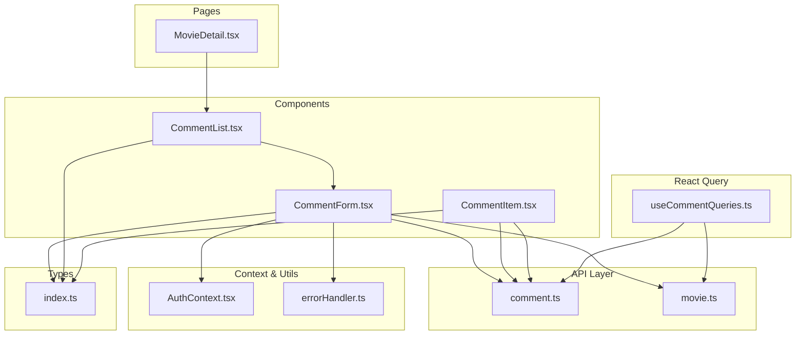
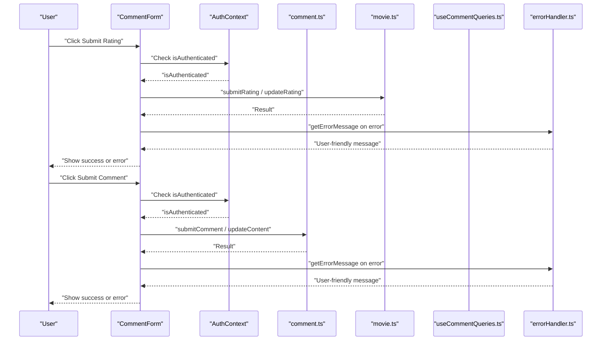
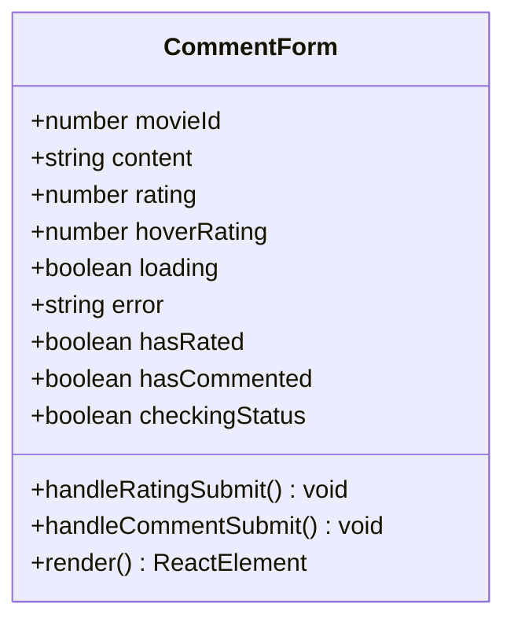
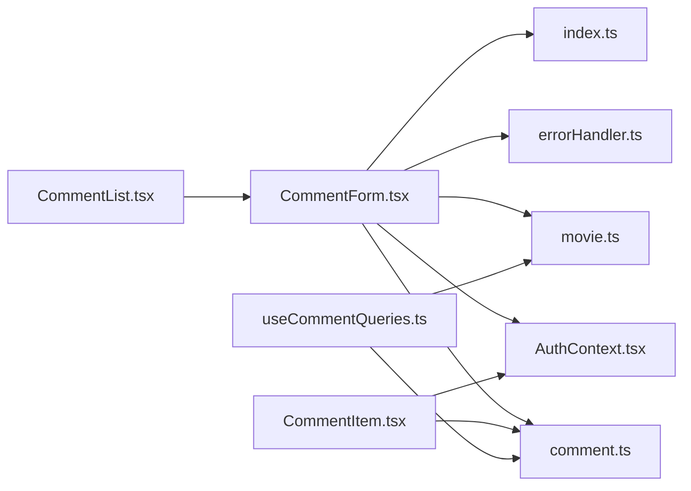

# Form Components

<cite>
**Referenced Files in This Document**
- [CommentForm.tsx](file://movie-review-web/src/components/CommentForm.tsx)
- [comment.ts](file://movie-review-web/src/api/comment.ts)
- [movie.ts](file://movie-review-web/src/api/movie.ts)
- [useCommentQueries.ts](file://movie-review-web/src/hooks/useCommentQueries.ts)
- [AuthContext.tsx](file://movie-review-web/src/context/AuthContext.tsx)
- [errorHandler.ts](file://movie-review-web/src/utils/errorHandler.ts)
- [CommentList.tsx](file://movie-review-web/src/components/CommentList.tsx)
- [CommentItem.tsx](file://movie-review-web/src/components/CommentItem.tsx)
- [MovieDetail.tsx](file://movie-review-web/src/pages/MovieDetail.tsx)
- [index.ts](file://movie-review-web/src/types/index.ts)
</cite>

## Table of Contents
1. [Introduction](#introduction)
2. [Project Structure](#project-structure)
3. [Core Components](#core-components)
4. [Architecture Overview](#architecture-overview)
5. [Detailed Component Analysis](#detailed-component-analysis)
6. [Dependency Analysis](#dependency-analysis)
7. [Performance Considerations](#performance-considerations)
8. [Troubleshooting Guide](#troubleshooting-guide)
9. [Conclusion](#conclusion)
10. [Appendices](#appendices)

## Introduction
This document provides comprehensive documentation for form components, with a primary focus on the CommentForm component. It explains form validation patterns, input handling, error display mechanisms, and submission workflows. It also covers form state management, controlled components, validation rules, user feedback patterns, integration with React Query, error handling strategies, accessibility compliance, styling and responsive design considerations, and integration with authentication context.

## Project Structure
The form components are part of a React-based frontend application integrated with a Java backend. The CommentForm component resides under the components directory and orchestrates user interactions for submitting and updating ratings and comments. It integrates with:
- Authentication context for user state
- API clients for comments and ratings
- React Query hooks for caching and optimistic updates
- Utility functions for error handling

**Diagram sources**
- [CommentForm.tsx](file://movie-review-web/src/components/CommentForm.tsx#L1-L222)
- [comment.ts](file://movie-review-web/src/api/comment.ts#L1-L49)
- [movie.ts](file://movie-review-web/src/api/movie.ts#L1-L65)
- [useCommentQueries.ts](file://movie-review-web/src/hooks/useCommentQueries.ts#L1-L102)
- [AuthContext.tsx](file://movie-review-web/src/context/AuthContext.tsx#L1-L123)
- [errorHandler.ts](file://movie-review-web/src/utils/errorHandler.ts#L1-L60)
- [CommentList.tsx](file://movie-review-web/src/components/CommentList.tsx#L1-L107)
- [CommentItem.tsx](file://movie-review-web/src/components/CommentItem.tsx#L1-L161)
- [MovieDetail.tsx](file://movie-review-web/src/pages/MovieDetail.tsx#L1-L343)
- [index.ts](file://movie-review-web/src/types/index.ts#L1-L204)

**Section sources**
- [CommentForm.tsx](file://movie-review-web/src/components/CommentForm.tsx#L1-L222)
- [CommentList.tsx](file://movie-review-web/src/components/CommentList.tsx#L1-L107)
- [MovieDetail.tsx](file://movie-review-web/src/pages/MovieDetail.tsx#L1-L343)

## Core Components
- CommentForm: A composite form component that manages rating and comment submission, handles authentication gating, and displays user feedback.
- CommentList: Displays paginated comments and embeds the CommentForm, coordinating refresh after successful submissions.
- CommentItem: Renders individual comments with user metadata, timestamps, and voting interactions.
- useCommentQueries: Provides React Query hooks for fetching comments, submitting/updating comments, and toggling likes with cache invalidation.
- AuthContext: Supplies authentication state and utilities to components requiring user context.
- errorHandler: Centralized error extraction and user-friendly messaging for API failures.

**Section sources**
- [CommentForm.tsx](file://movie-review-web/src/components/CommentForm.tsx#L1-L222)
- [CommentList.tsx](file://movie-review-web/src/components/CommentList.tsx#L1-L107)
- [CommentItem.tsx](file://movie-review-web/src/components/CommentItem.tsx#L1-L161)
- [useCommentQueries.ts](file://movie-review-web/src/hooks/useCommentQueries.ts#L1-L102)
- [AuthContext.tsx](file://movie-review-web/src/context/AuthContext.tsx#L1-L123)
- [errorHandler.ts](file://movie-review-web/src/utils/errorHandler.ts#L1-L60)

## Architecture Overview
The CommentForm participates in a controlled component pattern with local state for content, rating, hover state, and loading/error indicators. It performs conditional rendering based on authentication and user interaction history. Submission workflows integrate with:
- API clients for comments and ratings
- React Query mutations for optimistic updates and cache invalidation
- Error handling utilities for consistent user feedback

**Diagram sources**
- [CommentForm.tsx](file://movie-review-web/src/components/CommentForm.tsx#L67-L112)
- [AuthContext.tsx](file://movie-review-web/src/context/AuthContext.tsx#L1-L123)
- [comment.ts](file://movie-review-web/src/api/comment.ts#L17-L39)
- [movie.ts](file://movie-review-web/src/api/movie.ts#L39-L48)
- [errorHandler.ts](file://movie-review-web/src/utils/errorHandler.ts#L17-L60)

## Detailed Component Analysis

### CommentForm Component
The CommentForm component encapsulates:
- Controlled inputs for rating and comment content
- Authentication gating and user identity display
- Status checks for existing user ratings/comments
- Submission workflows for both rating and comment
- Error display and loading states
- Accessibility-compliant interactions

Key behaviors:
- Controlled components: state is managed locally for content, rating, hover rating, and flags for editing modes.
- Authentication gating: renders a login prompt when the user is not authenticated.
- Status synchronization: on mount, fetches user’s existing rating and comment for the movie and pre-populates form state.
- Dual submission paths: separate handlers for rating and comment submission with confirm dialogs for updates.
- Error handling: centralized error extraction with user-friendly messages.
- Feedback: loading indicators, success alerts, and error banners.

Validation patterns:
- Rating validation: prevents submission when rating is zero.
- Comment validation: prevents submission when content is empty or whitespace-only.
- Confirmation dialogs: prompts before updating existing rating/comment.

Submission workflows:
- Rating: either submits a new rating or updates an existing one, then triggers a success callback to refresh related lists.
- Comment: either submits a new comment or updates an existing one, then triggers a success callback to refresh the comment list.

User feedback patterns:
- Disabled states during loading and while checking status.
- Animated loaders and pulse indicators for asynchronous operations.
- Success alerts and error banners with icons.

Accessibility considerations:
- Focus management and keyboard navigation for interactive elements.
- Disabled states for buttons when actions are not permitted.
- Semantic labeling and ARIA-friendly button roles.

Integration with React Query:
- While the component performs direct API calls, the surrounding list infrastructure uses React Query for caching and invalidation. The success callbacks trigger cache invalidation to keep UI synchronized.

Styling and responsive design:
- Tailwind-based responsive layout with flexbox and grid.
- Adaptive spacing and typography scales for different screen sizes.
- Hover and focus states for interactive elements.

Integration with authentication context:
- Uses AuthContext to determine authentication state and display user nickname.
- Redirects unauthenticated users to the login page.

**Section sources**
- [CommentForm.tsx](file://movie-review-web/src/components/CommentForm.tsx#L1-L222)
- [AuthContext.tsx](file://movie-review-web/src/context/AuthContext.tsx#L1-L123)
- [errorHandler.ts](file://movie-review-web/src/utils/errorHandler.ts#L1-L60)
- [index.ts](file://movie-review-web/src/types/index.ts#L117-L144)

#### Class Diagram: CommentForm Internal State and Methods

**Diagram sources**
- [CommentForm.tsx](file://movie-review-web/src/components/CommentForm.tsx#L9-L12)

### API Integrations
- comment.ts: Provides functions for:
  - Fetching comments with or without user interaction data depending on authentication
  - Submitting and updating comments
  - Toggling likes for comments
  - Retrieving user-specific comment for a movie
  - Fetching user’s comment history
- movie.ts: Provides functions for:
  - Submitting and updating ratings
  - Fetching user’s rating for a movie
  - Additional rating-related operations

These APIs are consumed directly by CommentForm for immediate operations and indirectly through React Query hooks in higher-level components.

**Section sources**
- [comment.ts](file://movie-review-web/src/api/comment.ts#L1-L49)
- [movie.ts](file://movie-review-web/src/api/movie.ts#L1-L65)

### React Query Hooks for Comments
The useCommentQueries module defines:
- Query keys for caching comment lists, user comments, and personal comment history
- Queries for fetching comments and user-specific comment
- Mutations for submitting, updating comments, and toggling likes with cache invalidation

These hooks enable optimistic UI updates and consistent cache synchronization across the application.

**Section sources**
- [useCommentQueries.ts](file://movie-review-web/src/hooks/useCommentQueries.ts#L1-L102)

### Authentication Context Integration
AuthContext supplies:
- User identity and authentication state
- Login, register, and logout functions
- Global listeners for unauthorized events and token refresh

CommentForm relies on authentication state to gate access and to display the current user’s nickname.

**Section sources**
- [AuthContext.tsx](file://movie-review-web/src/context/AuthContext.tsx#L1-L123)

### Error Handling Strategy
The errorHandler module extracts user-friendly messages from API errors:
- Handles Axios HTTP errors with structured response data
- Falls back to status-code-based messages
- Supports standard Error objects and direct string errors
- Provides a default message for unknown errors

CommentForm uses this utility to present meaningful error messages to users after failed submissions.

**Section sources**
- [errorHandler.ts](file://movie-review-web/src/utils/errorHandler.ts#L1-L60)
- [CommentForm.tsx](file://movie-review-web/src/components/CommentForm.tsx#L83-L108)

### CommentList and CommentItem Integration
CommentList:
- Manages pagination and loading states
- Embeds CommentForm and passes a success callback to refresh the list
- Displays comments and “load more” functionality

CommentItem:
- Renders individual comments with user metadata and timestamps
- Implements like/unlike interactions with optimistic UI updates

Together, these components provide a cohesive comment experience around the CommentForm.

**Section sources**
- [CommentList.tsx](file://movie-review-web/src/components/CommentList.tsx#L1-L107)
- [CommentItem.tsx](file://movie-review-web/src/components/CommentItem.tsx#L1-L161)

### MovieDetail Integration
MovieDetail integrates the comment system by:
- Rendering the comment section and handling scroll-to-comment behavior
- Managing authentication gating for writing reviews
- Providing navigation to the login page when needed

**Section sources**
- [MovieDetail.tsx](file://movie-review-web/src/pages/MovieDetail.tsx#L1-L343)

## Dependency Analysis
The CommentForm component depends on:
- AuthContext for authentication state and user identity
- comment.ts and movie.ts for API interactions
- errorHandler.ts for consistent error messaging
- index.ts for shared types and interfaces

**Diagram sources**
- [CommentForm.tsx](file://movie-review-web/src/components/CommentForm.tsx#L1-L222)
- [AuthContext.tsx](file://movie-review-web/src/context/AuthContext.tsx#L1-L123)
- [comment.ts](file://movie-review-web/src/api/comment.ts#L1-L49)
- [movie.ts](file://movie-review-web/src/api/movie.ts#L1-L65)
- [errorHandler.ts](file://movie-review-web/src/utils/errorHandler.ts#L1-L60)
- [CommentList.tsx](file://movie-review-web/src/components/CommentList.tsx#L1-L107)
- [CommentItem.tsx](file://movie-review-web/src/components/CommentItem.tsx#L1-L161)
- [useCommentQueries.ts](file://movie-review-web/src/hooks/useCommentQueries.ts#L1-L102)
- [index.ts](file://movie-review-web/src/types/index.ts#L1-L204)

**Section sources**
- [CommentForm.tsx](file://movie-review-web/src/components/CommentForm.tsx#L1-L222)
- [useCommentQueries.ts](file://movie-review-web/src/hooks/useCommentQueries.ts#L1-L102)

## Performance Considerations
- Controlled components minimize unnecessary re-renders by managing state locally.
- Parallel status checks for rating and comment reduce initial load time.
- Loading and disabled states prevent redundant submissions and improve perceived responsiveness.
- React Query cache invalidation ensures efficient updates without full page reloads in higher-level components.

[No sources needed since this section provides general guidance]

## Troubleshooting Guide
Common issues and resolutions:
- Authentication gating: Unauthenticated users are redirected to the login page. Ensure AuthContext is properly initialized and token is present in localStorage.
- Empty content submission: The component prevents submission when content is empty or whitespace-only. Validate input length before enabling submit buttons.
- Duplicate submissions: Loading states disable buttons. Ensure loading flags are reset in finally blocks after API calls.
- Error messages: Use getErrorMessage to surface user-friendly messages. Verify Axios error handling and fallback status codes.
- Cache synchronization: After successful submissions, ensure cache invalidation occurs to reflect updates in lists.

**Section sources**
- [CommentForm.tsx](file://movie-review-web/src/components/CommentForm.tsx#L67-L112)
- [errorHandler.ts](file://movie-review-web/src/utils/errorHandler.ts#L17-L60)
- [useCommentQueries.ts](file://movie-review-web/src/hooks/useCommentQueries.ts#L44-L86)

## Conclusion
The CommentForm component demonstrates robust form handling with controlled components, authentication gating, and user feedback. Its integration with API clients, error handling utilities, and React Query enables a responsive and consistent user experience. The component’s design supports accessibility, responsive styling, and seamless integration with the broader comment ecosystem.

[No sources needed since this section summarizes without analyzing specific files]

## Appendices

### Validation Rules Reference
- Rating validation: Must be greater than zero before submission.
- Comment validation: Content must be non-empty after trimming.

**Section sources**
- [CommentForm.tsx](file://movie-review-web/src/components/CommentForm.tsx#L67-L112)

### Accessibility Compliance Checklist
- Keyboard navigation: Interactive elements support tab order and Enter/Space activation.
- Focus management: Clear focus indicators on interactive elements.
- Disabled states: Buttons and inputs reflect disabled state appropriately.
- ARIA roles: Buttons use appropriate roles and labels.

**Section sources**
- [CommentForm.tsx](file://movie-review-web/src/components/CommentForm.tsx#L146-L210)

### Styling and Responsive Design Notes
- Tailwind utilities provide responsive layouts across breakpoints.
- Adaptive padding and margins ensure readability on mobile devices.
- Hover and focus states enhance interactivity and usability.

**Section sources**
- [CommentForm.tsx](file://movie-review-web/src/components/CommentForm.tsx#L125-L221)