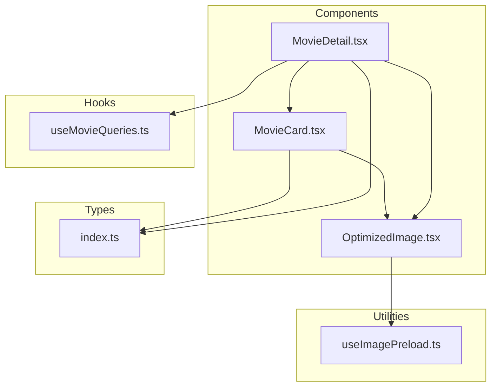
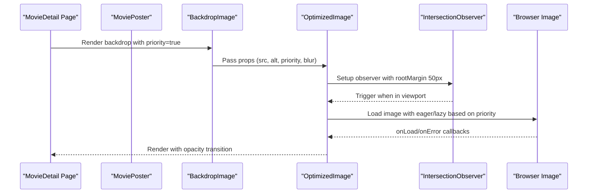
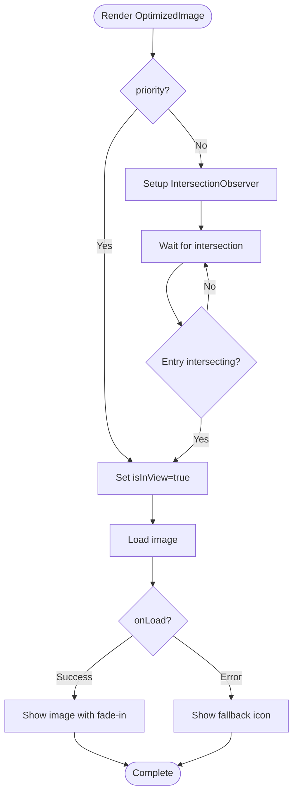
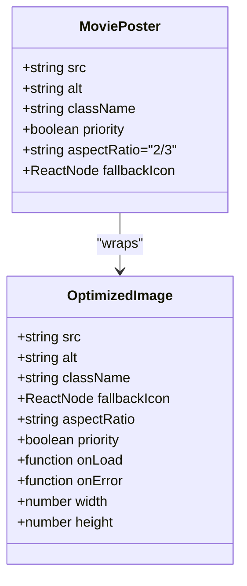
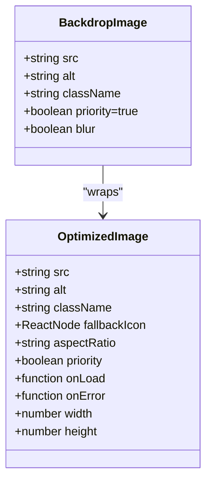
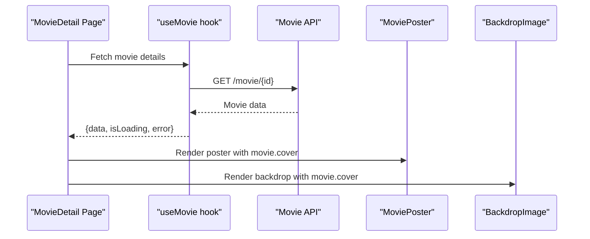
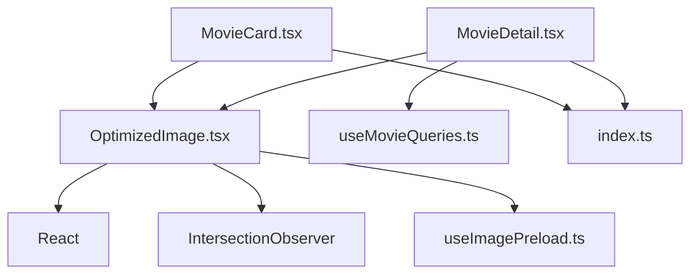

# Image Components

<cite>
**Referenced Files in This Document**
- [OptimizedImage.tsx](file://movie-review-web/src/components/OptimizedImage.tsx)
- [MovieCard.tsx](file://movie-review-web/src/components/MovieCard.tsx)
- [MovieDetail.tsx](file://movie-review-web/src/pages/MovieDetail.tsx)
- [useImagePreload.ts](file://movie-review-web/src/utils/useImagePreload.ts)
- [index.ts](file://movie-review-web/src/types/index.ts)
- [useMovieQueries.ts](file://movie-review-web/src/hooks/useMovieQueries.ts)
</cite>

## Table of Contents
1. [Introduction](#introduction)
2. [Project Structure](#project-structure)
3. [Core Components](#core-components)
4. [Architecture Overview](#architecture-overview)
5. [Detailed Component Analysis](#detailed-component-analysis)
6. [Dependency Analysis](#dependency-analysis)
7. [Performance Considerations](#performance-considerations)
8. [Troubleshooting Guide](#troubleshooting-guide)
9. [Conclusion](#conclusion)
10. [Appendices](#appendices)

## Introduction
This document provides comprehensive documentation for the image optimization components used in the movie review web application. It focuses on three primary components:
- OptimizedImage: A flexible, lazy-loading image component with loading states, error handling, and responsive image support.
- MoviePoster: A specialized poster component tailored for movie posters with fixed aspect ratio and fallback icon.
- BackdropImage: A specialized hero/backdrop component optimized for large background images with optional blur effect.

The documentation covers props interfaces, lazy loading implementation using IntersectionObserver, loading and error states, fallback mechanisms, aspect ratio handling, responsive image generation, performance optimizations, accessibility considerations, loading strategies, and integration patterns with movie data.

## Project Structure
The image components are located in the frontend project under the components directory and are used across several pages and components. They integrate with React Query hooks for data fetching and with utility hooks for preloading images.

**Diagram sources**
- [OptimizedImage.tsx](file://movie-review-web/src/components/OptimizedImage.tsx#L1-L179)
- [MovieCard.tsx](file://movie-review-web/src/components/MovieCard.tsx#L1-L38)
- [MovieDetail.tsx](file://movie-review-web/src/pages/MovieDetail.tsx#L1-L343)
- [useImagePreload.ts](file://movie-review-web/src/utils/useImagePreload.ts#L1-L75)
- [index.ts](file://movie-review-web/src/types/index.ts#L34-L51)
- [useMovieQueries.ts](file://movie-review-web/src/hooks/useMovieQueries.ts#L1-L95)

**Section sources**
- [OptimizedImage.tsx](file://movie-review-web/src/components/OptimizedImage.tsx#L1-L179)
- [MovieCard.tsx](file://movie-review-web/src/components/MovieCard.tsx#L1-L38)
- [MovieDetail.tsx](file://movie-review-web/src/pages/MovieDetail.tsx#L1-L343)
- [useImagePreload.ts](file://movie-review-web/src/utils/useImagePreload.ts#L1-L75)
- [index.ts](file://movie-review-web/src/types/index.ts#L34-L51)
- [useMovieQueries.ts](file://movie-review-web/src/hooks/useMovieQueries.ts#L1-L95)

## Core Components
This section documents the props interfaces and behavior of each component.

- OptimizedImage
  - Purpose: Base image component with lazy loading, loading states, error handling, and responsive image support.
  - Key props:
    - src: Image URL string.
    - alt: Alt text for accessibility.
    - className: Optional CSS class names.
    - fallbackIcon: Optional React node for error fallback.
    - aspectRatio: Optional CSS aspect ratio string (e.g., "2/3").
    - priority: Boolean flag to disable lazy loading for above-the-fold images.
    - onLoad/onError: Callbacks invoked on successful load or error.
    - width/height: Optional explicit dimensions.
  - Behavior:
    - Uses IntersectionObserver for lazy loading with a root margin of 50px and threshold of 0.01.
    - Renders a loading spinner while the image is loading.
    - Displays a fallback icon when an error occurs.
    - Applies object-cover scaling and smooth opacity transitions.
    - Supports responsive images via sizes attribute and a placeholder srcset generator.

- MoviePoster
  - Purpose: Specialized poster component for movie posters.
  - Key props:
    - src: Image URL string.
    - alt: Alt text for accessibility.
    - className: Optional CSS class names.
    - priority: Boolean flag to disable lazy loading for above-the-fold images.
  - Behavior:
    - Wraps OptimizedImage with a fixed aspect ratio of "2/3".
    - Provides a fallback icon for missing images.
    - Defaults to a placeholder URL if src is empty.

- BackdropImage
  - Purpose: Specialized component for hero/backdrop images.
  - Key props:
    - src: Image URL string.
    - alt: Alt text for accessibility.
    - className: Optional CSS class names.
    - priority: Boolean flag to disable lazy loading for above-the-fold images.
    - blur: Boolean flag to apply a blur effect.
  - Behavior:
    - Wraps OptimizedImage with optional blur effect.
    - Defaults priority to true for hero backgrounds.

**Section sources**
- [OptimizedImage.tsx](file://movie-review-web/src/components/OptimizedImage.tsx#L4-L15)
- [OptimizedImage.tsx](file://movie-review-web/src/components/OptimizedImage.tsx#L128-L134)
- [OptimizedImage.tsx](file://movie-review-web/src/components/OptimizedImage.tsx#L154-L161)

## Architecture Overview
The image components are designed to optimize performance and user experience through lazy loading, responsive image generation, and graceful fallbacks. They integrate with React Query for data fetching and with utility hooks for preloading critical images.

**Diagram sources**
- [MovieDetail.tsx](file://movie-review-web/src/pages/MovieDetail.tsx#L123-L132)
- [OptimizedImage.tsx](file://movie-review-web/src/components/OptimizedImage.tsx#L35-L57)
- [OptimizedImage.tsx](file://movie-review-web/src/components/OptimizedImage.tsx#L106-L123)

## Detailed Component Analysis

### OptimizedImage Implementation
OptimizedImage implements a robust image loading strategy with lazy loading, loading states, error handling, and responsive image support.

**Diagram sources**
- [OptimizedImage.tsx](file://movie-review-web/src/components/OptimizedImage.tsx#L35-L57)
- [OptimizedImage.tsx](file://movie-review-web/src/components/OptimizedImage.tsx#L59-L68)
- [OptimizedImage.tsx](file://movie-review-web/src/components/OptimizedImage.tsx#L106-L123)

Key implementation details:
- Lazy loading with IntersectionObserver configured with a root margin of 50px and threshold of 0.01 to start loading before images enter the viewport.
- Loading state management with a pulse animation spinner overlay.
- Error handling with a fallback icon display and error callback invocation.
- Responsive image support via sizes attribute and a placeholder srcset generator.
- Smooth opacity transition for image appearance.

**Section sources**
- [OptimizedImage.tsx](file://movie-review-web/src/components/OptimizedImage.tsx#L17-L126)

### MoviePoster Specialization
MoviePoster is a specialized wrapper around OptimizedImage tailored for movie posters.

**Diagram sources**
- [OptimizedImage.tsx](file://movie-review-web/src/components/OptimizedImage.tsx#L4-L15)
- [OptimizedImage.tsx](file://movie-review-web/src/components/OptimizedImage.tsx#L128-L151)

Behavioral characteristics:
- Fixed aspect ratio of "2/3" suitable for movie posters.
- Fallback icon for missing images.
- Priority defaults to false, enabling lazy loading for below-the-fold posters.
- Placeholder URL fallback when src is empty.

**Section sources**
- [OptimizedImage.tsx](file://movie-review-web/src/components/OptimizedImage.tsx#L128-L151)
- [MovieCard.tsx](file://movie-review-web/src/components/MovieCard.tsx#L14-L19)

### BackdropImage Specialization
BackdropImage is optimized for hero/backdrop images with optional blur effects.

**Diagram sources**
- [OptimizedImage.tsx](file://movie-review-web/src/components/OptimizedImage.tsx#L4-L15)
- [OptimizedImage.tsx](file://movie-review-web/src/components/OptimizedImage.tsx#L154-L178)

Behavioral characteristics:
- Priority defaults to true for hero backgrounds to ensure immediate loading.
- Optional blur effect via Tailwind classes.
- Inherits all OptimizedImage features including lazy loading, loading states, and error handling.

**Section sources**
- [OptimizedImage.tsx](file://movie-review-web/src/components/OptimizedImage.tsx#L154-L178)
- [MovieDetail.tsx](file://movie-review-web/src/pages/MovieDetail.tsx#L123-L132)

### Integration with Movie Data
The image components integrate seamlessly with movie data fetched via React Query hooks.

**Diagram sources**
- [MovieDetail.tsx](file://movie-review-web/src/pages/MovieDetail.tsx#L14-L18)
- [useMovieQueries.ts](file://movie-review-web/src/hooks/useMovieQueries.ts#L14-L25)
- [MovieDetail.tsx](file://movie-review-web/src/pages/MovieDetail.tsx#L140-L144)
- [MovieDetail.tsx](file://movie-review-web/src/pages/MovieDetail.tsx#L124-L129)

Integration patterns:
- Movie posters are rendered with priority=true for above-the-fold visibility.
- Backdrop images use priority=true and optional blur for hero backgrounds.
- Movie data types define cover URLs for image sources.

**Section sources**
- [MovieDetail.tsx](file://movie-review-web/src/pages/MovieDetail.tsx#L14-L18)
- [useMovieQueries.ts](file://movie-review-web/src/hooks/useMovieQueries.ts#L14-L25)
- [index.ts](file://movie-review-web/src/types/index.ts#L34-L51)

## Dependency Analysis
The image components depend on React, IntersectionObserver for lazy loading, and utility hooks for preloading. They integrate with React Query for data fetching and with Tailwind CSS for styling.

**Diagram sources**
- [OptimizedImage.tsx](file://movie-review-web/src/components/OptimizedImage.tsx#L1-L2)
- [useImagePreload.ts](file://movie-review-web/src/utils/useImagePreload.ts#L1-L2)
- [MovieCard.tsx](file://movie-review-web/src/components/MovieCard.tsx#L1-L5)
- [MovieDetail.tsx](file://movie-review-web/src/pages/MovieDetail.tsx#L1-L9)
- [useMovieQueries.ts](file://movie-review-web/src/hooks/useMovieQueries.ts#L1-L3)
- [index.ts](file://movie-review-web/src/types/index.ts#L34-L51)

Dependencies:
- React for component lifecycle and state management.
- IntersectionObserver for efficient lazy loading.
- useImagePreload utility for preloading critical images.
- React Query hooks for data fetching and caching.
- Tailwind CSS for responsive styling and transitions.

**Section sources**
- [OptimizedImage.tsx](file://movie-review-web/src/components/OptimizedImage.tsx#L1-L2)
- [useImagePreload.ts](file://movie-review-web/src/utils/useImagePreload.ts#L1-L2)
- [MovieCard.tsx](file://movie-review-web/src/components/MovieCard.tsx#L1-L5)
- [MovieDetail.tsx](file://movie-review-web/src/pages/MovieDetail.tsx#L1-L9)
- [useMovieQueries.ts](file://movie-review-web/src/hooks/useMovieQueries.ts#L1-L3)

## Performance Considerations
The image components implement several performance optimizations:

- Lazy loading with IntersectionObserver reduces initial bundle size and improves perceived performance.
- Root margin of 50px starts loading before images enter the viewport, reducing perceived latency.
- Threshold of 0.01 ensures early loading for small intersections.
- Responsive image support via sizes attribute and placeholder srcset generator.
- Smooth opacity transitions reduce layout shifts during image loading.
- Priority loading for above-the-fold content prevents unnecessary network requests.
- Error handling with fallback icons prevents layout thrashing.

Responsive image generation:
- The component includes a placeholder srcset generator that can be extended to support backend image processing.
- Sizes attribute provides optimal image selection based on viewport width.

Accessibility considerations:
- Alt text is mandatory for all images.
- Loading states provide visual feedback for screen readers.
- Error fallbacks prevent inaccessible blank spaces.

**Section sources**
- [OptimizedImage.tsx](file://movie-review-web/src/components/OptimizedImage.tsx#L35-L57)
- [OptimizedImage.tsx](file://movie-review-web/src/components/OptimizedImage.tsx#L70-L79)
- [OptimizedImage.tsx](file://movie-review-web/src/components/OptimizedImage.tsx#L111-L112)

## Troubleshooting Guide
Common issues and solutions:

- Images not loading:
  - Verify src URLs are valid and accessible.
  - Check network connectivity and CORS policies.
  - Ensure priority prop is set appropriately for above-the-fold content.

- Lazy loading not triggering:
  - Confirm IntersectionObserver is supported in the browser.
  - Check container element has proper dimensions and is not hidden.
  - Verify rootMargin and threshold values meet viewport requirements.

- Aspect ratio issues:
  - Ensure aspectRatio prop matches the intended image dimensions.
  - Check container styles do not override aspect ratio.

- Performance problems:
  - Limit the number of concurrent lazy-loaded images.
  - Use priority for critical above-the-fold images.
  - Consider implementing backend image processing for responsive images.

- Accessibility concerns:
  - Always provide meaningful alt text.
  - Ensure fallback icons are accessible alternatives.
  - Test with screen readers and keyboard navigation.

**Section sources**
- [OptimizedImage.tsx](file://movie-review-web/src/components/OptimizedImage.tsx#L59-L68)
- [OptimizedImage.tsx](file://movie-review-web/src/components/OptimizedImage.tsx#L81-L83)

## Conclusion
The image optimization components provide a robust, performant solution for displaying movie-related images across the application. They balance lazy loading performance with accessibility and user experience through thoughtful loading states, error handling, and responsive image support. The specialized MoviePoster and BackdropImage components offer tailored behavior for common use cases while maintaining consistency with the base OptimizedImage component.

## Appendices

### Usage Examples
- Movie poster in a card component:
  - Import MoviePoster from the components directory.
  - Pass movie.cover as src and movie.name as alt.
  - Set priority to true for above-the-fold visibility.

- Backdrop image in movie detail:
  - Import BackdropImage from the components directory.
  - Pass movie.cover as src and movie.name as alt.
  - Set priority to true and blur to true for hero backgrounds.

- Generic optimized image:
  - Import OptimizedImage from the components directory.
  - Configure aspectRatio, priority, and fallbackIcon as needed.
  - Use onLoad and onError callbacks for analytics or logging.

### Priority Loading Guidelines
- Above-the-fold content: Set priority=true to ensure immediate loading.
- Below-the-fold content: Keep priority=false to enable lazy loading.
- Hero backgrounds: Set priority=true for optimal visual impact.
- List items: Keep priority=false to improve initial page load performance.

### Backend Integration Notes
- The srcset generator and responsive image utilities are placeholders for backend image processing.
- Extend getOptimizedImageUrl and generateSrcSet to support backend-specific image optimization parameters.
- Implement backend endpoints for image resizing and quality adjustment.

**Section sources**
- [MovieCard.tsx](file://movie-review-web/src/components/MovieCard.tsx#L14-L19)
- [MovieDetail.tsx](file://movie-review-web/src/pages/MovieDetail.tsx#L123-L144)
- [useImagePreload.ts](file://movie-review-web/src/utils/useImagePreload.ts#L45-L74)