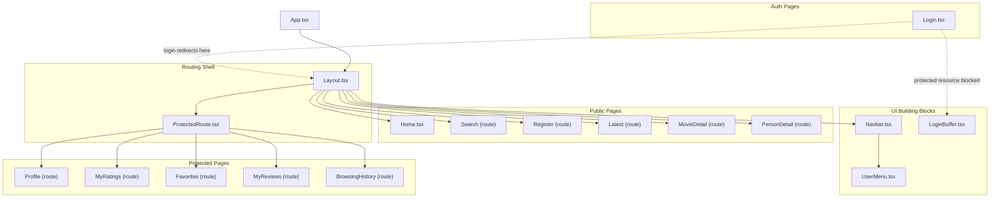
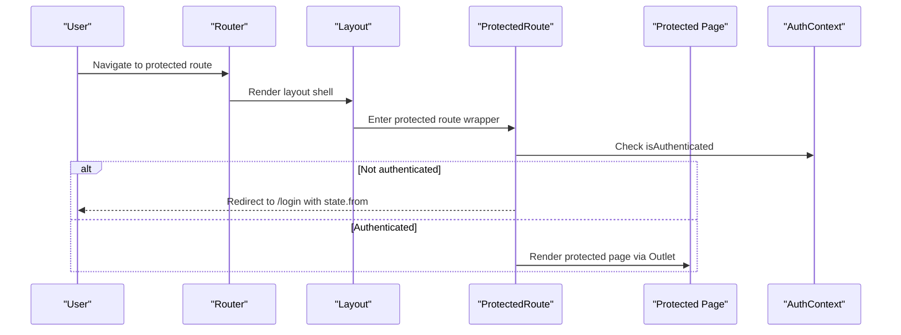
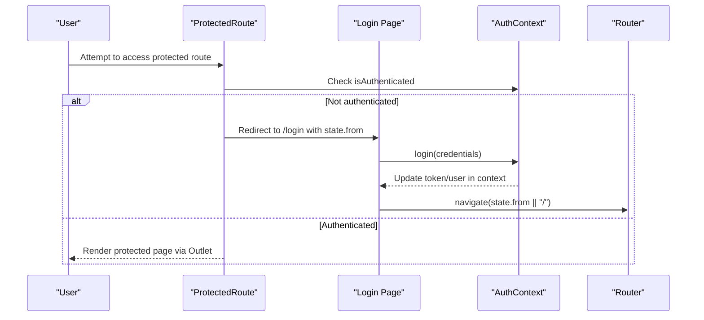
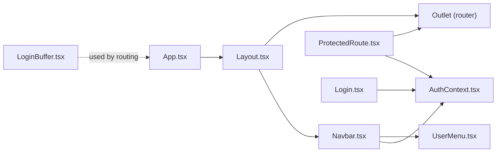

# Layout Components

<cite>
**Referenced Files in This Document**
- [Layout.tsx](file://movie-review-web/src/components/Layout.tsx)
- [LoginBuffer.tsx](file://movie-review-web/src/components/LoginBuffer.tsx)
- [Navbar.tsx](file://movie-review-web/src/components/Navbar.tsx)
- [UserMenu.tsx](file://movie-review-web/src/components/UserMenu.tsx)
- [ProtectedRoute.tsx](file://movie-review-web/src/components/ProtectedRoute.tsx)
- [AuthContext.tsx](file://movie-review-web/src/context/AuthContext.tsx)
- [App.tsx](file://movie-review-web/src/App.tsx)
- [Login.tsx](file://movie-review-web/src/pages/Login.tsx)
- [Home.tsx](file://movie-review-web/src/pages/Home.tsx)
- [index.css](file://movie-review-web/src/index.css)
- [main.tsx](file://movie-review-web/src/main.tsx)
- [vite.config.ts](file://movie-review-web/vite.config.ts)
</cite>

## Table of Contents
1. [Introduction](#introduction)
2. [Project Structure](#project-structure)
3. [Core Components](#core-components)
4. [Architecture Overview](#architecture-overview)
5. [Detailed Component Analysis](#detailed-component-analysis)
6. [Dependency Analysis](#dependency-analysis)
7. [Performance Considerations](#performance-considerations)
8. [Troubleshooting Guide](#troubleshooting-guide)
9. [Conclusion](#conclusion)
10. [Appendices](#appendices)

## Introduction
This document explains the layout system used by the frontend application, focusing on the main Layout component and the LoginBuffer mechanism. It covers how the page shell is structured, how content is wrapped and organized, and how authentication buffering works during login transitions. It also documents layout variants, responsive design, header/footer integration, sidebar management, and content area handling. Practical guidance is included for customization, theme integration, page-specific overrides, performance considerations, hydration patterns, and integration with global state management.

## Project Structure
The layout system centers around a single route shell that wraps all pages, with a shared header and footer, and a protected route guard that enforces authentication. Authentication state is globally managed, and the router composes nested routes inside the layout shell.

**Diagram sources**
- [App.tsx](file://movie-review-web/src/App.tsx#L18-L48)
- [Layout.tsx](file://movie-review-web/src/components/Layout.tsx#L6-L68)
- [ProtectedRoute.tsx](file://movie-review-web/src/components/ProtectedRoute.tsx#L11-L36)
- [Navbar.tsx](file://movie-review-web/src/components/Navbar.tsx#L7-L88)
- [UserMenu.tsx](file://movie-review-web/src/components/UserMenu.tsx#L6-L120)
- [LoginBuffer.tsx](file://movie-review-web/src/components/LoginBuffer.tsx#L11-L74)
- [Login.tsx](file://movie-review-web/src/pages/Login.tsx#L14-L148)
- [Home.tsx](file://movie-review-web/src/pages/Home.tsx#L26-L65)

**Section sources**
- [App.tsx](file://movie-review-web/src/App.tsx#L18-L48)
- [Layout.tsx](file://movie-review-web/src/components/Layout.tsx#L6-L68)
- [ProtectedRoute.tsx](file://movie-review-web/src/components/ProtectedRoute.tsx#L11-L36)

## Core Components
- Layout: Provides the global page shell with a sticky header and a footer. The content area renders nested routes via Outlet.
- Navbar: Implements the top navigation bar with logo, desktop search, links, and user actions.
- UserMenu: Dropdown menu for authenticated users with profile and account actions.
- ProtectedRoute: Guards protected routes and renders nested children via Outlet.
- LoginBuffer: Presents a friendly barrier for protected resources with login and back navigation.
- AuthContext: Global authentication state provider with localStorage-backed persistence and event-driven updates.

Key responsibilities:
- Layout: Establishes the page scaffold and content area.
- Navbar/UserMenu: Provide identity-aware navigation and user controls.
- ProtectedRoute: Enforces authentication and optional admin roles.
- LoginBuffer: Handles authentication buffering with contextual messaging and navigation.
- AuthContext: Centralizes token/user state, login/register/logout, and global auth events.

**Section sources**
- [Layout.tsx](file://movie-review-web/src/components/Layout.tsx#L6-L68)
- [Navbar.tsx](file://movie-review-web/src/components/Navbar.tsx#L7-L88)
- [UserMenu.tsx](file://movie-review-web/src/components/UserMenu.tsx#L6-L120)
- [ProtectedRoute.tsx](file://movie-review-web/src/components/ProtectedRoute.tsx#L11-L36)
- [LoginBuffer.tsx](file://movie-review-web/src/components/LoginBuffer.tsx#L11-L74)
- [AuthContext.tsx](file://movie-review-web/src/context/AuthContext.tsx#L20-L123)

## Architecture Overview
The layout architecture follows a route-shell pattern:
- App defines routes and nests a Layout shell under the root path.
- Layout composes Navbar and Footer and renders child routes via Outlet.
- ProtectedRoute wraps protected routes and renders Outlet for matched children.
- AuthContext provides authentication state and lifecycle hooks.

**Diagram sources**
- [App.tsx](file://movie-review-web/src/App.tsx#L22-L44)
- [Layout.tsx](file://movie-review-web/src/components/Layout.tsx#L13-L15)
- [ProtectedRoute.tsx](file://movie-review-web/src/components/ProtectedRoute.tsx#L11-L36)
- [AuthContext.tsx](file://movie-review-web/src/context/AuthContext.tsx#L112-L120)

## Detailed Component Analysis

### Layout Component
Responsibilities:
- Renders the global header (Navbar) and footer.
- Wraps child routes in a flexible content area using Outlet.
- Applies base typography and color classes.

Structure highlights:
- Header: Navbar is placed at the top.
- Content: main element with flex-1 to fill available vertical space.
- Footer: Grid-based footer with branding, quick links, and social media.

Responsive design:
- Footer uses responsive grid classes to adapt column counts.
- Navbar hides desktop search on small screens and adjusts spacing.

Customization tips:
- To add a sidebar, insert a two-column grid inside the content area and place the sidebar adjacent to the main outlet.
- To override per-page, wrap individual pages with a custom shell instead of relying solely on the global Layout.

**Section sources**
- [Layout.tsx](file://movie-review-web/src/components/Layout.tsx#L6-L68)

### Navbar and UserMenu
Responsibilities:
- Provide site branding, navigation links, and desktop search.
- Present either guest actions or an authenticated user menu.

Key behaviors:
- Desktop search input captures Enter key and navigates to search results.
- UserMenu conditionally renders based on user presence and manages click-outside dismissal.

Integration:
- Navbar consumes AuthContext to decide between login link and user menu.
- UserMenu uses AuthContext to access user info and trigger logout.

**Section sources**
- [Navbar.tsx](file://movie-review-web/src/components/Navbar.tsx#L7-L88)
- [UserMenu.tsx](file://movie-review-web/src/components/UserMenu.tsx#L6-L120)
- [AuthContext.tsx](file://movie-review-web/src/context/AuthContext.tsx#L7-L14)

### ProtectedRoute and Authentication Buffering
ProtectedRoute:
- Checks authentication and optionally admin role.
- Uses Outlet to render nested children when authorized.
- Shows a loader while checking state.

LoginBuffer:
- Used when a protected resource requires authentication.
- Provides a clear message, login CTA, and safe back navigation.
- Accepts props for targetId, title, and custom message.

Login flow integration:
- When unauthenticated, ProtectedRoute redirects to /login with state.from.
- Login page reads state.from and navigates back after successful login.

**Diagram sources**
- [ProtectedRoute.tsx](file://movie-review-web/src/components/ProtectedRoute.tsx#L11-L36)
- [Login.tsx](file://movie-review-web/src/pages/Login.tsx#L14-L61)
- [AuthContext.tsx](file://movie-review-web/src/context/AuthContext.tsx#L44-L86)
- [App.tsx](file://movie-review-web/src/App.tsx#L22-L44)

**Section sources**
- [ProtectedRoute.tsx](file://movie-review-web/src/components/ProtectedRoute.tsx#L11-L36)
- [LoginBuffer.tsx](file://movie-review-web/src/components/LoginBuffer.tsx#L11-L74)
- [Login.tsx](file://movie-review-web/src/pages/Login.tsx#L14-L61)
- [AuthContext.tsx](file://movie-review-web/src/context/AuthContext.tsx#L44-L86)

### Theme and Responsive Design
Theme integration:
- CSS variables define a cohesive dark theme palette with amber accents.
- Tailwind utilities and custom glass classes are used throughout.
- Animations and transitions are standardized via utility classes.

Responsive design:
- Navbar adapts search visibility and spacing across breakpoints.
- Footer grid adjusts column count for different screen sizes.
- Components use container utilities and responsive padding.

Customization examples:
- Override theme variables to change accent colors or backgrounds.
- Extend responsive utilities to adjust grid or spacing for specific pages.
- Add page-specific CSS classes to fine-tune layout for special pages.

**Section sources**
- [index.css](file://movie-review-web/src/index.css#L4-L60)
- [index.css](file://movie-review-web/src/index.css#L62-L187)
- [Navbar.tsx](file://movie-review-web/src/components/Navbar.tsx#L28-L52)
- [Layout.tsx](file://movie-review-web/src/components/Layout.tsx#L18-L20)

### Sidebar Management and Content Area Handling
Current implementation:
- Layout provides a single content area via Outlet.
- No dedicated sidebar is present in the current shell.

Proposed patterns:
- Two-column layout: Wrap main content in a grid and insert a sidebar column before the Outlet.
- Collapsible sidebar: Use state to toggle visibility and adjust content width responsively.
- Sticky sidebar: Apply sticky positioning to a secondary column for long content pages.

Page-specific overrides:
- For pages requiring a sidebar, create a page-level wrapper that adds the sidebar while still rendering the Outlet for the page content.

[No sources needed since this section proposes patterns without analyzing specific files]

### Page Organization Patterns
- Public pages (e.g., Home, Latest, Search, MovieDetail, PersonDetail) are direct children of the Layout shell.
- Protected pages (Profile, MyRatings, Favorites, MyReviews, BrowsingHistory) are nested under ProtectedRoute within the Layout shell.
- Login and Register are public routes under the Layout shell.

This pattern centralizes the header/footer and navigation while cleanly separating public and private content.

**Section sources**
- [App.tsx](file://movie-review-web/src/App.tsx#L22-L44)
- [Home.tsx](file://movie-review-web/src/pages/Home.tsx#L26-L65)

## Dependency Analysis
High-level dependencies:
- App defines routing and nests Layout.
- Layout depends on Navbar and Outlet.
- ProtectedRoute depends on AuthContext and Outlet.
- Navbar depends on AuthContext and UserMenu.
- LoginBuffer is used by the app’s routing logic to present authentication barriers.
- AuthContext provides state and events consumed by Navbar, ProtectedRoute, and Login.

**Diagram sources**
- [App.tsx](file://movie-review-web/src/App.tsx#L18-L48)
- [Layout.tsx](file://movie-review-web/src/components/Layout.tsx#L6-L68)
- [Navbar.tsx](file://movie-review-web/src/components/Navbar.tsx#L7-L88)
- [UserMenu.tsx](file://movie-review-web/src/components/UserMenu.tsx#L6-L120)
- [ProtectedRoute.tsx](file://movie-review-web/src/components/ProtectedRoute.tsx#L11-L36)
- [Login.tsx](file://movie-review-web/src/pages/Login.tsx#L14-L61)
- [AuthContext.tsx](file://movie-review-web/src/context/AuthContext.tsx#L20-L123)

**Section sources**
- [App.tsx](file://movie-review-web/src/App.tsx#L18-L48)
- [AuthContext.tsx](file://movie-review-web/src/context/AuthContext.tsx#L20-L123)

## Performance Considerations
- Hydration and SSR: The app initializes QueryClient and AuthProvider at the root, ensuring state is available on first render. AuthContext uses lazy initialization from localStorage to avoid hydration mismatches.
- Routing: ProtectedRoute renders a minimal spinner while checking authentication, preventing unnecessary re-renders.
- Styling: Tailwind is integrated via Vite plugin, enabling efficient CSS generation and purging unused styles.
- Images: Utility hooks exist for preloading and responsive srcset generation, supporting performance-sensitive pages.

Recommendations:
- Keep the Layout lightweight; defer heavy computations to pages.
- Use React Suspense and React.lazy for large page chunks when applicable.
- Leverage QueryClient caching and staleTime to minimize network requests.

**Section sources**
- [main.tsx](file://movie-review-web/src/main.tsx#L9-L39)
- [AuthContext.tsx](file://movie-review-web/src/context/AuthContext.tsx#L21-L40)
- [ProtectedRoute.tsx](file://movie-review-web/src/components/ProtectedRoute.tsx#L15-L21)
- [vite.config.ts](file://movie-review-web/vite.config.ts#L1-L11)

## Troubleshooting Guide
Common issues and resolutions:
- Authentication flicker on load: AuthContext uses lazy initialization from localStorage, eliminating useEffect-driven re-renders and reducing flicker.
- Unauthorized redirects: ProtectedRoute handles redirect with state.from; ensure Login reads this state and navigates accordingly.
- Global 401 handling: AuthContext listens for global unauthorized events and logs out the user automatically.
- LoginBuffer UX: If users are blocked from protected resources, LoginBuffer provides clear messaging and back navigation.

Debug tips:
- Verify AuthContext state updates by listening to auth:token-refreshed and auth:unauthorized events.
- Confirm ProtectedRoute Outlet renders children by checking route nesting in App.
- Inspect Navbar’s isAuthenticated flag to ensure AuthContext is properly wrapped.

**Section sources**
- [AuthContext.tsx](file://movie-review-web/src/context/AuthContext.tsx#L88-L110)
- [ProtectedRoute.tsx](file://movie-review-web/src/components/ProtectedRoute.tsx#L23-L26)
- [Login.tsx](file://movie-review-web/src/pages/Login.tsx#L50-L55)
- [Navbar.tsx](file://movie-review-web/src/components/Navbar.tsx#L8-L8)

## Conclusion
The layout system provides a clean, extensible foundation for the application. The Layout component establishes a consistent shell, while ProtectedRoute and AuthContext enforce authentication seamlessly. LoginBuffer offers a friendly barrier for protected resources. With responsive design built into the UI primitives and a robust theming system, the layout supports customization and performance-conscious development. The architecture encourages page-specific overrides and future enhancements such as sidebar management.

## Appendices

### Example: Adding a Sidebar to the Layout
- Modify the content area in Layout to a two-column grid.
- Insert a sidebar column before the Outlet for page content.
- Use responsive utilities to hide the sidebar on smaller screens or stack it above content.

[No sources needed since this section provides a conceptual pattern]

### Example: Page-Specific Layout Override
- Create a page-level wrapper component that includes the Layout shell plus page-specific markup.
- Place the page’s content inside the wrapper, replacing the default Outlet-driven rendering for that page.

[No sources needed since this section provides a conceptual pattern]