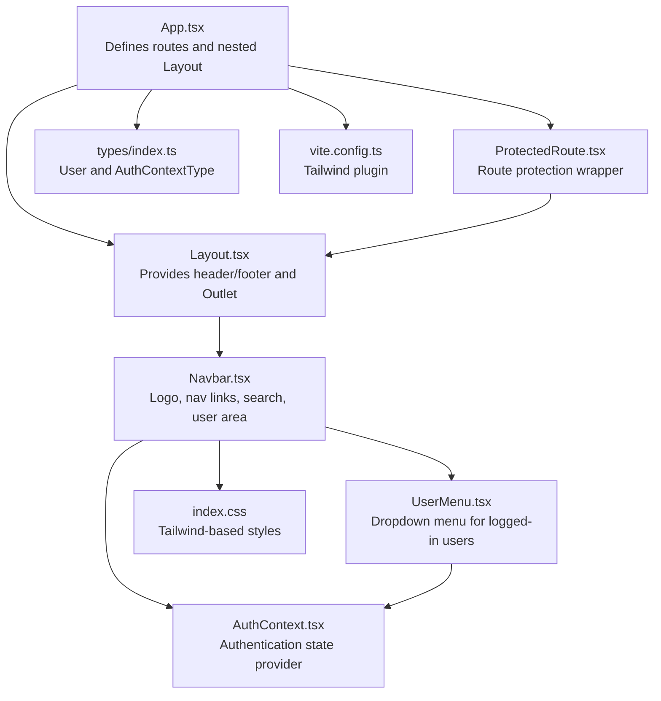
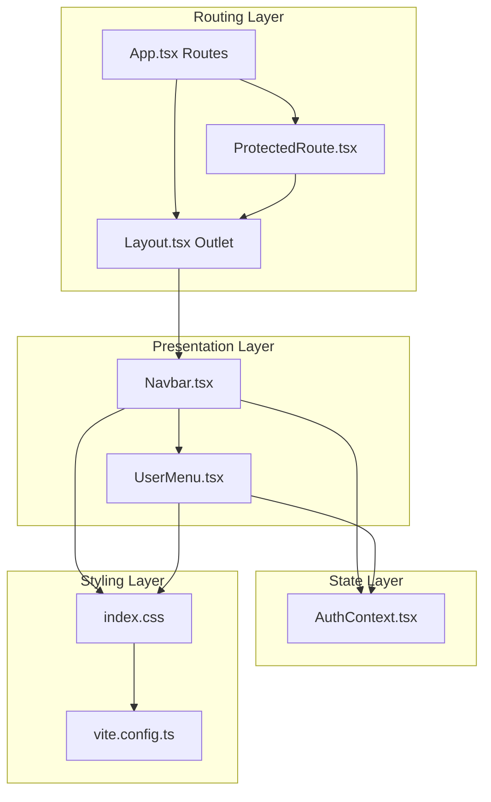
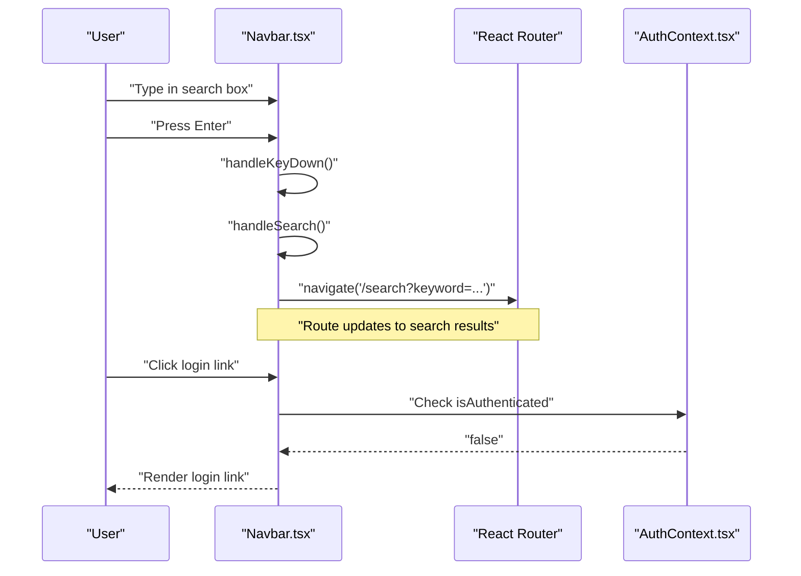
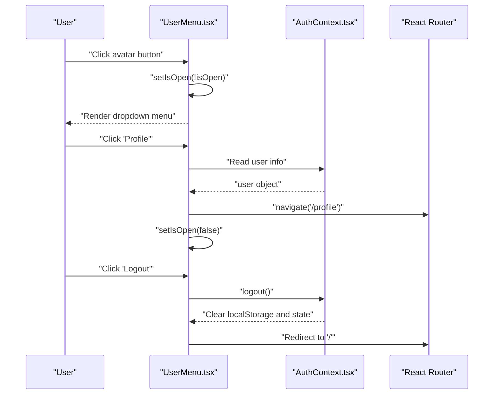
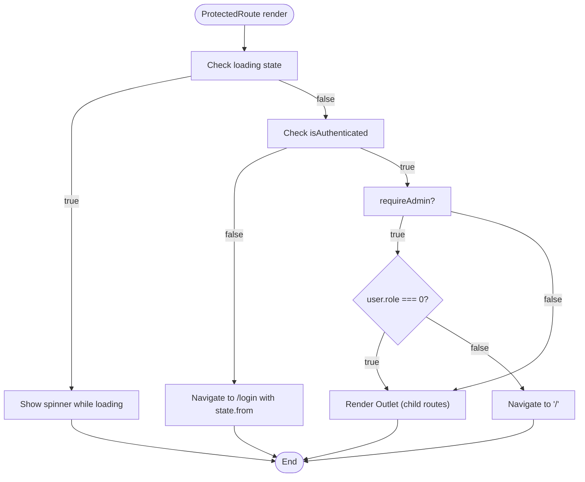
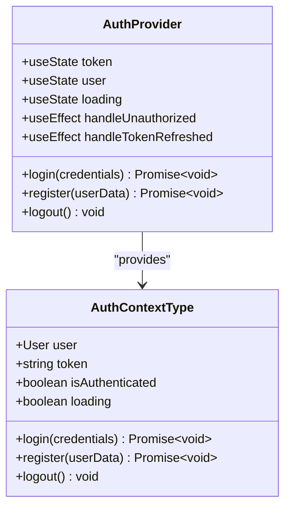
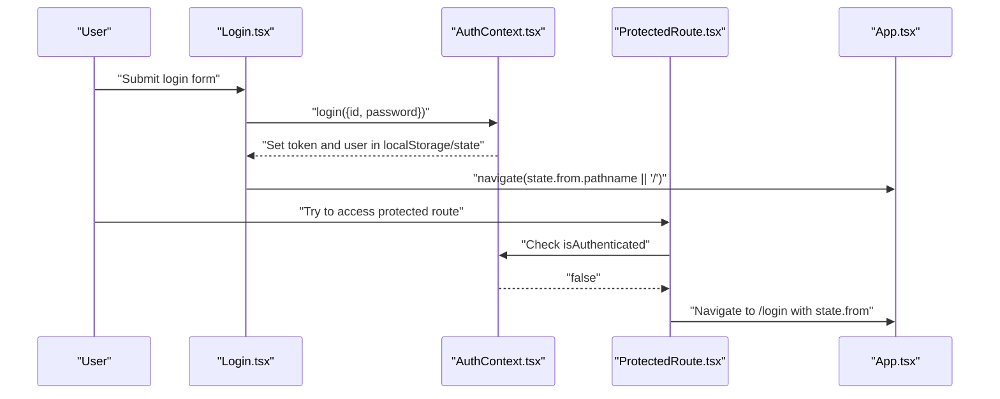
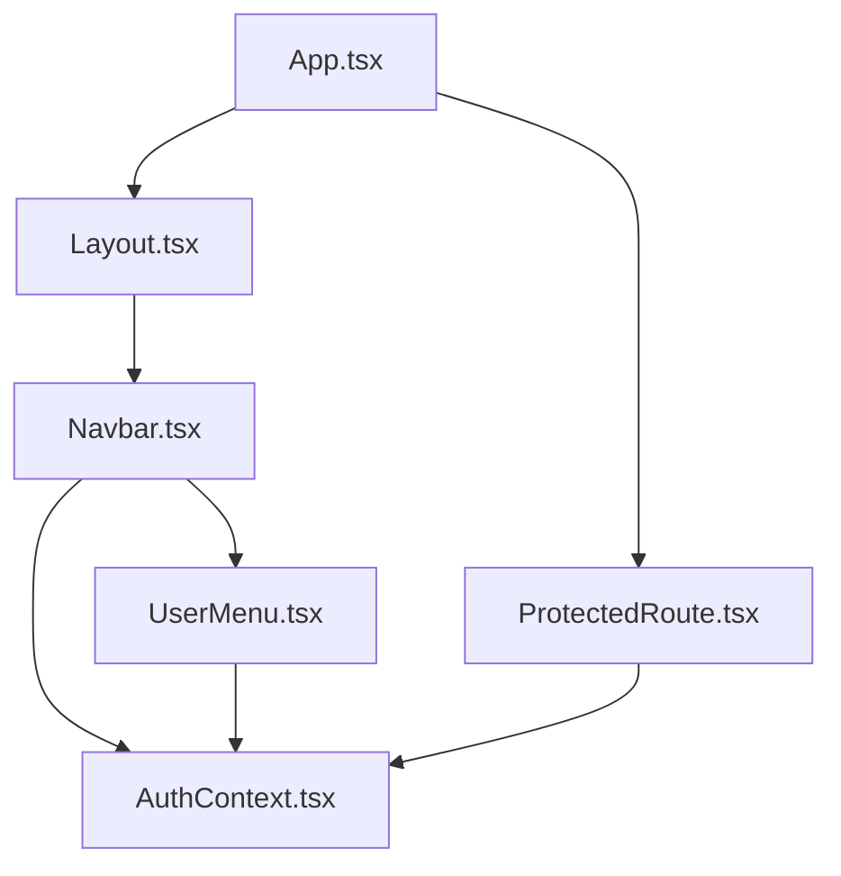

# Navigation Components

<cite>
**Referenced Files in This Document**
- [App.tsx](file://movie-review-web/src/App.tsx)
- [Layout.tsx](file://movie-review-web/src/components/Layout.tsx)
- [Navbar.tsx](file://movie-review-web/src/components/Navbar.tsx)
- [UserMenu.tsx](file://movie-review-web/src/components/UserMenu.tsx)
- [ProtectedRoute.tsx](file://movie-review-web/src/components/ProtectedRoute.tsx)
- [AuthContext.tsx](file://movie-review-web/src/context/AuthContext.tsx)
- [index.css](file://movie-review-web/src/index.css)
- [vite.config.ts](file://movie-review-web/vite.config.ts)
- [Login.tsx](file://movie-review-web/src/pages/Login.tsx)
- [Register.tsx](file://movie-review-web/src/pages/Register.tsx)
- [Profile.tsx](file://movie-review-web/src/pages/Profile.tsx)
- [index.ts](file://movie-review-web/src/types/index.ts)
</cite>

## Table of Contents
1. [Introduction](#introduction)
2. [Project Structure](#project-structure)
3. [Core Components](#core-components)
4. [Architecture Overview](#architecture-overview)
5. [Detailed Component Analysis](#detailed-component-analysis)
6. [Dependency Analysis](#dependency-analysis)
7. [Performance Considerations](#performance-considerations)
8. [Troubleshooting Guide](#troubleshooting-guide)
9. [Conclusion](#conclusion)
10. [Appendices](#appendices)

## Introduction
This document provides comprehensive documentation for the navigation components in the movie review web application, focusing on Navbar, UserMenu, and ProtectedRoute. It explains routing integration, authentication state handling, menu item rendering, navigation patterns, active state management, and responsive behavior. It also covers user authentication integration, dropdown menus, route protection, conditional rendering based on user roles, accessibility compliance, keyboard navigation, and mobile-responsive design patterns. Examples demonstrate navigation setup, custom menu items, and integration with React Router.

## Project Structure
The navigation system is built around a layout-first routing model:
- App defines routes grouped under a shared Layout.
- Layout renders Navbar at the top and provides an outlet for page content.
- Navbar handles global navigation and user authentication state.
- UserMenu provides a dropdown menu for authenticated users.
- ProtectedRoute enforces authentication and optional admin role checks.
- AuthContext manages authentication state and persistence.

**Diagram sources**
- [App.tsx](file://movie-review-web/src/App.tsx#L18-L48)
- [Layout.tsx](file://movie-review-web/src/components/Layout.tsx#L6-L15)
- [Navbar.tsx](file://movie-review-web/src/components/Navbar.tsx#L7-L87)
- [UserMenu.tsx](file://movie-review-web/src/components/UserMenu.tsx#L6-L118)
- [ProtectedRoute.tsx](file://movie-review-web/src/components/ProtectedRoute.tsx#L11-L35)
- [AuthContext.tsx](file://movie-review-web/src/context/AuthContext.tsx#L20-L122)
- [index.css](file://movie-review-web/src/index.css#L1-L187)
- [vite.config.ts](file://movie-review-web/vite.config.ts#L6-L10)
- [index.ts](file://movie-review-web/src/types/index.ts#L76-L114)

**Section sources**
- [App.tsx](file://movie-review-web/src/App.tsx#L18-L48)
- [Layout.tsx](file://movie-review-web/src/components/Layout.tsx#L6-L15)
- [index.css](file://movie-review-web/src/index.css#L1-L187)
- [vite.config.ts](file://movie-review-web/vite.config.ts#L6-L10)

## Core Components
- Navbar: Renders the global header with logo, navigation links, search input, and user area. Handles keyboard search submission and conditional rendering based on authentication state.
- UserMenu: Provides a dropdown menu for authenticated users with profile, favorites, history, reviews, settings, and logout actions.
- ProtectedRoute: Guards protected routes, redirects unauthenticated users to login with return URL preservation, and optionally restricts access by role.
- AuthContext: Centralizes authentication state, persistence in localStorage, login/register/logout operations, and global event listeners for unauthorized events and token refresh.

Key responsibilities:
- Routing integration: App.tsx nests routes under Layout; ProtectedRoute wraps protected routes.
- Authentication state handling: AuthContext exposes user, token, isAuthenticated, and loading state.
- Menu item rendering: Conditional rendering in Navbar and UserMenu based on authentication and user data.
- Active state management: No explicit active state handling in the provided files; consider adding active link highlighting in future enhancements.
- Responsive behavior: Uses Tailwind breakpoints (sm, md) to hide/show elements and adapt layout.

**Section sources**
- [Navbar.tsx](file://movie-review-web/src/components/Navbar.tsx#L7-L87)
- [UserMenu.tsx](file://movie-review-web/src/components/UserMenu.tsx#L6-L118)
- [ProtectedRoute.tsx](file://movie-review-web/src/components/ProtectedRoute.tsx#L11-L35)
- [AuthContext.tsx](file://movie-review-web/src/context/AuthContext.tsx#L20-L122)

## Architecture Overview
The navigation architecture follows a layered pattern:
- Presentation layer: Navbar and UserMenu components.
- Routing layer: App.tsx and ProtectedRoute manage route visibility and protection.
- State layer: AuthContext manages authentication state and persistence.
- Styling layer: Tailwind CSS and custom animations/classes.

**Diagram sources**
- [App.tsx](file://movie-review-web/src/App.tsx#L18-L48)
- [Layout.tsx](file://movie-review-web/src/components/Layout.tsx#L6-L15)
- [Navbar.tsx](file://movie-review-web/src/components/Navbar.tsx#L7-L87)
- [UserMenu.tsx](file://movie-review-web/src/components/UserMenu.tsx#L6-L118)
- [ProtectedRoute.tsx](file://movie-review-web/src/components/ProtectedRoute.tsx#L11-L35)
- [AuthContext.tsx](file://movie-review-web/src/context/AuthContext.tsx#L20-L122)
- [index.css](file://movie-review-web/src/index.css#L1-L187)
- [vite.config.ts](file://movie-review-web/vite.config.ts#L6-L10)

## Detailed Component Analysis

### Navbar Component
Navbar integrates:
- Logo and brand identity.
- Navigation links for public pages.
- Search input with keyboard support (Enter key).
- Conditional rendering: shows UserMenu when authenticated, otherwise shows a login link.
- Responsive design using Tailwind breakpoints.

**Diagram sources**
- [Navbar.tsx](file://movie-review-web/src/components/Navbar.tsx#L13-L25)
- [App.tsx](file://movie-review-web/src/App.tsx#L27-L27)

Accessibility and keyboard navigation:
- Search input supports Enter key submission.
- Links use semantic anchor elements for keyboard navigation.

Responsive behavior:
- Navigation links hidden on small screens.
- Search input hidden on small screens.
- User area adapts to screen size.

**Section sources**
- [Navbar.tsx](file://movie-review-web/src/components/Navbar.tsx#L7-L87)

### UserMenu Component
UserMenu provides:
- Toggleable dropdown menu for authenticated users.
- User avatar fallback and nickname display.
- Navigation links for profile, ratings, favorites, browsing history, and reviews.
- Account settings and logout action.
- Outside click detection to close the menu.

**Diagram sources**
- [UserMenu.tsx](file://movie-review-web/src/components/UserMenu.tsx#L6-L118)
- [AuthContext.tsx](file://movie-review-web/src/context/AuthContext.tsx#L79-L86)
- [App.tsx](file://movie-review-web/src/App.tsx#L36-L40)

Accessibility and keyboard navigation:
- Dropdown toggle uses a button element.
- Menu items are links; ensure focus management can be added for advanced scenarios.

Conditional rendering:
- Menu renders only when user exists.
- Logout clears local storage and state, then navigates.

**Section sources**
- [UserMenu.tsx](file://movie-review-web/src/components/UserMenu.tsx#L6-L118)
- [AuthContext.tsx](file://movie-review-web/src/context/AuthContext.tsx#L79-L86)

### ProtectedRoute Component
ProtectedRoute enforces:
- Authentication check using AuthContext.
- Loading state handling during authentication resolution.
- Redirect to login with return URL preservation.
- Optional admin-only access using user role.
- Rendering child routes via Outlet.

**Diagram sources**
- [ProtectedRoute.tsx](file://movie-review-web/src/components/ProtectedRoute.tsx#L11-L35)

Role-based access:
- Admin-only routes use requireAdmin flag.
- Role comparison uses numeric role values defined in types.

**Section sources**
- [ProtectedRoute.tsx](file://movie-review-web/src/components/ProtectedRoute.tsx#L11-L35)
- [index.ts](file://movie-review-web/src/types/index.ts#L82-L82)

### AuthContext Component
AuthContext centralizes:
- Initialization from localStorage with synchronous reads.
- Login and registration flows persist tokens and user data.
- Logout clears all authentication data.
- Global event listeners for unauthorized events and token refresh.
- Exposes user, token, isAuthenticated, login, register, logout, and loading.

**Diagram sources**
- [AuthContext.tsx](file://movie-review-web/src/context/AuthContext.tsx#L20-L122)
- [index.ts](file://movie-review-web/src/types/index.ts#L106-L114)

**Section sources**
- [AuthContext.tsx](file://movie-review-web/src/context/AuthContext.tsx#L20-L122)
- [index.ts](file://movie-review-web/src/types/index.ts#L106-L114)

### Routing Integration and Setup
- App.tsx defines routes grouped under Layout.
- Public routes (home, login, register, search, latest, person detail, movie detail, user profile) are declared directly under Layout.
- Protected routes (profile, my-ratings, favorites, my-reviews, browsing-history) are wrapped by ProtectedRoute.
- ProtectedRoute uses Outlet to render child routes.

Example setup highlights:
- Nested route structure under Layout ensures consistent header/footer across pages.
- ProtectedRoute conditionally renders child routes based on authentication and role.

**Section sources**
- [App.tsx](file://movie-review-web/src/App.tsx#L22-L44)

### Authentication Integration and Login/Logout Flow
- Login page captures credentials, validates form, calls AuthContext.login, and navigates back to the intended destination using location.state.
- Logout clears localStorage and AuthContext state, triggering global unauthorized event handling.

**Diagram sources**
- [Login.tsx](file://movie-review-web/src/pages/Login.tsx#L36-L61)
- [AuthContext.tsx](file://movie-review-web/src/context/AuthContext.tsx#L45-L63)
- [ProtectedRoute.tsx](file://movie-review-web/src/components/ProtectedRoute.tsx#L15-L26)
- [App.tsx](file://movie-review-web/src/App.tsx#L25-L26)

**Section sources**
- [Login.tsx](file://movie-review-web/src/pages/Login.tsx#L14-L61)
- [AuthContext.tsx](file://movie-review-web/src/context/AuthContext.tsx#L45-L86)
- [ProtectedRoute.tsx](file://movie-review-web/src/components/ProtectedRoute.tsx#L15-L26)

### Responsive Behavior and Accessibility
Responsive behavior:
- Navbar hides navigation links and search on small screens.
- User area adapts to screen size; login link shown when not authenticated.
- Tailwind breakpoints (sm, md) control visibility and layout.

Accessibility considerations:
- Links and buttons use semantic HTML.
- Search input supports keyboard submission.
- Dropdown menu toggles via button; consider adding aria-haspopup and aria-expanded attributes for improved accessibility.

Mobile-responsive design patterns:
- Flexbox and grid utilities adapt content layout.
- Glass and backdrop blur classes enhance visual hierarchy on small screens.

**Section sources**
- [Navbar.tsx](file://movie-review-web/src/components/Navbar.tsx#L38-L68)
- [index.css](file://movie-review-web/src/index.css#L62-L187)

### Custom Menu Items and Conditional Rendering
Customization examples:
- Add new menu items in UserMenu by extending the existing list of Link elements.
- Conditionally render items based on user role using requireAdmin prop in ProtectedRoute.
- Extend Navbar links for additional public pages.

Conditional rendering patterns:
- Navbar shows UserMenu when authenticated; otherwise shows login link.
- UserMenu renders only when user data exists.

**Section sources**
- [UserMenu.tsx](file://movie-review-web/src/components/UserMenu.tsx#L52-L114)
- [Navbar.tsx](file://movie-review-web/src/components/Navbar.tsx#L70-L83)
- [ProtectedRoute.tsx](file://movie-review-web/src/components/ProtectedRoute.tsx#L28-L31)

## Dependency Analysis
Component dependencies and relationships:
- App depends on Layout, ProtectedRoute, and page components.
- Layout depends on Navbar and Outlet.
- Navbar depends on AuthContext and UserMenu.
- UserMenu depends on AuthContext and React Router.
- ProtectedRoute depends on AuthContext and React Router Outlet.
- AuthContext depends on user API and localStorage.

**Diagram sources**
- [App.tsx](file://movie-review-web/src/App.tsx#L1-L50)
- [Layout.tsx](file://movie-review-web/src/components/Layout.tsx#L1-L68)
- [Navbar.tsx](file://movie-review-web/src/components/Navbar.tsx#L1-L88)
- [UserMenu.tsx](file://movie-review-web/src/components/UserMenu.tsx#L1-L120)
- [ProtectedRoute.tsx](file://movie-review-web/src/components/ProtectedRoute.tsx#L1-L36)
- [AuthContext.tsx](file://movie-review-web/src/context/AuthContext.tsx#L1-L123)

**Section sources**
- [App.tsx](file://movie-review-web/src/App.tsx#L1-L50)
- [AuthContext.tsx](file://movie-review-web/src/context/AuthContext.tsx#L1-L123)

## Performance Considerations
- Synchronous initialization of authentication state avoids unnecessary re-renders and eliminates loading flashes.
- LocalStorage usage for tokens and user data reduces network requests on initial load.
- Dropdown menu uses CSS transitions and minimal DOM manipulation; consider virtualization for very long lists.
- Search input debouncing could improve performance for frequent keystrokes (optional enhancement).

[No sources needed since this section provides general guidance]

## Troubleshooting Guide
Common issues and resolutions:
- Authentication state not persisting after reload: Verify localStorage keys and parsing logic in AuthContext.
- Protected routes redirecting unexpectedly: Check requireAdmin flag and user role values.
- UserMenu not closing on outside click: Ensure event listener cleanup and proper ref usage.
- Login redirect loop: Confirm state.from handling and navigation after successful login.

**Section sources**
- [AuthContext.tsx](file://movie-review-web/src/context/AuthContext.tsx#L23-L36)
- [ProtectedRoute.tsx](file://movie-review-web/src/components/ProtectedRoute.tsx#L23-L31)
- [UserMenu.tsx](file://movie-review-web/src/components/UserMenu.tsx#L12-L23)
- [Login.tsx](file://movie-review-web/src/pages/Login.tsx#L50-L55)

## Conclusion
The navigation system combines a clean layout-first routing model with robust authentication state management. Navbar and UserMenu provide intuitive, responsive navigation, while ProtectedRoute ensures secure access to protected areas. AuthContext centralizes authentication logic and persistence. Together, these components deliver a scalable foundation for navigation, routing, and user experience.

[No sources needed since this section summarizes without analyzing specific files]

## Appendices

### Example: Adding a New Protected Route
Steps:
- Define the page component (e.g., MySettings).
- Add a route under ProtectedRoute in App.tsx.
- Optionally protect with requireAdmin if needed.
- Add a menu item in UserMenu or Navbar for quick access.

**Section sources**
- [App.tsx](file://movie-review-web/src/App.tsx#L35-L43)
- [UserMenu.tsx](file://movie-review-web/src/components/UserMenu.tsx#L52-L114)

### Example: Role-Based Access Control
- Use requireAdmin flag in ProtectedRoute to restrict routes to administrators.
- Ensure user role values align with backend definitions.

**Section sources**
- [ProtectedRoute.tsx](file://movie-review-web/src/components/ProtectedRoute.tsx#L28-L31)
- [index.ts](file://movie-review-web/src/types/index.ts#L82-L82)