# UI Components Library

<cite>
**Referenced Files in This Document**
- [MovieCard.tsx](file://movie-review-web/src/components/MovieCard.tsx)
- [Hero.tsx](file://movie-review-web/src/components/Hero.tsx)
- [Navbar.tsx](file://movie-review-web/src/components/Navbar.tsx)
- [Layout.tsx](file://movie-review-web/src/components/Layout.tsx)
- [OptimizedImage.tsx](file://movie-review-web/src/components/OptimizedImage.tsx)
- [UserMenu.tsx](file://movie-review-web/src/components/UserMenu.tsx)
- [CommentForm.tsx](file://movie-review-web/src/components/CommentForm.tsx)
- [CommentItem.tsx](file://movie-review-web/src/components/CommentItem.tsx)
- [CommentList.tsx](file://movie-review-web/src/components/CommentList.tsx)
- [LoginBuffer.tsx](file://movie-review-web/src/components/LoginBuffer.tsx)
- [AuthContext.tsx](file://movie-review-web/src/context/AuthContext.tsx)
- [errorHandler.ts](file://movie-review-web/src/utils/errorHandler.ts)
- [index.ts](file://movie-review-web/src/types/index.ts)
- [index.css](file://movie-review-web/src/index.css)
- [App.css](file://movie-review-web/src/App.css)
</cite>

## Table of Contents
1. [Introduction](#introduction)
2. [Project Structure](#project-structure)
3. [Core Components](#core-components)
4. [Architecture Overview](#architecture-overview)
5. [Detailed Component Analysis](#detailed-component-analysis)
6. [Dependency Analysis](#dependency-analysis)
7. [Performance Considerations](#performance-considerations)
8. [Troubleshooting Guide](#troubleshooting-guide)
9. [Conclusion](#conclusion)
10. [Appendices](#appendices)

## Introduction
This document describes the reusable UI components library used in the movie review web application. It focuses on each component’s visual appearance, behavior, user interaction patterns, props/attributes, events, customization options, and styling approaches. It also provides usage examples, composition patterns, responsive design guidelines, accessibility considerations, cross-browser compatibility notes, component states/animations/transitions, theming support, performance optimization techniques, testing strategies, and maintenance considerations.

## Project Structure
The UI components live under the components directory and are composed within a layout that includes a navigation bar and footer. Shared utilities and contexts support authentication and error handling. Styling leverages Tailwind CSS with a custom color palette and layered animations.

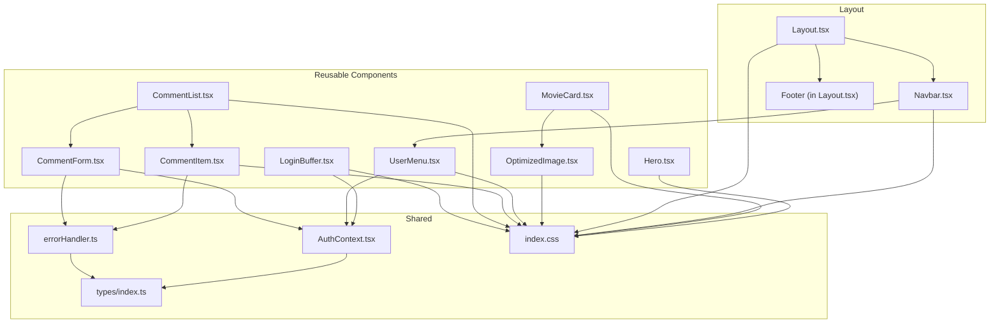

**Diagram sources**
- [Layout.tsx](file://movie-review-web/src/components/Layout.tsx#L6-L67)
- [Navbar.tsx](file://movie-review-web/src/components/Navbar.tsx#L1-L88)
- [MovieCard.tsx](file://movie-review-web/src/components/MovieCard.tsx#L1-L38)
- [Hero.tsx](file://movie-review-web/src/components/Hero.tsx#L1-L68)
- [OptimizedImage.tsx](file://movie-review-web/src/components/OptimizedImage.tsx#L1-L179)
- [UserMenu.tsx](file://movie-review-web/src/components/UserMenu.tsx#L1-L120)
- [CommentForm.tsx](file://movie-review-web/src/components/CommentForm.tsx#L1-L222)
- [CommentItem.tsx](file://movie-review-web/src/components/CommentItem.tsx#L1-L161)
- [CommentList.tsx](file://movie-review-web/src/components/CommentList.tsx#L1-L107)
- [LoginBuffer.tsx](file://movie-review-web/src/components/LoginBuffer.tsx#L1-L74)
- [AuthContext.tsx](file://movie-review-web/src/context/AuthContext.tsx#L1-L123)
- [errorHandler.ts](file://movie-review-web/src/utils/errorHandler.ts#L1-L60)
- [index.ts](file://movie-review-web/src/types/index.ts#L1-L204)
- [index.css](file://movie-review-web/src/index.css#L1-L187)

**Section sources**
- [Layout.tsx](file://movie-review-web/src/components/Layout.tsx#L6-L67)
- [index.css](file://movie-review-web/src/index.css#L1-L187)

## Core Components
This section summarizes each component’s purpose, key props/events, and styling approach.

- MovieCard
  - Purpose: Renders a clickable movie card with poster, score badge, and metadata.
  - Key props: movie (object with id, name, cover, score, genres, year).
  - Behavior: Hover scaling on poster; navigates to movie detail route.
  - Styling: Tailwind classes with hover lift and amber score badge.
  - Accessibility: Uses alt text from movie name; link semantics for navigation.

- Hero
  - Purpose: Full-width hero with background image, gradient overlay, and CTA buttons.
  - Behavior: Preloads background image; fades in after load; shows placeholder while loading.
  - Styling: Gradient overlay, responsive typography, amber accents.

- Navbar
  - Purpose: Top navigation with logo, search input, links, and user menu.
  - Behavior: Handles search submission via Enter key; routes to search results.
  - Styling: Backdrop blur, amber accents, responsive layout.

- Layout
  - Purpose: Wraps app with Navbar and footer; renders outlet content.
  - Styling: Grid-based footer, responsive columns.

- OptimizedImage
  - Purpose: Lazy-loading image with loading spinner, error fallback, aspect ratio support.
  - Key props: src, alt, className, fallbackIcon, aspectRatio, priority, onLoad, onError, width, height.
  - Specialized variants: MoviePoster, BackdropImage.
  - Behavior: IntersectionObserver-based lazy loading; priority disables lazy loading.

- UserMenu
  - Purpose: Authenticated user dropdown with profile actions and logout.
  - Behavior: Click-outside close; animated open/close; rotates chevron indicator.
  - Styling: Glass effect, border accents, hover states.

- CommentForm
  - Purpose: Allows authenticated users to rate and comment on a movie.
  - Key props: movieId, onSuccess callback.
  - Behavior: Loads existing rating/comment; submit updates; handles errors via shared handler.
  - Styling: Amber accents, hover scale, loading states.

- CommentItem
  - Purpose: Displays a single comment with avatar, nickname, star rating, and like action.
  - Behavior: Toggle like with optimistic UI and revert on server mismatch; formats dates.
  - Styling: Hover border glow, amber liked state.

- CommentList
  - Purpose: Lists comments with pagination-like “load more” and integrates CommentForm.
  - Behavior: Fetches paginated comments; refreshes on success; shows empty/loading states.

- LoginBuffer
  - Purpose: Gatekeeping component for protected actions; prompts login with back navigation.
  - Behavior: Preserves current location in state for post-login redirect.

**Section sources**
- [MovieCard.tsx](file://movie-review-web/src/components/MovieCard.tsx#L1-L38)
- [Hero.tsx](file://movie-review-web/src/components/Hero.tsx#L1-L68)
- [Navbar.tsx](file://movie-review-web/src/components/Navbar.tsx#L1-L88)
- [Layout.tsx](file://movie-review-web/src/components/Layout.tsx#L1-L68)
- [OptimizedImage.tsx](file://movie-review-web/src/components/OptimizedImage.tsx#L1-L179)
- [UserMenu.tsx](file://movie-review-web/src/components/UserMenu.tsx#L1-L120)
- [CommentForm.tsx](file://movie-review-web/src/components/CommentForm.tsx#L1-L222)
- [CommentItem.tsx](file://movie-review-web/src/components/CommentItem.tsx#L1-L161)
- [CommentList.tsx](file://movie-review-web/src/components/CommentList.tsx#L1-L107)
- [LoginBuffer.tsx](file://movie-review-web/src/components/LoginBuffer.tsx#L1-L74)

## Architecture Overview
The components are organized around a shared theme and context. Authentication state drives visibility and behavior of interactive components. Utility modules centralize error handling and data typing.

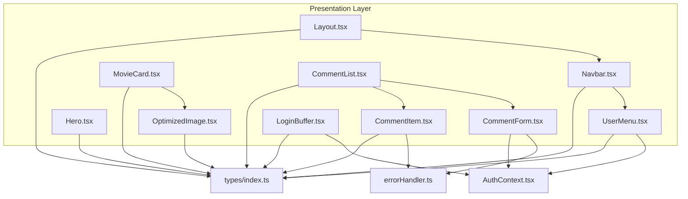

**Diagram sources**
- [AuthContext.tsx](file://movie-review-web/src/context/AuthContext.tsx#L1-L123)
- [errorHandler.ts](file://movie-review-web/src/utils/errorHandler.ts#L1-L60)
- [index.ts](file://movie-review-web/src/types/index.ts#L1-L204)
- [Layout.tsx](file://movie-review-web/src/components/Layout.tsx#L1-L68)
- [Navbar.tsx](file://movie-review-web/src/components/Navbar.tsx#L1-L88)
- [UserMenu.tsx](file://movie-review-web/src/components/UserMenu.tsx#L1-L120)
- [MovieCard.tsx](file://movie-review-web/src/components/MovieCard.tsx#L1-L38)
- [Hero.tsx](file://movie-review-web/src/components/Hero.tsx#L1-L68)
- [OptimizedImage.tsx](file://movie-review-web/src/components/OptimizedImage.tsx#L1-L179)
- [CommentForm.tsx](file://movie-review-web/src/components/CommentForm.tsx#L1-L222)
- [CommentItem.tsx](file://movie-review-web/src/components/CommentItem.tsx#L1-L161)
- [CommentList.tsx](file://movie-review-web/src/components/CommentList.tsx#L1-L107)
- [LoginBuffer.tsx](file://movie-review-web/src/components/LoginBuffer.tsx#L1-L74)

## Detailed Component Analysis

### MovieCard
- Visual appearance: Rounded card with poster image, amber score badge, truncated title, and year/genre metadata.
- Behavior: Navigation to movie detail; hover scaling on poster; subtle lift and shadow.
- Props:
  - movie: object with id, name, cover, score, genres, year.
- Events: None (navigation via Link).
- Styling: Tailwind utilities; hover-lift; group-hover scale; amber score badge.
- Accessibility: Alt text from movie name; semantic link.

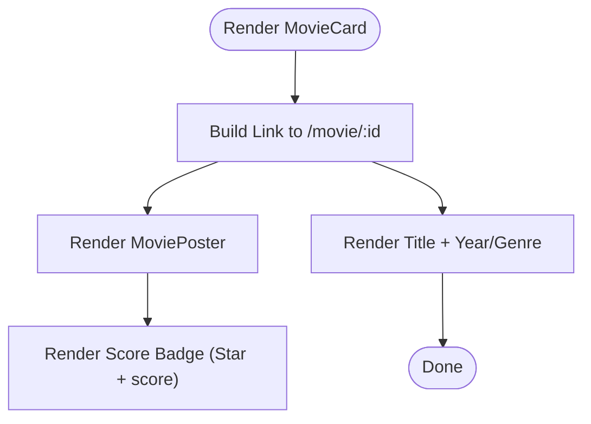

**Diagram sources**
- [MovieCard.tsx](file://movie-review-web/src/components/MovieCard.tsx#L11-L38)
- [OptimizedImage.tsx](file://movie-review-web/src/components/OptimizedImage.tsx#L128-L152)

**Section sources**
- [MovieCard.tsx](file://movie-review-web/src/components/MovieCard.tsx#L1-L38)
- [OptimizedImage.tsx](file://movie-review-web/src/components/OptimizedImage.tsx#L128-L152)

### Hero
- Visual appearance: Full-height hero with background image, gradient overlay, and CTA buttons.
- Behavior: Preloads background image; fades in after load; placeholder shown until loaded.
- Props: None.
- Styling: Responsive typography, amber highlights, gradient overlay.

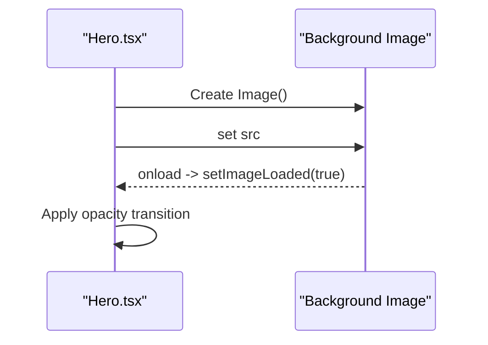

**Diagram sources**
- [Hero.tsx](file://movie-review-web/src/components/Hero.tsx#L7-L11)

**Section sources**
- [Hero.tsx](file://movie-review-web/src/components/Hero.tsx#L1-L68)

### Navbar
- Visual appearance: Sticky top nav with logo, centered search (desktop), quick links, and user area.
- Behavior: Controlled search input; Enter key triggers search; routes to /search?keyword=...
- Props: None.
- Styling: Backdrop blur, amber accents, responsive breakpoints.

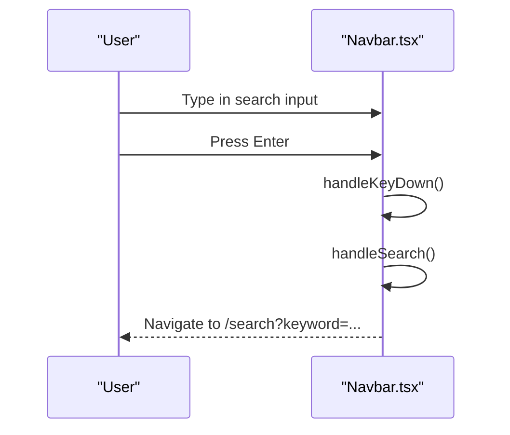

**Diagram sources**
- [Navbar.tsx](file://movie-review-web/src/components/Navbar.tsx#L13-L25)

**Section sources**
- [Navbar.tsx](file://movie-review-web/src/components/Navbar.tsx#L1-L88)

### Layout
- Visual appearance: Minimal layout with Navbar, Outlet content, and a multi-column footer.
- Behavior: Renders child routes via Outlet.
- Props: None.
- Styling: Responsive grid footer, amber branding.

**Section sources**
- [Layout.tsx](file://movie-review-web/src/components/Layout.tsx#L1-L68)

### OptimizedImage
- Visual appearance: Container with optional loading spinner, error fallback icon, and actual image.
- Behavior: Lazy-loads when in viewport (IntersectionObserver); supports priority eager loading; aspect ratio container; responsive srcset placeholder.
- Props:
  - src, alt, className, fallbackIcon, aspectRatio, priority, onLoad, onError, width, height.
- Specialized:
  - MoviePoster: fixed 2/3 aspect ratio, amber fallback icon.
  - BackdropImage: optional blur effect.
- Styling: Pulse loader, shimmer fallback, fade-in on load.

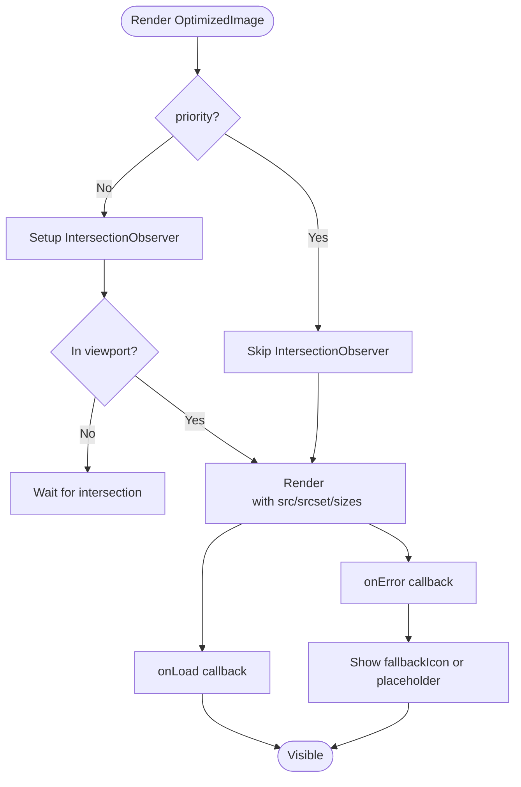

**Diagram sources**
- [OptimizedImage.tsx](file://movie-review-web/src/components/OptimizedImage.tsx#L35-L68)
- [OptimizedImage.tsx](file://movie-review-web/src/components/OptimizedImage.tsx#L128-L179)

**Section sources**
- [OptimizedImage.tsx](file://movie-review-web/src/components/OptimizedImage.tsx#L1-L179)

### UserMenu
- Visual appearance: Avatar button with dropdown menu; lists profile actions and logout.
- Behavior: Animated open/close; click-outside closes; rotates chevron indicator.
- Props: None.
- Styling: Glass panel, border accents, hover states.

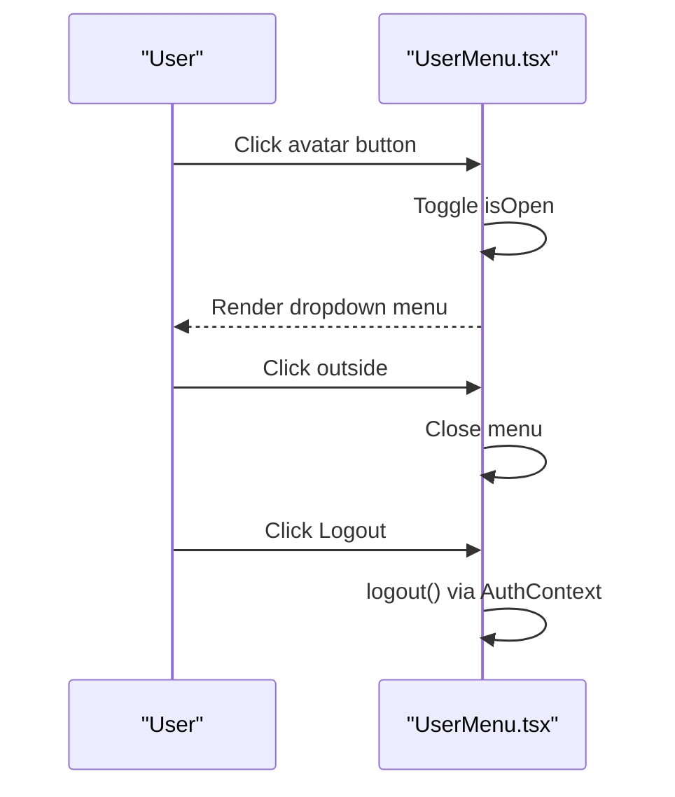

**Diagram sources**
- [UserMenu.tsx](file://movie-review-web/src/components/UserMenu.tsx#L6-L23)
- [AuthContext.tsx](file://movie-review-web/src/context/AuthContext.tsx#L79-L86)

**Section sources**
- [UserMenu.tsx](file://movie-review-web/src/components/UserMenu.tsx#L1-L120)
- [AuthContext.tsx](file://movie-review-web/src/context/AuthContext.tsx#L1-L123)

### CommentForm
- Visual appearance: Rating stars, numeric display, textarea, and submit/update buttons.
- Behavior: Loads existing rating/comment; handles confirm dialogs for updates; optimistic UI; error messages via shared handler.
- Props:
  - movieId: number
  - onSuccess: () => void
- Events: None (uses callbacks).
- Styling: Amber accents, hover scale, loading spinner, disabled states.

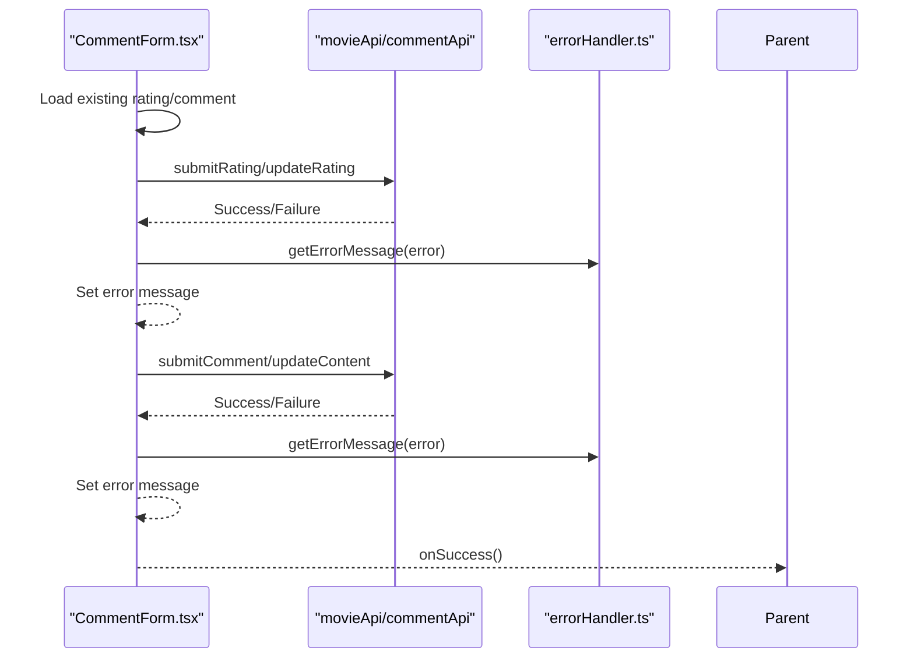

**Diagram sources**
- [CommentForm.tsx](file://movie-review-web/src/components/CommentForm.tsx#L67-L112)
- [errorHandler.ts](file://movie-review-web/src/utils/errorHandler.ts#L17-L60)

**Section sources**
- [CommentForm.tsx](file://movie-review-web/src/components/CommentForm.tsx#L1-L222)
- [errorHandler.ts](file://movie-review-web/src/utils/errorHandler.ts#L1-L60)

### CommentItem
- Visual appearance: Avatar, nickname, star rating, content, and like button with vote count.
- Behavior: Toggle like with optimistic UI; animates on click; formats timestamps; handles server mismatches.
- Props:
  - comment: object with userId, content, commentTime, votes, rating/score, isLiked, and optional legacy fields.
- Styling: Hover border glow, amber liked state.

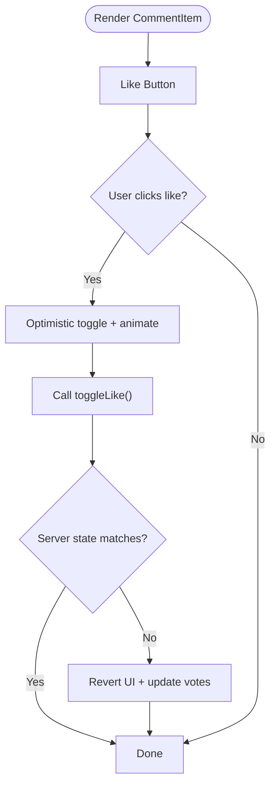

**Diagram sources**
- [CommentItem.tsx](file://movie-review-web/src/components/CommentItem.tsx#L61-L97)

**Section sources**
- [CommentItem.tsx](file://movie-review-web/src/components/CommentItem.tsx#L1-L161)

### CommentList
- Visual appearance: Title, CommentForm, list of CommentItem, and “load more” button.
- Behavior: Fetches comments with page number; refreshes on success; shows empty/loading states.
- Props:
  - movieId: number
- Styling: Spacing, glass panels, loader spinner.

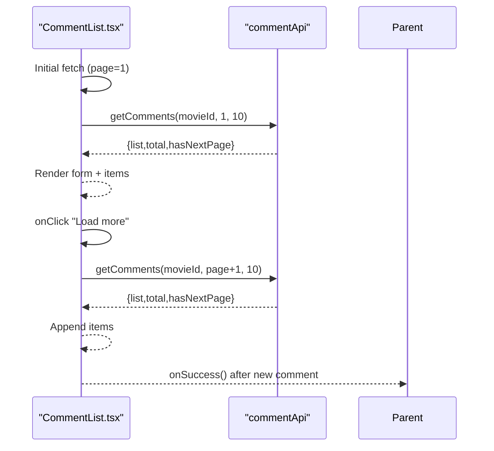

**Diagram sources**
- [CommentList.tsx](file://movie-review-web/src/components/CommentList.tsx#L19-L55)

**Section sources**
- [CommentList.tsx](file://movie-review-web/src/components/CommentList.tsx#L1-L107)

### LoginBuffer
- Visual appearance: Centered card with lock icon, message, login button, and back button.
- Behavior: Preserves current location; navigates back if history allows; otherwise to home.
- Props:
  - targetId?: string
  - title?: string
  - message?: ReactNode
- Styling: Glass panel, amber accents, hover scale.

**Section sources**
- [LoginBuffer.tsx](file://movie-review-web/src/components/LoginBuffer.tsx#L1-L74)

## Dependency Analysis
- Component coupling:
  - Navbar depends on AuthContext for authentication state and uses UserMenu.
  - CommentForm and CommentItem depend on AuthContext for user state and on errorHandler for error messaging.
  - CommentList composes CommentForm and CommentItem and manages pagination.
  - MovieCard composes OptimizedImage for poster rendering.
- External dependencies:
  - lucide-react icons.
  - Tailwind CSS utilities and custom animations.
- Theming:
  - Custom CSS variables define color tokens and shadows; animations are centralized.

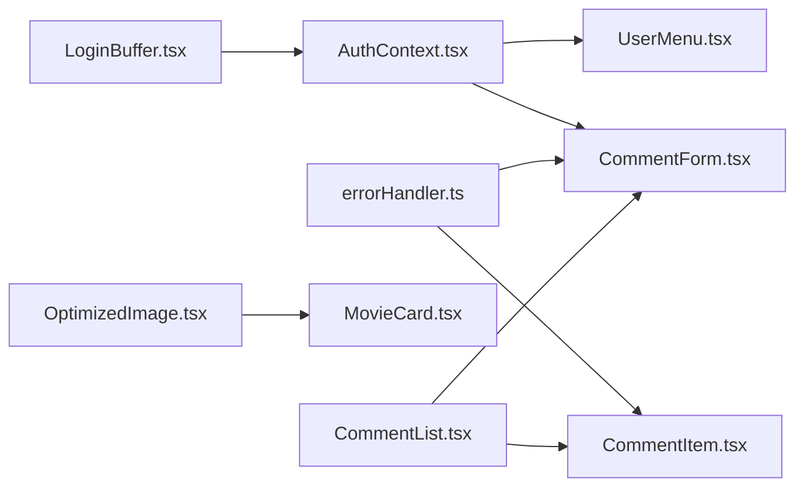

**Diagram sources**
- [AuthContext.tsx](file://movie-review-web/src/context/AuthContext.tsx#L1-L123)
- [UserMenu.tsx](file://movie-review-web/src/components/UserMenu.tsx#L1-L120)
- [CommentForm.tsx](file://movie-review-web/src/components/CommentForm.tsx#L1-L222)
- [errorHandler.ts](file://movie-review-web/src/utils/errorHandler.ts#L1-L60)
- [OptimizedImage.tsx](file://movie-review-web/src/components/OptimizedImage.tsx#L1-L179)
- [MovieCard.tsx](file://movie-review-web/src/components/MovieCard.tsx#L1-L38)
- [CommentList.tsx](file://movie-review-web/src/components/CommentList.tsx#L1-L107)
- [CommentItem.tsx](file://movie-review-web/src/components/CommentItem.tsx#L1-L161)
- [LoginBuffer.tsx](file://movie-review-web/src/components/LoginBuffer.tsx#L1-L74)

**Section sources**
- [index.css](file://movie-review-web/src/index.css#L4-L60)

## Performance Considerations
- Image optimization:
  - OptimizedImage uses IntersectionObserver for lazy loading and priority flag to bypass lazy loading for above-the-fold images. Consider implementing responsive srcset generation based on backend capabilities.
- Rendering:
  - Memoize heavy computations inside components if needed; avoid unnecessary re-renders by passing stable callbacks and avoiding inline prop objects.
- Network:
  - Parallelize initial checks in CommentForm (rating and comment status) to reduce perceived latency.
- Animations:
  - Prefer transform/opacity for animations to leverage GPU acceleration; keep durations reasonable.
- Bundle size:
  - Keep icon imports scoped; avoid importing entire icon libraries.

[No sources needed since this section provides general guidance]

## Troubleshooting Guide
- Error handling:
  - Centralized via getErrorMessage which inspects AxiosError response bodies and HTTP status codes, returning user-friendly messages.
- Common issues:
  - Authentication-related failures trigger global unauthorized event listeners; ensure AuthProvider is mounted at the root.
  - Comment likes may revert if server state differs; UI gracefully reverts and updates counts accordingly.
  - LoginBuffer preserves location via React Router state for seamless redirects after login.

**Section sources**
- [errorHandler.ts](file://movie-review-web/src/utils/errorHandler.ts#L1-L60)
- [AuthContext.tsx](file://movie-review-web/src/context/AuthContext.tsx#L88-L110)
- [CommentItem.tsx](file://movie-review-web/src/components/CommentItem.tsx#L80-L96)
- [LoginBuffer.tsx](file://movie-review-web/src/components/LoginBuffer.tsx#L54-L57)

## Conclusion
The UI components library emphasizes a cohesive dark theme with amber accents, thoughtful interactions, and performance-conscious image handling. Components are modular, reusable, and integrate with shared context and utilities for authentication and error handling. Following the guidelines herein ensures consistent behavior, accessibility, and maintainability across the application.

[No sources needed since this section summarizes without analyzing specific files]

## Appendices

### Props and Attributes Reference
- MovieCard
  - movie: Movie
- Hero
  - None
- Navbar
  - None
- Layout
  - None
- OptimizedImage
  - src, alt, className, fallbackIcon, aspectRatio, priority, onLoad, onError, width, height
- MoviePoster
  - src, alt, className, priority
- BackdropImage
  - src, alt, className, priority, blur
- UserMenu
  - None
- CommentForm
  - movieId: number, onSuccess: () => void
- CommentItem
  - comment: Comment
- CommentList
  - movieId: number
- LoginBuffer
  - targetId?: string, title?: string, message?: ReactNode

**Section sources**
- [MovieCard.tsx](file://movie-review-web/src/components/MovieCard.tsx#L7-L9)
- [OptimizedImage.tsx](file://movie-review-web/src/components/OptimizedImage.tsx#L4-L15)
- [OptimizedImage.tsx](file://movie-review-web/src/components/OptimizedImage.tsx#L129-L134)
- [OptimizedImage.tsx](file://movie-review-web/src/components/OptimizedImage.tsx#L155-L161)
- [UserMenu.tsx](file://movie-review-web/src/components/UserMenu.tsx#L1-L6)
- [CommentForm.tsx](file://movie-review-web/src/components/CommentForm.tsx#L9-L12)
- [CommentItem.tsx](file://movie-review-web/src/components/CommentItem.tsx#L8-L10)
- [CommentList.tsx](file://movie-review-web/src/components/CommentList.tsx#L8-L10)
- [LoginBuffer.tsx](file://movie-review-web/src/components/LoginBuffer.tsx#L5-L9)

### Styling and Theming
- Design tokens:
  - CSS variables define backgrounds, borders, text, and accent colors.
- Utilities:
  - Tailwind utilities and custom animations (fadeIn, slideUp, slideDown, shimmer, pulse-glow).
- Customization:
  - Override CSS variables to change theme globally; extend animation utilities for component-specific effects.

**Section sources**
- [index.css](file://movie-review-web/src/index.css#L4-L60)
- [index.css](file://movie-review-web/src/index.css#L62-L187)

### Accessibility and Cross-Browser Compatibility
- Accessibility:
  - Use semantic elements (nav, button, a); ensure alt text for images; provide keyboard navigation (Enter key for search).
- Cross-browser:
  - Tailwind and CSS variables are broadly supported; IntersectionObserver is widely available; ensure polyfills if targeting older browsers.

[No sources needed since this section provides general guidance]

### Testing Strategies and Maintenance
- Testing:
  - Unit tests for handlers and helpers (e.g., error handling).
  - Component snapshot tests for static renders; interaction tests for user flows (search, login, like toggles).
  - Mock APIs for CommentForm and CommentList to simulate success/failure scenarios.
- Maintenance:
  - Keep props and types in types/index.ts synchronized with component interfaces.
  - Centralize shared logic (e.g., error handling) to minimize duplication.
  - Monitor bundle size and remove unused icons/utilities.

[No sources needed since this section provides general guidance]